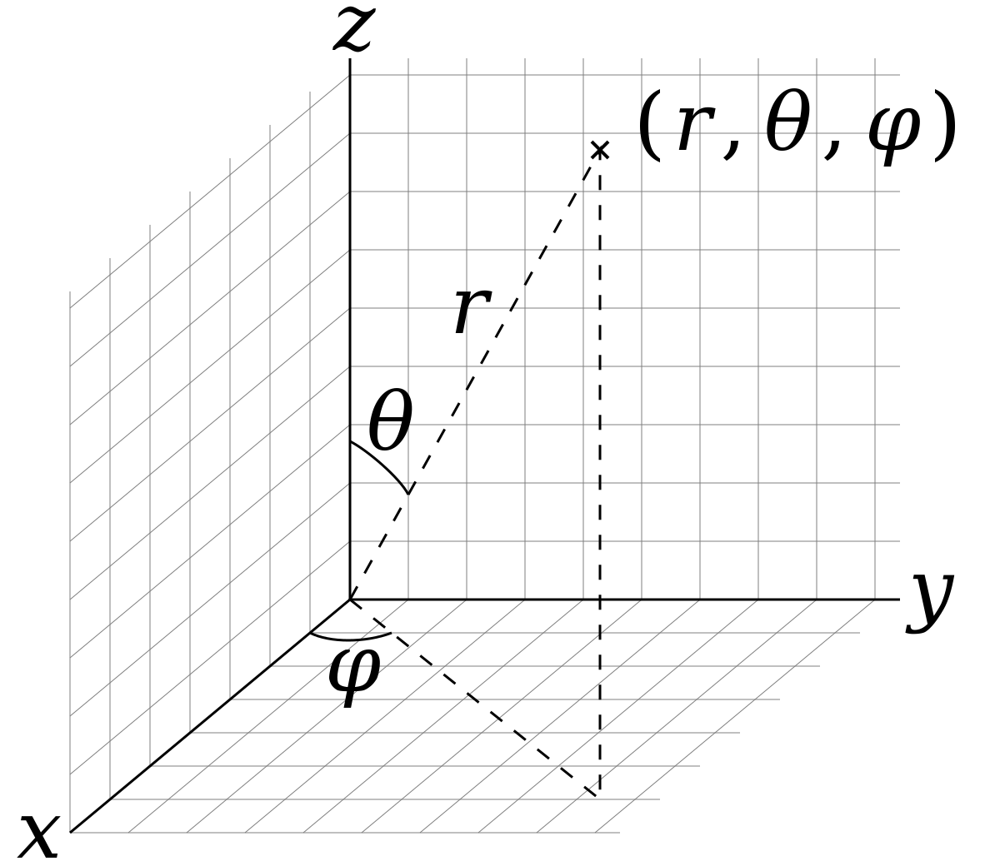
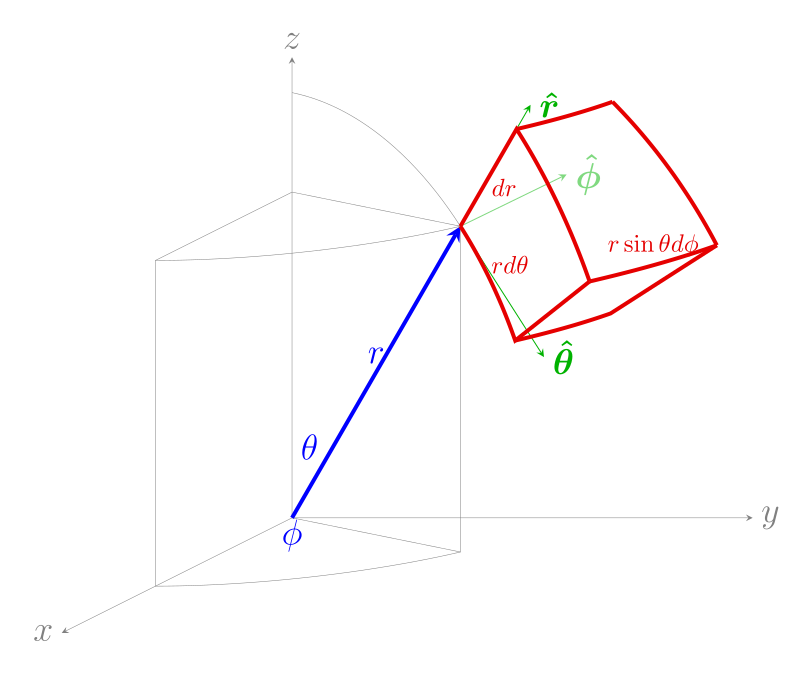

alias:: 球坐标系, 球坐标, spherical coordinates

- [[球坐标系]]是利用[[球座标]] $(r,\theta,\phi)$ 表示一个[[点]] $p$ 在[[三维空间]]的 *位置* 的三维[[正交坐标系]]。下图显示了 *球座标* 的几何意义：*原点* 与 *点* $p$ 之间的[[径向距离]] $r$，*原点* 到 *点* $p$ 的连线与 *正z-轴* 之间的[[极角]]，以及 *原点* 到 *点* $p$ 的连线在 *xy-平面* 的[[投影线]]与 $正x-轴$ 之间的[[方位角]]。它可以被视为[[极坐标系]]的 *三维推广*。球座标的概念，延伸至高维空间，则称为[[超球座标]] .
  {:height 600/2, :width 520/2}
- ## 球坐标系下的微积分公式
	- [[面积元素]]
	  logseq.order-list-type:: number
		- 在[[球面]]上, 固定[[半径]], [[天顶角]]从 $\theta$ 到 $\theta+\mathrm{d}\theta$ , [[方位角]]从 $\varphi$ 到 $\varphi+\mathrm{d}\varphi$ 变化, 公式为：
		  logseq.order-list-type:: number
		  $$\mathrm{d}{S_r}=r^2\sin\theta\mathrm{d}\theta\mathrm{d}\varphi$$
		- 固定[[天顶角]] $\theta$ ，其他两个变量变化，则公式为
		  logseq.order-list-type:: number
		  $$
		  \mathrm{d}S_{\theta}=r\sin\theta\mathrm{d}r\mathrm{d}\varphi
		  $$
		- 固定方位角 $\varphi$，其他两个变量变化，则公式为
		  logseq.order-list-type:: number
		  $$
		  \mathrm{d}S_{\varphi}=r\mathrm{d}r\mathrm{d}\theta
		  $$
		- {:height 406, :width 337}
	- [[体积元素]]
	  logseq.order-list-type:: number
	  可从[[三重积分的球坐标变换公式]]得出, [[径向坐标]]从 $r$ 到 $r+\mathrm{d}r$, [[天顶角]]从 $\theta$ 到 $\theta+\mathrm{d}\theta$, 并且[[方位角]]从 $\varphi$ 到 $\varphi+\mathrm{d}\varphi$ 的公式为：
	  $$
	  \mathrm{d}V=r^2\sin\theta\:\mathrm{d}r\:\mathrm{d}\theta\:\mathrm{d}\varphi
	  $$
-