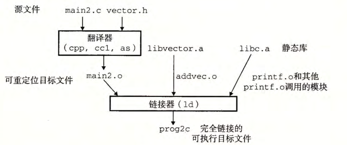

alias:: 静态库

- 所有的[[编译系统]]都提供一种机制，将所有相关的[[目标模块]]打包成为一个**单独的** *文件* ，称为[[静态库]], 它可以用做[[链接器]]的 *输入* 。
  当链接器构造一个 *输出* 的 可执行文件 时，它只复制 静态库 里**被应用程序引用的目标模块**。
  >减少了可执行文件在磁盘和内存中的大小。
- ## [[Archive]]
  id:: 6560cfcb-a0d0-4cf5-8369-cffd9bc7509a
	- 在[[Linux]]系统中，[[静态库]]以一种称为 存档 ([[archive]]) 的特殊文件格式 存放在 *磁盘* 中。存档文件是一组 连接起来的[[可重定位目标文件]]的 *集合* ，有一个头部用来描述每个成员目标文件的大小和位置 。
	  存档文件名由后缀[[.a]]标识。
	- #+BEGIN_PINNED
	  如下图中的例子，当链接器运行时，它判定 main2.o 引用了 addvec.o 定义的 addvec 符号，所以[[复制]] addvec .o 到可执行文件。因为程序不引用任何由 multvec.o 定义的符号，所以链接器就不会复制这个模块到可执行文件。链接器还会复制江 be.a 中的 printf.o 模块，以及许多 C 运行时系统中的其他模块。
	  
	  #+END_PINNED
-