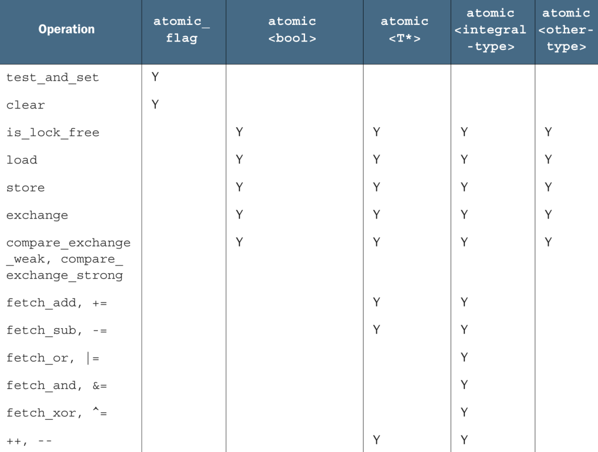

- `std::atomic` 是 C++11 中引入的一个模板类，用于提供[[原子操作]]。原子操作是指在多线程环境中不可被中断的操作，确保在读取、修改、写入变量时不会被其他线程打断，从而避免[[竞态条件]]。使用 `std::atomic` 可以安全地在多个线程之间共享和修改数据，而不需要使用[[互斥锁]]。
- ### 基本用法
  `std::atomic` 类模板可以用于基本数据类型（如 `int`、`float`、指针等），也可以用于用户自定义的类型，前提是这些类型满足`std::atomic`对类型的要求（例如，必须是可拷贝构造的）。
  
  下面是一个使用 `std::atomic` 的简单示例：
  
  ```cpp
  #include <iostream>
  #include <atomic>
  #include <thread>
  #include <vector>
  
  std::atomic<int> counter(0); // 原子变量初始化为0
  
  void increment(int n) {
    for (int i = 0; i < n; ++i) {
        counter.fetch_add(1, std::memory_order_relaxed); // 原子地增加counter的值
    }
  }
  
  int main() {
    std::vector<std::thread> threads;
    int numThreads = 10;
    int incrementsPerThread = 100;
  
    // 创建并启动线程
    for (int i = 0; i < numThreads; ++i) {
        threads.emplace_back(increment, incrementsPerThread);
    }
  
    // 等待所有线程完成
    for (auto& t : threads) {
        t.join();
    }
  
    std::cout << "Expected: " << numThreads * incrementsPerThread << std::endl;
    std::cout << "Actual: " << counter.load() << std::endl; // 原子地读取counter的值
  
    return 0;
  }
  ```
  
  在这个示例中，`counter` 是一个全局的 `std::atomic<int>` 实例。多个线程并发执行 `increment` 函数，每个线程将 `counter` 的值原子地增加 `incrementsPerThread` 次。程序的输出展示了通过原子操作保证了数据一致性。
- ### 内存顺序
	- `std::atomic` 提供了不同的内存顺序选项，用于在保证原子操作的同时，控制编译器和硬件的优化程度。这些选项包括：
		- `std::memory_order_relaxed`：放宽内存顺序，允许重排序，但保证操作的原子性。
		- `std::memory_order_acquire`：在当前操作之前的读操作不能被重排序到当前操作之后。
		- `std::memory_order_release`：当前操作之后的写操作不能被重排序到当前操作之前。
		- `std::memory_order_acq_rel`：同时具有 `acquire` 和 `release` 的效果。
		- `std::memory_order_seq_cst`：顺序一致性内存顺序，是最严格的顺序，保证所有线程看到相同顺序的操作。
	- 选择合适的内存顺序可以在保证正确性的基础上提高程序性能。对于大多数用途，使用默认的 `std::memory_order_seq_cst` 已经足够安全，虽然它可能不是最高效的选项。
- ## 成员
	- ### 静态成员类型
		- **`is_always_lock_free`**：静态常量表达式，如果相应硬件上的原子类型X是无锁类型，那么`X::is_always_lock_free` 将返回 `true`。例如：给定目标硬件平台 `std::atomic<int>` 无锁，那么 `std::atomic<int>::is_always_lock_free` 将会返回 `true` 。
		  不过因为 `std::atomic<uintmax_t>` 这是一个运行时属性，所以 `std::atomic<uintmax_t>::is_always_lock_free` 在该平台编译时可能为 false 。
			- 宏 `ATOMIC_BOOL_LOCK_FREE , ATOMIC_CHAR_LOCK_FREE , ATOMIC_CHAR16_T_LOCK_FREE , ATOMIC_CHAR32_T_LOCK_FREE， ATOMIC_WCHAR_T_LOCK_FREE ， ATOMIC_SHORT_LOCK_FREE , ATOMIC_INT_LOCK_FREE , ATOMIC_LONG_LOCK_FREE , ATOMIC_LLONG_LOCK_FREE` 和 `ATOMIC_POINTER_LOCK_FREE` 。它们指定了内置原子类型的无锁状态和无符号对应类型
			  (LLONG对应long long，POINTER对应所有指针类型)。如果原子类型不是无锁结构，那么值为0。如果原子
			  类型是无锁结构，那么值为2。如果原子类型的无锁状态在运行时才能确定，那么值为1。
	- ### 存储和加载
		- **`store`**：以原子方式替换存储的值。
		- **`load`**：以原子方式获取存储的值。
		- **`operator=`**：存储一个值，等同于调用 `store` 方法。
		- **`operator T`**：隐式转换操作，获取存储的值，等同于调用 `load` 方法。
	- ### 修改操作
		- **`exchange`**：以原子方式替换存储的值，并返回旧值。
		- **[[compare_exchange_weak()]]** 和 **[[compare_exchange_strong()]]**：比较存储的值是否与期望值相等，如果相等，则以原子方式替换为新的值。`compare_exchange_weak` 可能会因为假失败而需要重试，而 `compare_exchange_strong` 有更强的成功保证。
	- ### 算术和位操作
		- **[[fetch_add]]**、**[[fetch_sub]]**：对存储的值执行原子的加法或减法操作，并返回操作前的旧值。
		- **`fetch_and`**、**`fetch_or`**、**`fetch_xor`**：执行原子的位与、位或、位异或操作，并返回操作前的旧值。
		- **`operator++`**、**`operator--`**：提供原子的递增和递减操作。
		- **`operator+=`**、**`operator-=`**：提供原子的加法和减法赋值操作。
		- **`operator&=`**、**`operator|=`**、**`operator^=`**：提供原子的位与、位或、位异或赋值操作。
	- ### 其他成员函数
		- **`is_lock_free`**：查询某原子类型的操作是直接用的[[原子指令]]
		  ( 返回 `true` )，还是内部用了一个[[锁]]结构( 返回 `false` )。
		  原子操作可以替代互斥量，来完成同步操作。如果操作内部使用互斥量实现，那么不可能有性能的提升。
			- 只有 [[std::atomic_flag]] 类型不提供 `is_lock_free()` 。该类型是一个简单的布尔标志，并且在这种类型上的操作都是无锁的。当有一个简单无锁的布尔标志时，可以使用该类型实现一个简单的锁，并且可以实现其他基础原子类型。对 `std::atomic_flag` 明确初始化后，做查询和设置(使用 `test_and_set()` 成员函数)，或清除(使用 `clear()`成员函数)都很容易：无赋值，无拷贝，没有测试和清除，没有任何多余操作。
		- **`wait`**、**`notify_one`**、**`notify_all`**（[[C++20]] 新增）：允许原子对象在特定值上阻塞等待，以及唤醒正在等待的线程。
	- 除法、乘法和移位操作不在其中。因为，整型原子值通常用来作[[计数器]]，或者是[[掩码]]，所以以上操作的缺失显得不是那么重要。如果需要，可以使用 `compare_exchange_weak()` 完成。
- ### 示例
	- ```cpp
	  #include <atomic>
	  #include <iostream>
	  #include <thread>
	  
	  std::atomic<int> count(0);
	  
	  void increment() {
	    for (int i = 0; i < 10000; ++i) {
	        count.fetch_add(1);
	    }
	  }
	  
	  int main() {
	    std::thread t1(increment);
	    std::thread t2(increment);
	  
	    t1.join();
	    t2.join();
	  
	    std::cout << "Count: " << count.load() << std::endl;
	    return 0;
	  }
	  ```
	  
	  这个例子展示了使用 `std::atomic<int>` 来确保多线程环境下对整数的安全递增操作。
	  
	  `std::atomic` 提供的这些操作使得在无需互斥锁的情况下，进行线程安全的读写操作成为可能，特别适合于对性能要求较高的场景。
	- ### 使用 `std::atomic` 实现线程安全的单例模式
	  `std::atomic` 还可以用于实现[[线程安全的单例模式]]，确保单例对象只被初始化一次。
	  ```cpp
	  #include <atomic>
	  #include <mutex>
	  #include <memory>
	  
	  class Singleton {
	  public:
	    static std::shared_ptr<Singleton> getInstance() {
	        Singleton* tmp = instance.load(std::memory_order_acquire);
	        if (tmp == nullptr) {
	            std::lock_guard<std::mutex> lock(mutex_);
	            tmp = instance.load(std::memory_order_relaxed);
	            if (tmp == nullptr) {
	                tmp = new Singleton;
	                instance.store(tmp, std::memory_order_release);
	            }
	        }
	        return std::shared_ptr<Singleton>(tmp);
	    }
	  
	  private:
	    Singleton() {}
	    static std::atomic<Singleton*> instance;
	    static std::mutex mutex_;
	  };
	  
	  std::atomic<Singleton*> Singleton::instance(nullptr);
	  std::mutex Singleton::mutex_;
	  ```
	  在这个示例中，[[双检锁模式]]（Double-Checked Locking Pattern）与 `std::atomic` 结合使用，以确保单例对象的线程安全初始化。
- `std::atomic<>` 类模板不仅仅是一套可特化的类型，作为原发模板也可以使用[自定义类型]([[std::atomic<> 类模板]])创建对应的原子变量。因为是通用类模板，操作限制为 `load()` ， `store()` ，从用户类型赋值，转换为用户类型， `exchange()` ， `compare_exchange_weak()` 和`compare_exchange_strong()` 。
  每种函数类型的[操作]([[原子操作]])都有一个内存序参数，这个参数可以用来指定存储的顺序。现在，只需要知道操作分为三类：
	- 1. Store操作，可选如下内存序： memory_order_relaxed , memory_order_release , memory_order_seq_cst 。
	- 2. Load操作，可选如下内存序： memory_order_relaxed , memory_order_consume , memory_order_acquire ,
	  memory_order_seq_cst 。
	- 3. Read-modify-write(读-改-写)操作，可选如下内存序： memory_order_relaxed , memory_order_consume ,
	  memory_order_acquire , memory_order_release , memory_order_acq_rel , memory_order_seq_cst 。
- 每一个原子操作，默认的内存序都是memory_order_seq_cst。
- 子类型的所有操作都是原子的，而赋值和拷贝调用了两个对象，这就就破坏了操作的原子性。这样的话，拷贝构造和拷贝赋值都会将第一个对象的值进行读取，然后再写入另外一个。对于两个独立的对象，这里就有两个独立的操作了，合并这两个操作必定是不原子的。因此，操作就不被允许。
- 
	-