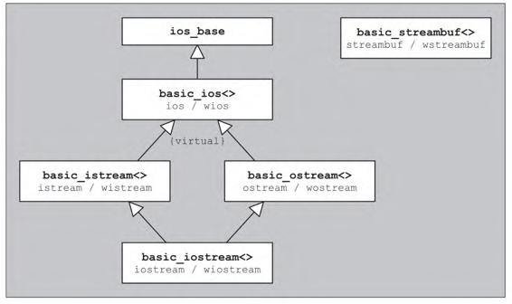

alias:: 流

- 基本的[[stream]]类层次体系：
  {:height 344, :width 566}
- ## 全局性的 stream 对象
	- [[IOStream]]程序库定义了数个[[全局]]性的 stream 对象。
	  它们分别以`char`或对应的`wchar_t`作为字符类型，用来访问标准I/O通道。
	- |名称|类型|用途|
	  |--|--|--|
	  ||||