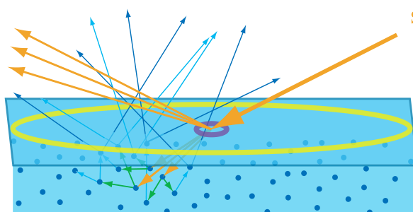

alias:: subsurface-scattered light, subsurface-scattered, 次表面散射

- [[metals]] [[reflect]] most incident light and quickly [[absorb]] the rest. 
  In contrast, [[non-metals]] exhibit a wide variety of [[scattering]] and [[absorption]] behaviors.
- Materials with low scattering and absorption are [[transparent]], transmitting any refracted light through the
  entire object.
- 简单的渲染这种材质的方法就是像[[标准光照模型]]中处理[[透明]]的方法。
- the transmitted light undergoesmultiple scattering and absorption events until finally some of it is **re-emitted back from the surface**. 
  As shown in this example, most of the *absorption* is at **longer** [[wavelengths]], leaving primarily *short-wavelength [[blue]] light*. 
  In addition, it scatters from particles inside the material. Eventually some refracted light is scattered back out of the surface, as shown by the blue arrows exiting the surface in various directions.
  
- ## Entry-Exit Distance and Shading Scale
- The [[subsurface-scattered light]] exits the surface at varying [[distances]] from the entry point.
- The distribution of [[entry-exit distances]] depends on the [[density]] and *properties* of the [[scattering particles]] in the material.
- The relationship between [these distances]([[entry-exit distances]]) and the [[shading scale]] is important. 
  id:: 6507c8fc-7ddf-4f3f-b021-586371494590
  If the [[entry-exit distances]] are **small** compared to the [[shading scale]], they can be assumed to be **effectively zero** for shading purposes.
- This allows [[subsurface scattering]] to be **combined** with [[surface reflection]] into a [[local shading model]], with *outgoing light* at a *point* **depending only on** *incoming light* at the **same point**.
- However, since [[subsurface-scattered light]] has a significantly **different appearance** than [[surface-reflected light]], it is convenient to divide them into **separate shading terms**.
  The [[specular term]] models [[surface reflection]], and the [[diffuse term]] models [[local subsurface scattering]].
- If the [[entry-exit distances]] are **large** compared to the [[shading scale]], then specialized rendering techniques called [[ global subsurface scattering]] techniques are needed to capture the visual effect of light **entering the surface at one point** and **leaving it from another**.
- The figure shows we are rendering a material with subsurface scattering. Two different sampling sizes are shown, in yellow and purple.
  {:height 308, :width 583}
- It is important to note that [local]([[local subsurface scattering]]) and (global)([[global subsurface scattering]]) subsurface scattering techniques model exactly the **same physical phenomena**.
- The best choice for each situation depends **not  only on the material properties but also on the [[scale of observation]]**.
-