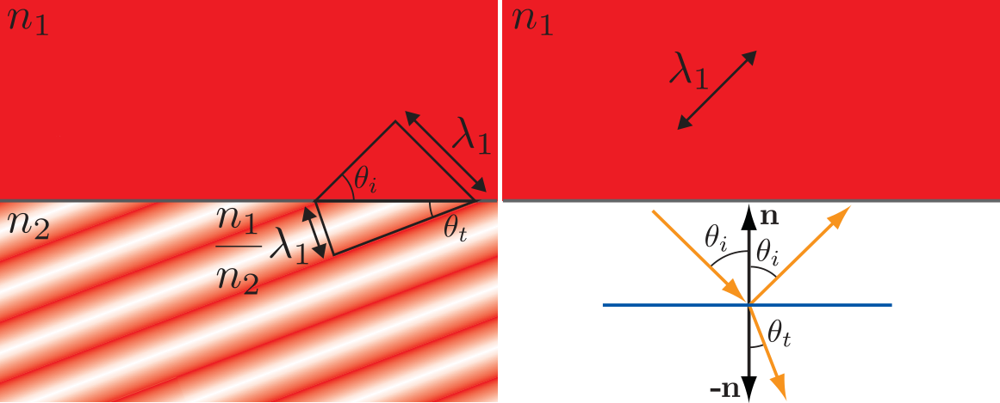
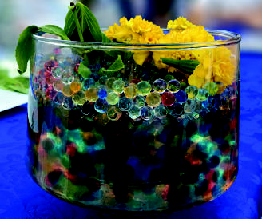
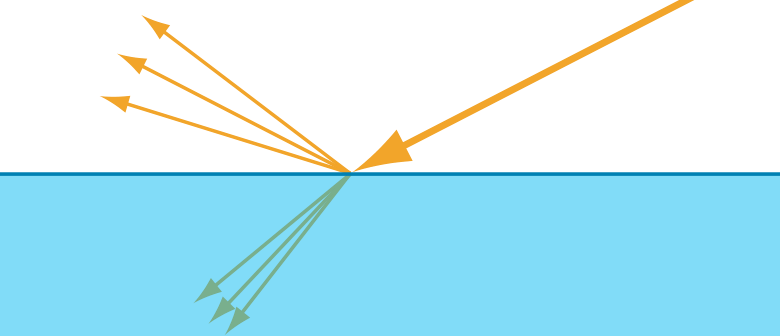

- From an [[optical]] perspective, an object surface is a *two-dimensional interface* **separating *volumes* with different [[index of refraction]] values**.
  >  In typical rendering situations, the outer volume contains air, with a refractive index of about $1.003$, often assumed to be $1$ for simplicity. The refractive index of the inner volume depends on the substance from which the object is made.
- When a [[light wave]] strikes a surface, two aspects of that surface have important
  effects on the result: the [[substances]] on **either side**, and the [[surface geometry]].
- # Substance
	- assuming the simplest-possible [[surface geometry]], a perfectly [[flat plane]].
	- We denote the index of refraction on the *outside* (the side where the [[incoming wave]] originates) as $n_1$ and the [[index of refraction]] on the *inside* (where the wave will be transmitted **after passing through the surface**) as $n_2$.
	- The *boundary conditions* require that the [[electrical field]] [[component]] *parallel* to the *surface is *continuous*. This has several implications:
		- At the surface, any [[scattered waves]] must be either [[in phase]], or $180^◦$ [[out of phase]], with the [[incident wave]].
		  logseq.order-list-type:: number
		  This restricts the *scattered waves* to go in only two possible directions, one continuing forward into the surface and one retreating away from it. 
		  The first of these is the [[transmitted wave]], and the second is the [[reflected wave]].
		- The [[scattered waves]] must have the same [[frequency]] as the [[incident wave]].
		  logseq.order-list-type:: number
		- The [[phase velocity]]—the speed the wave travels through the medium—changes **proportionally to** the [[relative index of refraction]] ($n_1/n_2$) . 
		  logseq.order-list-type:: number
		  Since the [[frequency]] is fixed, the [[wavelength]] also changes proportionally to $(n_1/n_2)$ .
	- The final result is shown in figure:
	  
	  The left side of the figure shows a side view with the incident wave coming in from the upper left. The *intensity of the red bands* indicate *wave phase*. The spacing of the waves below the surface is changed proportionally to the ratio ($n1/n2$), which in this case is 0.5. The *phases* *line up* along the surface, so the change in spacing bends ([[refracts]]) the transmitted wave direction. The triangle construction shows the derivation of [[Snell’s law]]. 
	  For clarity, the upper right of the figure shows the [[reflected wave]] separately. It has the same wave spacing as the incident wave, and thus its direction has the same angle with the surface normal. 
	  The lower right of the figure shows the wave direction vectors.
	- The [[reflected]] and [[incident wave directions]] have the same angle $θ_i$ with the surface [[normal]]. 
	  The [[transmitted wave direction]] is [[refracted]] at an *angle* $θ_t$, which has the following relation to $θ_i$:
	  $$\sin\theta_t=\frac{n_1}{n_2}\sin\theta_i$$
	  This equation for [[refraction]] is known as [[Snell’s law]]. It is used in global refraction effects.
	- > [[Reftaction]] it happens at the surface of opaque objects as well. 
	  In the case of [[metals]], the interior contains many free electrons (electrons not bound to molecules) that absorb the [[refracted light]] energy and **redirect** it into the [[reflected wave]].
	  This is why [[metals]] have high [[absorption]] as well as high [[reflectivity]].
	- ## Gradual Change in Index of Refraction
	- A more **gradual change** in [[index of refraction]] does not split the light, but instead causes its path to **curve**, in a continuous analog of the discontinuous bend that occurs in refraction. This effect commonly can be seen when air density varies due to temperature, such as [[mirages]] and heat distortion, as shown in figure.
	  
	- Even an object with a well-defined boundary will have no visible surface if it is
	  immersed in a substance with the same index of refraction. 
	  
- # Geometry
	- ## [[surface irregularity]] 
	  surface irregularities **much smaller** than a wavelength have no effect on light,
	  and surface irregularities **much larger** than a wavelength effectively tilt the surface
	  without affecting its local flatness. 
	  Only irregularities with a size in the range of 1–100 wavelengths cause the surface to behave differently than a [[flat plane]], via a phenomenon called [[diffraction]] .
	- ## [[geometrical optics]]
		- In rendering, we typically use [[geometrical optics]], which ignores *wave effects* such as
		  [[interference]] and [[diffraction]]. 
		  This is equivalent to assuming that all surface irregularities are either smaller than a light wavelength or much larger.
		  In [[geometrical optics]] **[[light]] is modeled as [[rays]] instead of [[]waves]]**. At the point a light ray intersects with a *surface* , the surface is treated locally as a [[flat plane]].
	- ## Microgeometry
		- When these [[irregularities]] are too small to be individually rendered—in other words, smaller than a [[pixel]]—we refer to them as [[microgeometry]] .
		- The effect of the [[microgeometry]] is to change that [[normal]] at different points on the surface, thus changing the [[reflected]] and [[refracted light directions]].
		- Even though each specific point on the surface reflects light in only a single direction, each pixel covers many surface points that reflect light in various directions. The appearance is driven by the **aggregate result** of all the different reflection directions.
	- ## [[roughness]]
		- rather than modeling the microgeometry explicitly, we treat it [[statistically]] and view the surface as having a [[random distribution]] of microstructure [[normals]].
		- As a result, we model the surface as reflecting (and refracting) light in a *continuous spread of directions*. 
		  The *width* of this spread depends on the statistical variance of the microgeometry [[normal]] vectors—in other words, the surface microscale [[roughness]].
		  {:height 317/2, :width 718/2}
	- ## [[subsurface scattering]]
-