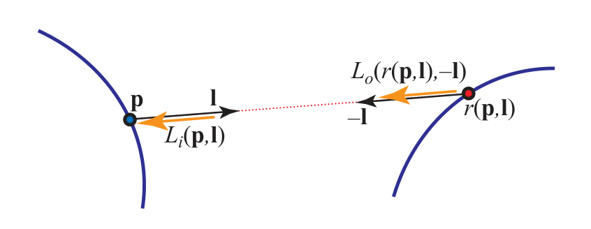

alias:: rendering equation

- [[The reflectance equation]] is a restricted special case of the full [[rendering equation]].
- # Definition
	- Different forms have been used for [[the rendering equation]]. We will use this version:
	- $$
	  L_o(\mathbf{p},\mathbf{v})=L_e(\mathbf{p},\mathbf{v})+\int_{\mathbf{l}\in\Omega}f(\mathbf{l},\mathbf{v})L_o(r(\mathbf{p},\mathbf{l}),-\mathbf{l})(\mathbf{n}\cdot\mathbf{l})^+d\mathbf{l}
	  $$
	- where the new elements are $L_e(\bold p, \bold v)$, which is the [[emitted radiance]] from the [[surface location]] $\bold p$ in [[direction]] $\bold v$,
	- and the
	  following replacement:
	  $$
	  L_{i}(\mathbf{p},\mathbf{l})=L_{o}(r(\mathbf{p},\mathbf{l}),-\mathbf{l})
	  $$
	  This term means that the [[incoming radiance]] into [[location]] $\bold p$ from direction $\bold l$ is equal to the [[outgoing radiance]] from **some other point in the opposite direction** $−\bold l$. 
	  In this case, the *other point* is defined by the [[ray casting function]] $r(\bold p, \bold l)$. This *function* returns the [[location]] of the **first** *surface point* hit by a *ray* cast from $\bold p$ in direction $\bold l$. 
	  See Figure:
	  {:width 846/2, :height 328/2}