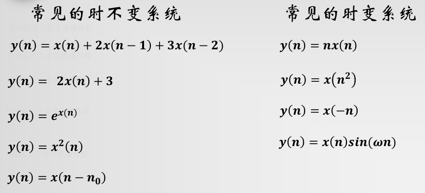

alias:: 时不变系统

- 如果[[系统]]对输入信号的运算关系  $T[\cdot]$  在整个运算过程中不随时间变化, 或者说系统对于输入信号的响应与信号加于系统的时间无关, 则这种系统称为 *时不变系统* , 用公式表示如下:
  id:: 65cf5fb2-b0bb-4111-b9af-5bade236ae05
  $$\left.\begin{array}{l}
  y(n)=T[x(n)] \\
  y\left(n-n_{0}\right)=T\left[x\left(n-n_{0}\right)\right]
  \end{array}\right\} \tag{1}$$
  式中  $n_{0}$  为任意整数。
	- 检查一个系统是否是时不变系统, 就是检查其是否满足 $(1)$ 式。
	- >  $y(n-n_0)$ 代表对输入信号先进行移位运算后系统运算，$T[x(n-n_0)]$ 代表对输入信号先进行系统运算后移位运算，是看这二者是否相等。
- 
- ## 例子
	- 请问y(n)=x(-n)是时变系统还是时不变的？ - Maple的回答 - 知乎
	  https://www.zhihu.com/question/25311824/answer/77292034
	- $y(n)=x(n^2)$ 为什么是时变系统？
		- 对于延迟输入的信号 $x(n-n_0)$ ，