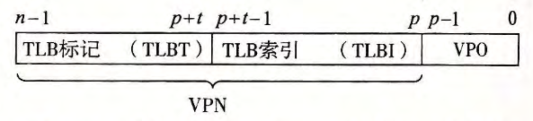
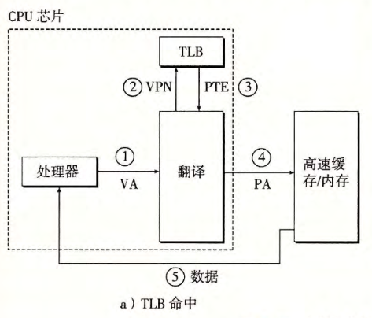
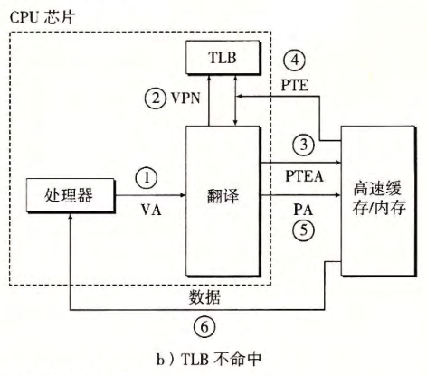

alias:: 翻译后备缓冲区, TLB

- 如果每次 CPU 产生一个虚拟地址， MMU 就必须查阅一个在 高速缓存/主存 中的 PTE, 以便将虚拟地址翻译为物理地址，在最糟糕的情况下，这会要求从[[内存]]多取一次数据，代价是**几十到几百个周期**。如果 PTE 碰巧缓存在[[L1]]中，那么开销就下降到 **1 个或 2 个周期**。
  然而，许多系统都试图消除即使是这样的开销，它们在[[MMU]]中包括了一个关于[[PTE]]的小的[[缓存]]，称为[[翻译后备缓冲器]](TLB) 。
- [[TLB]]是一个小的、[[虚拟寻址]]的[[缓存]]，其中**每一行**都保存着一个由单个[[PTE]]组成的 *块* 。TLB通常有高度的 *相联度* 。
  如图所示， 用于 *组选择* 和 *行匹配* 的 *索引* 和 *标记* 字段是从虚拟地址中的[[虚拟页号]]中提取出来的。
  如果 TLB 有 $T=2^t$ 个*组* ，那么[[TLB 索引]](TLBI) 是由[[VPN]]的 $t$ 个**最低位**组成的，而[[TLB 标记]](TLBT) 是由[[VPN]]中剩余的 *位* 组成的，用来区别可能映射到同一个[[TLB 组]]的不同的[[VPN]]。
	- 
	- TLB 是利用 VPN 的位进行虚拟寻址的。因为 TLB 有 4 个组，所以 VPN 的低 2 位就作为组索引 (TLBI) 。 VPN 中剩下的高 6 位作为标记 (TLBT),
- 下图展示了当[[TLB 命中]]时（通常情况）所包括的步骤。这里的关键点是，**所有的 地址翻译 步骤都是在芯片上的[[MMU]]中执行的**，因此非常快。
	- 笫 1 步： CPU 产生一个虚拟地址。
	- 第 2 步和笫 3 步： MMU 从 TLB 中取出相应的 PTE 。
	- 第 4 步： MMU 将这个虚拟地址翻译成一个物理地址，并且将它发送到 高速缓存 ／ 主存。
	- 第 5 步：高速缓存 ／ 主存将所请求的数据字返回给 CPU 。
	- 
- 当[[TLB 不命中]]时， MMU 必须从 L1 缓存中取出相应的 PTE, 如下图所示。新取出的 PTE 存放在 TLB 中，可能会覆盖一个已经存在的条目。
	- 