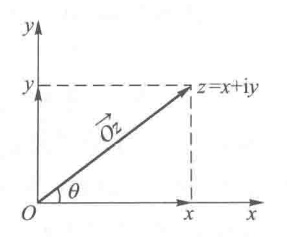

alias:: 复数的三角形式

- # Definition
	- 设$z=x+yi$，在[[complex plane]]上的点$Z(x,y)$表示中的[[复数]]$z=x+yi$，如图所示：
	  {:height 245, :width 287}
	- 设点$Z$到[[原点]]$O$的距离为$r$, 称为$z$的[[模]]，记作$\left |z\right |$。容易算出
	  $$r=\left |z\right |=\sqrt{x^2+y^2}$$
	- 从**实轴**$x$轴的正方向到向量$OZ$的转角为$\theta$, 称为$z$的一个[[辐角]]。辐角有无穷多个值，其中任意两个值相差$2\pi$的整数倍。我们用$\mathrm{Arg}\ z$表示。
	  $\mathrm{arg}\ z$称为[[主辐角]], $-\pi<\mathrm{arg}\ z\le\pi$, 表示$z$的*辐角*中介于$-\pi$与$\pi$之间的那一个, 其值为：
	  $$
	  \arg z=\theta=\begin{cases}\arctan\frac{-y}{x},&x>0,y\text{ 为任意实数},
	  \\\\\frac{\pi}{2},&x=0,y>0,
	  \\\\\arctan\frac{y}{x}+\pi,&x<0,y\geqslant0,
	  \\\\\arctan\frac{y}{x}-\pi,&x<0,y<0,
	  \\\\-\frac{\pi}{2},&x=0,y<0.\end{cases}
	  $$
	- 根据[[trigonometric function]]的定义得，
	  id:: 9a45ad64-11cd-4613-ae84-08db72d6699a
	  \begin{aligned}
	  x=r\cos\theta\\
	  \ y=r\sin\theta
	  \end{aligned}
	  于是复数$z=x+yi$又可以表示成
	  $$z=r(\cos\theta+i\sin\theta)$$
	  称为[[trigonometric form of complex number]]。式中$\theta=\mathrm{arg}\ z$。
- > 复数无法比大小，所以对于实数成立的设计比大小的定理，对于复数都不一定成立
- ## 乘法
	- $$z_1\cdot z_2=r_1r_2[\cos(\theta_1+\theta_2)+i\sin(\theta_1+\theta_2)]$$
	- $$\mid z_1\cdot z_2\mid=r_1r_2=\mid z_1\mid\mid z_2\mid$$
	  $$\operatorname{Arg}(z_1\cdot z_2)=\theta_1+\theta_2+2k\pi=\operatorname{Arg}z_1+\operatorname{Arg}z_2$$
	- [[乘幂]]即为[[棣莫弗公式]]。
- ## 除法
  当$z_2\ne0$时有
	- $$\frac{z_1}{z_2}=\frac{r_1}{r_2}\Big[\cos\left(\theta_1-\theta_2\right)+\mathrm{i}\sin\left(\theta_1-\theta_2\right)\Big]$$
	- $$\left|\frac{z_1}{z_2}\right|=\frac{\mid z_1\mid}{\mid z_2\mid}$$
	  $$\text{Arg}\frac{z_1}{z_2}=\text{Arg}z_1-\text{Arg}z_2$$
	- > 此即为[[向量除法]]。
- ## 方根
	- 设
	  $$\omega^n=z$$
	  $$\rho^n=r$$
	  $$n\phi=\theta+2k\pi$$
	  可得
	- $$w=\left|z\right|^{\frac{1}{n}}\left\{\cos\left[\frac{1}{n}(\arg z+2k\pi)\right]+\mathrm{i}\sin\left[\frac{1}{n}(\arg z+2k\pi)\right]\right\},\quad k=0,1,\cdots,n-1$$
	- $$\rho=r^{\frac{1}{n}}$$
	  $$\quad\varphi=\frac{1}{n}(\arg z+2k\pi)$$
	- 此处$\rho=r^{\frac{1}{n}}$是$r$在[[实数]]意义下的$n$次根，即[[算数根]]。
	- 其中$\phi$的任意两个值相差不是$2\pi$的*整数倍*，所以任意一个不为$0$的*复数* 开$n$[[次方]]有$n$个[[根]]。
	  w的n个*根*会**均匀**的分布在以$\rho$为[[模长]]的圆周（$2\pi$）上。
		- >[例子](https://www.bilibili.com/video/BV1w54y1m7Wb?t=662.6&p=12)
	-
-
-