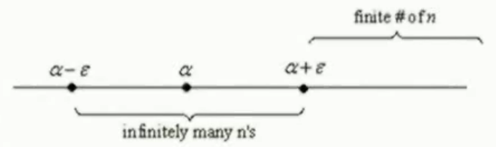

alias:: upper limits, limsup

- # Definition
	- Let $\{s_n\}$ be a [[sequence]] of [[real numbers]] with the following property: 
	  For every [[real]] $M$ there is an [[integer]] $N$ such that $n\ge N$ implies $s_n\ge M$. We then write
	  $$s_n\to+\infty$$
		- >$(\forall M\in\mathbb{R})(\exist N\in\mathbb{Z})(\forall n\ge N)s_n\ge M$
	- Similarly, if for every real $M$ there is an integer $N$ such that $n\le N$ implies $s_n\le M$, we write  
	  $$s_n\to-\infty$$
	- Let $\{s_n\}$ be a **sequence** of **real numbers**. Let $E$ be the **set** of [[numbers]] $x$ (in the [[extended real number system]]) such that $s_{n_k}\to x$ for some [[subsequence]] $\{s_{n_k}\}$. This $E$ contains all [[subsequential limits]], plus possibly the numbers $+\infty, -\infty$.
	  id:: 64744536-d5fc-4c90-bc23-d2c7dfc76e8b
	  We now put 
	  $$s^* = \mathrm{sup}\ E$$
	  $$s_* = \mathrm{inf}\ E$$
	  The **numbers** $$s^*, s_*$$ are called the [[upper limit]] and [[lower limit]] of $\{s_n\}$; we use the notation 
	  $$\limsup_{n\to\infty}\ s_n= s^*$$
	  $$\liminf_{n\to\infty}\ s_n= s_*$$
# Theorem
	- [[upper limit]] and [[lower limit]] always exist.
	  logseq.order-list-type:: number
	- ((64744536-d5fc-4c90-bc23-d2c7dfc76e8b)). Then $s^*$ has the following two properties:
	  logseq.order-list-type:: number
		- $s^*\in E$.
		  logseq.order-list-type:: number
		- $(\forall a > s^*)(\exist N\in\mathbb{N})(\forall n\ge N)s_n<a$.
		  logseq.order-list-type:: number
		- > $a\in\{s_n\}$ but $a\notin E$. 
		  > It means if $\exist a > s^*$, there at least are [[infinite]] elements of $\{s_n\}$ less than $a$.
		  
		- Moreover, $s^*$ is the **only** number with these two properties.
		- Of course, an analogous result is true for $s_*$.
	- If $s_{n} \leq t_{n}$ for $n \geq N$, where $N$ is **fixed**, then
	  logseq.order-list-type:: number
	  \begin{array}{c}
	  \liminf _{n \rightarrow \infty} s_{n} \leq \liminf _{n \rightarrow \infty} t_{n} \\
	  \limsup _{n \rightarrow \infty} s_{n} \leq \limsup _{n \rightarrow \infty} t_{n} 
	  \end{array}
	- Let $\left\{a_{n}\right\},\left\{b_{n}\right\}$  and  $\left\{c_{n}\right\}$ be sequences of real numbers with $a_{n} \leq b_{n} \leq c_{n}, \forall n$. If $\lim _{n \rightarrow \infty} a_{n}=\lim _{n \rightarrow \infty} c_{n}=\alpha$, then $\lim _{n \rightarrow \infty} b_{n}=\alpha$.
	  logseq.order-list-type:: number
	- ${a_n}$ [[converges]] $\Longleftrightarrow\limsup a_n=\liminf a_n$.
	  logseq.order-list-type:: number
	- For any sequence $\{a_n\}$ of positive numbers,
	  logseq.order-list-type:: number
	  $$\liminf_{n\to\infty}\left|\frac{a_{n+1}}{a_n}\right|\leq\liminf_{n\to\infty}\sqrt[n]{\left|a_n\right|}\leq\limsup_{n\to\infty}\sqrt[n]{\left|a_n\right|}\leq \limsup_{n\to\infty}\left|\frac{a_{n+1}}{a_n}\right|$$
-