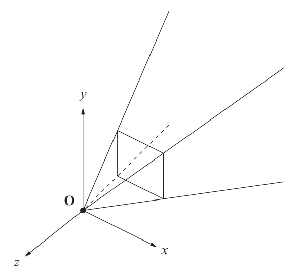

alias:: camera space ,eye space, 观察空间, 摄像机空间

- #Unity
- 以摄像机为 *原点* 的 *坐标系*
- 在 [[Unity]] 中[[观察空间]]使用的是[[右手坐标系]]，体现在[[观察空间]]的 $+z$ *轴* 指向的是[[摄像机]]的[[模型空间]]的[[后方]]，其余一致. 如下图所示
  {:width 592/2, :height 553/2}
  
  所以二者的矩阵由如下关系
  $$\boldsymbol M_\text{view}=\left[\begin{aligned}\begin{array}{c}
  1&0&0&0 \\
  0&1&0&0 \\
  0&0&-1&0 \\
  0&0&0&1
  \end{array}\end{aligned}\right]\boldsymbol M_\text{camera model}$$
- > [[Unity]]中选种 *摄像机* 显示的是 *摄像机* 的[[transform]]，而不是[[模型空间]]的。
- [[观察空间]]可以认为是[[模型空间]]的一个特例。