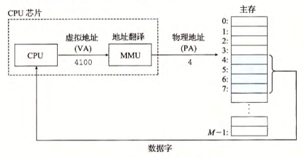

alias:: 虚拟寻址

- 现代处理器使用的是一种称为[[虚拟寻址]]的寻址形式。
  使用虚拟寻址， [[CPU]]通过生成一个[[虚拟地址]]来访问[[主存]]，这个虚拟地址在被送到内存之前先转换成适当的[[物理地址]]。
  将一个[[虚拟地址]]转换为[[物理地址]]的任务叫做[[地址翻译]]。就像[[异常处理]]一样，地址翻译需要 CPU硬件 和[[操作系统]]之间的紧密合作。 
  CPU芯片上叫做[[内存管理单元]](MMU)的专用硬件，利用存放在主存中的 *查询表* 来 动态[翻译]([[地址翻译]])虚拟地址 ，该表的内容由[[操作系统]]管理。
- 