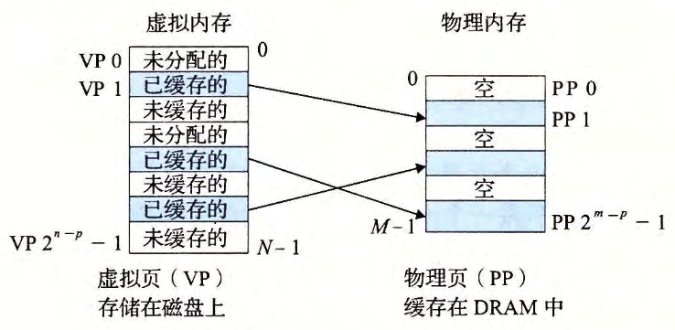
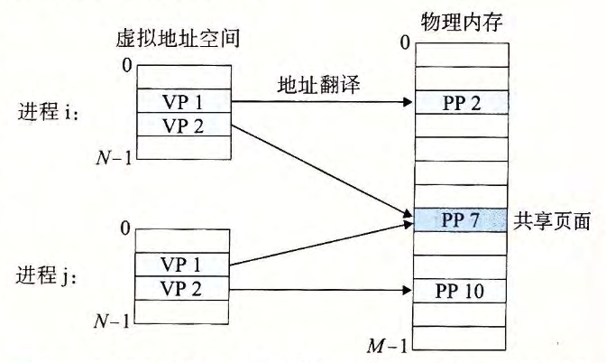
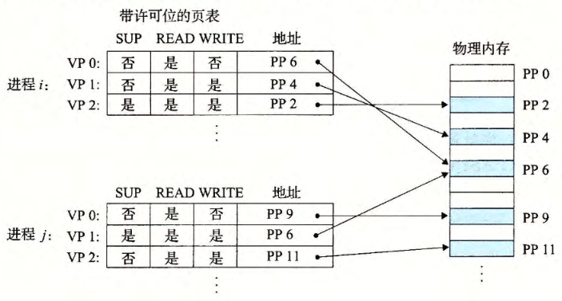

alias:: 虚拟内存, 虚拟内存系统

- 虚拟内存是[[硬件异常]]、[[硬件地址翻译]]、[[主存]]、[[磁盘文件]]和[[内核软件]]的完美交互，它为每个[[进程]]提供了一个**大的、一致的和私有的**[[地址空间]]。
  通过一个很清晰的机制，虚拟内存提供了三个重要的能力：
	- 它将[[主存]]看成是一个存储在[[磁盘]]上的[[地址空间]]的[[高速缓存]]，在主存中只保存活动区域，并根据需要在磁盘和主存之间来回传送数据，通过这种方式，它高效地使用了主存。
	  logseq.order-list-type:: number
	- 它为每个进程提供了一致的地址空间，从而简化了内存管理。
	  logseq.order-list-type:: number
	- 它保护了每个进程的地址空间**不被其他进程破坏**。
	  logseq.order-list-type:: number
	- collapsed:: true
	  #+BEGIN_TIP
	  之所以要理解虚拟内存，是因为虚拟内存是：
	  #+END_TIP
		- 核心的。虚拟内存遍及计算机系统的所有层面，在硬件异常、汇编器、链接器、加载器、共享对象、文件和进程的设计中扮演着重要角色。
		  logseq.order-list-type:: number
		- 强大的。虚拟内存遍及计算机系统的所有层面，在硬件异常、汇编器、链接器、加载器、共享对象、文件和进程的设计中扮演着重要角色。
		  logseq.order-list-type:: number
		- 危险的。如果虚拟内存使用不当，应用将遇到复杂危险的与内存有关的错误。例如，一个带有错误指针的程序可以 立即崩溃千＂段错误”或者“保护错误。
		  logseq.order-list-type:: number
- # [[地址空间]]
- # VM 作为缓存工具
	- ## 虚拟页
	  概念上而言，虚拟内存 被组织为一个由存放在[[磁盘]]上的 N个连续的字节大小的单元 组成的[[数组]] 。 每[[字节]]都有一个唯一的[[虚拟地址]]，作为到 数组 的索引。
	  [[磁盘]]上数组的内容被缓存在[[主存]]中 。 和存储器层次结构中其他缓存一样，磁盘（较低层）上的数据被分割成[[块]]，这些块作为[[磁盘]]和[[主存]]（较高层）之间的 传输单元 。VM系统 通过将 虚拟内存 分割为称为[[虚拟页]](VP) 的大小固定的 块 来处理这个问题 。 每个虚拟页的大小为 $P=2^p$ 字节 。
	- ## 物理页
	  类似地，[[物理内存]]被分割为[[物理页]](PP) , 大小也为 $P$ 字节。
	- 在任意时刻，[[虚拟页面]]的集合都分为三个不相交的子集：
		- [[未分配页]]： VM 系统还未分配（或者创建）的页 。 未分配的块没有任何数据和它们相关联，因此也就**不占用任何[[磁盘]]空间**。
		  logseq.order-list-type:: number
		- [[缓存页]]：当前已缓存在[[物理内存]]中的已分配页 。
		  logseq.order-list-type:: number
		- [[未缓存页]]：未缓存在[[物理内存]]中的已分配页 。
		  logseq.order-list-type:: number
		- logseq.order-list-type:: number
		  #+BEGIN_PINNED
		  下图的示例展示了一个有 8 个虚拟页的小虚拟内存。
		  {:height 301, :width 598}
		  #+END_PINNED
	- ## [[DRAM]]
		- 因为大的[[不命中处罚]]和 访问第一个字节的开销 ，[[虚拟页]]往往很大，通常是 4KB~2MB 。由于大的不命中处罚， DRAM缓存是[[全相联]]的，即任何[[虚拟页]]都可以放置在任何的[[物理页]]中。
		  不命中时的[[替换策略]]也很重要，因为替换错了虚拟页的处罚也非常之高。因此，与硬件对[[SRAM]]缓存相比，[[操作系统]]对[[DRAM]]缓存使用了更复杂精密的 替换算法 。
		  最后，因为对磁盘的访问时间很长， DRAM 缓存总是使用[[写回]]，而不是[[直写]]。
	- ## [[页表]]
	- ## VM 的[[局部性]]
		- 尽管在整个运行过程中程序引用的不同页面的总数可能超出 物理内存 总的大小，但是[[局部性原则]]保证了在任意时刻，程序将趋向于在一个较小的[[活动页面]]集合上工作，这个集合叫做[[工作集]]。
		  在初始开销，也就是将 工作集页面 调度到 内存 中之后，接下来对这个工作集的引用将会 命中 ，而不会产生额外的磁盘流量。
		  只要我们的程序有好的[[时间局部性]]，虚拟内存系统就能工作得相当好。
		- 但是，当然不是所有的程序都能展现良好的 时间局部性 。如果[[工作集]]的大小超出了[[物理内存]]的大小，那么程序将产生一种叫做[[抖动]]的状态，这时页面将**不断地换进换出**。
		-
- # VM 作为内存管理工具
	- [[操作系统]]**为每个[[进程]]提供了一个独立的[[页表]]**，因而也就是一个独立的[[虚拟地址空间]]。
	  id:: 6569d759-eece-4fbd-a4e4-efbefb89fb25
	  下图展示了这个基本思想：
		- 
		  id:: 6569d2a8-2178-4ce9-a708-655e0aa81640
		- #+BEGIN_NOTE
		  多个[[虚拟页面]]可以映射到同一个[[共享物理页面]]上。
		  #+END_NOTE
	- [[按需页面调度]]和 **独立的**[[虚拟地址空间]]的结合，对系统中[[内存]]的使用和管理造成了深远的影响。特别地， VM简化了链接和加载、代码和数据共享，以及应用程序的内存分配。
		- ## 简化[[链接]]
			- 独立的地址空间允许每个[[进程]]的[[内存映像]]使用相同的基本格式，而不管代码和数据实际存放在 物理内存 的何处。
			  例如，一个给定的 Linux系统上的每个进程都使用类似的内存格式。
			  这样的一致性极大地简化了[[链接器]]的设计和实现，允许链接器生成[[完全链接]]的可执行文件，这些可执行文件是独立于物理内存中代码和数据的最终位置的。
		- ## 简化[[加载]]
			- 虚拟内存简化向内存中加载[[可执行文件]]和[[共享对象文件]]。要把目标文件中[[.text]]和[[.data]]节加载到一个新创建的进程中， Linux加载器为代码和数据段分配虚拟页，把它们标记为无效的（即[未被缓存的]([[未缓存页]])），将[[页表条目]]指向[[目标文件]]中适当的位置。
			- 有趣的是，[[加载器]]**从不从[[磁盘]]到[[内存]]实际复制任何数据**。在每个页**初次被引用时**，要么是 CPU取指令时引用的，要么是一条正在执行的指令引用一个内存位置时引用的，[[虚拟内存系统]]会按照需要自动地调入数据页。
		- ## 简化[[共享]]
			- [[独立地址空间]]为操作系统提供了一个管理用户[[进程]]和[[操作系统]]自身之间共享的一致机制。
			- 一般而言，每个进程都有自己私有的代码、数据、堆以及栈区域，是不和其他进程共享的。在这种情况中，操作系统创建[[页表]]，将相应的[[虚拟页]]映射到**不相交的**[[物理页面]]。
			- 然而，在一些情况中，还是**需要进程来共享代码和数据**。
			  例如，每个进程必须调用相同的操作系统[[内核代码]]，而每个 C程序 都会调用 C标准库 中的程序。[[操作系统]]通过将**不同[[进程]]中**适当的[[虚拟页面]]映射到**相同的**[[物理页面]]，从而安排多个进程[[共享]]这部分代码的一个**副本**，而不是在每个进程中都包括单独的 内核 和 C标准库的副本，如[图](((6569d2a8-2178-4ce9-a708-655e0aa81640)))所示。
		- ## 简化[[内存分配]]
			- 虚拟内存为向用户进程提供一个简单的**分配额外内存的机制**。当一个运行在用户进程中的程序要求额外的[[堆空间]]时（如调用[[malloc]]的结果），操作系统分配一个适当数字（例如 $k$ )个**连续的**[[虚拟内存页面]]，并且将它们映射到[[物理内存]]。
- # VM 作为内存保护工具
  collapsed:: true
	- 任何现代计算机系统必须为操作系统提供手段来**控制对内存系统的访问**。
	  不应该允许一个[[用户进程]]修改它的 只读代码段 。而且也不应该允许它读或修改任何 内核中的代码和数据结构 。不应该允许它读或者写 其他进程的私有内存 ，并且不允许它修改任何与其他进程[[共享的虚拟页]]，除非所有的[[共享者]]都**显式地**允许它这么做（通过调用明确的[[进程间通信]][[系统调用]]）。
	- 就像我们所看到的，提供[[独立的地址空间]]使得区分不同进程的私有内存变得容易。
	  但是，[[地址翻译机制]]可以以一种自然的方式扩展到提供更好的访问控制。因为每次 CPU 生成一个地址时，地址翻译硬件都会读一个PTE, 所以通过在[[PTE]]上添加一些额外的[[许可位]]来**控制对一个虚拟页面内容的访问十分简单**。下图展示了大致的思想。
		- 
	- 在这个示例中，每个 PTE 中已经添加了三个[[许可位]]。 [[SUP 位]]表示进程是否必须运行在[[内核模式]]下才能访问该页。运行在[[内核模式]]中的进程可以访问**任何**页面，但是运行在[[用户模式]]中的进程**只**允许访问那些 SUP 为 0 的页面。
	  [[READ 位]]和[[WRITE 位]]控制对[[页面]]的[[读]]和[[写]]访问。
	  例如，如果进程 1 运行在用户模式下，那么它有读 VP 0 和读写 VP 1 的权限。然而，不允许它访问 VP 2 。
	  如果一条指令**违反了这些许可条件**，那么[[CPU]]就触发一个[[一般保护故障]]，将[[控制]]传递给一个[[内核]]中的[[异常处理程序]]。 Linux shell 一般将这种异常报告为[[段错误]]。
- # [[地址翻译]]