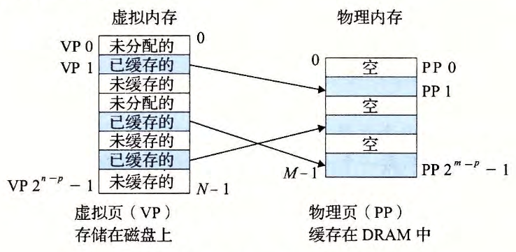

alias:: 虚拟页, VP, 虚拟页面, 虚拟内存页面

- 概念上而言，虚拟内存 被组织为一个由存放在[[磁盘]]上的 $N$ 个连续的字节大小的单元 组成的[[数组]] 。 每 字节 都有一个唯一的[[虚拟地址]]，作为到 数组 的索引。
  [[磁盘]]上数组的内容被缓存在[[主存]]中 。 和存储器层次结构中其他缓存一样，磁盘（较低层）上的数据被分割成[[块]]，这些 *块* 作为[[磁盘]]和[[主存]]（较高层）之间的 传输单元 。
  VM系统 通过将[[虚拟内存]]分割为称为 ^^虚拟页(VP)^^ 的大小固定的 块 来处理这个问题 。 每个虚拟页的大小为 $P=2^p$ 字节 。
- ## [[物理页]]
  类似地，[[物理内存]]被分割为^^物理页(PP)^^ , 大小也为 $P$ 字节。
- ## 虚拟页的分类
  在任意时刻，虚拟页面 的集合都分为三个不相交的子集：
	- [[未分配页]]： VM 系统还未分配（或者创建）的页 。 未分配的块没有任何数据和它们相关联，因此也就**不占用任何[[磁盘]]空间**。
	  logseq.order-list-type:: number
	- [[缓存页]]：当前已缓存在[[物理内存]]中的[[已分配页]]。
	  logseq.order-list-type:: number
	- [[未缓存页]]：未缓存在[[物理内存]]中的[[已分配页]]。
	  logseq.order-list-type:: number
	- #+BEGIN_PINNED
	  下图的示例展示了一个有 8 个虚拟页的小虚拟内存。
	  {:height 301, :width 598}
	  #+END_PINNED
	- query-sort-by:: block
	  query-table:: true
	  query-sort-desc:: true
	-