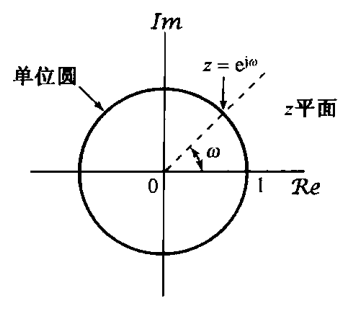
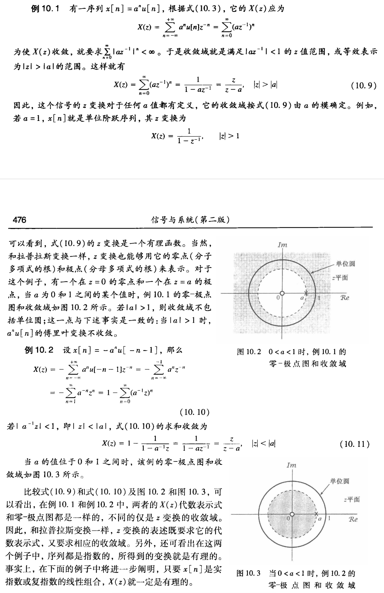
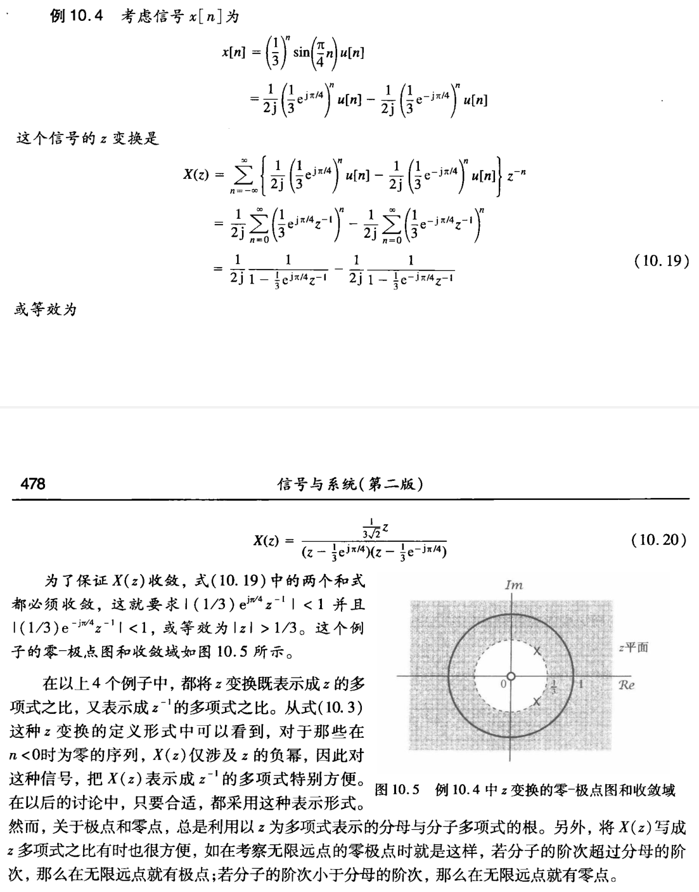
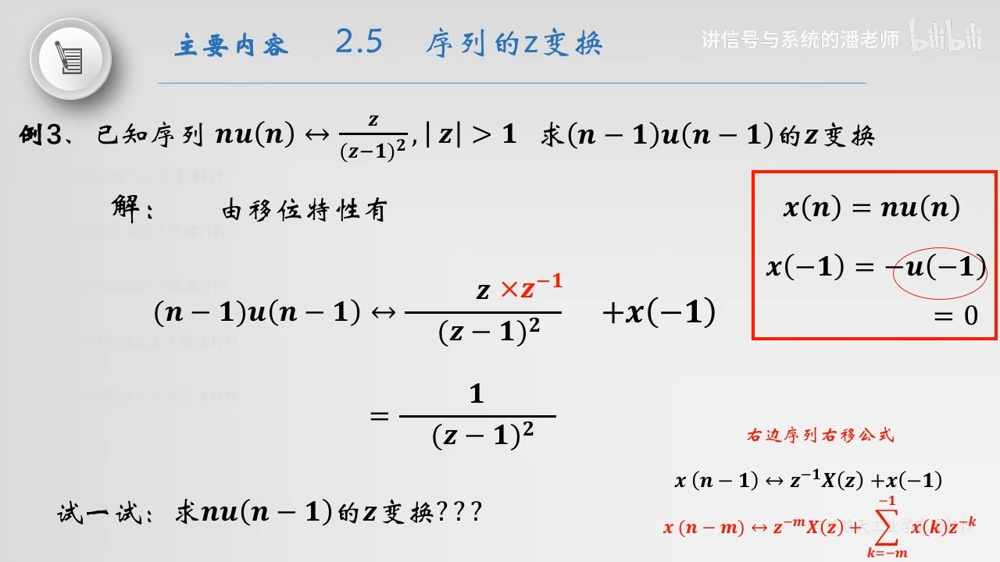
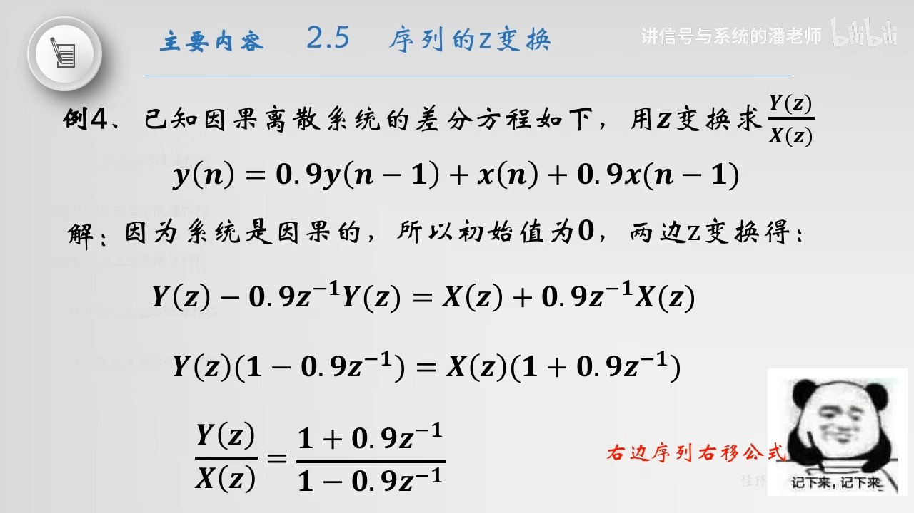
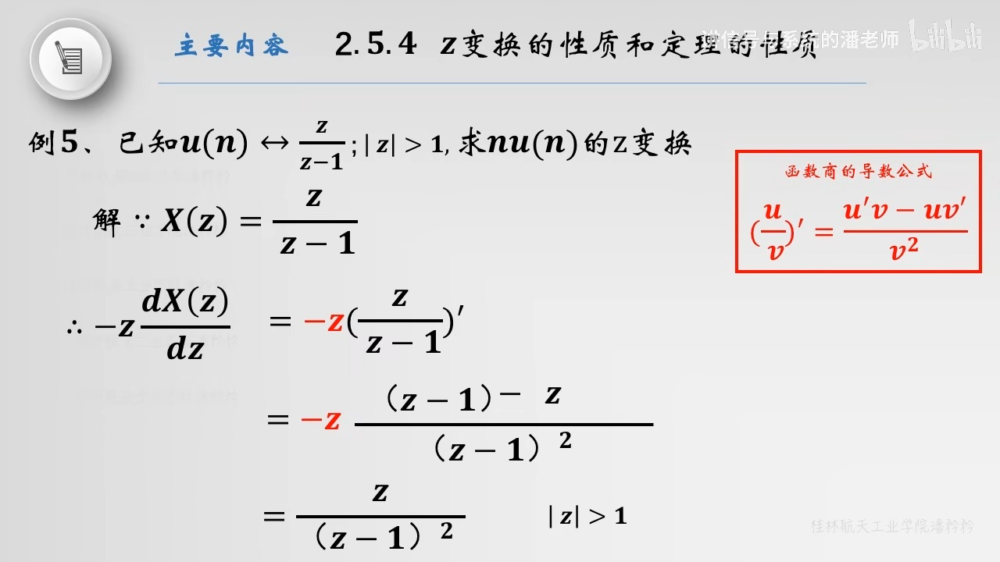
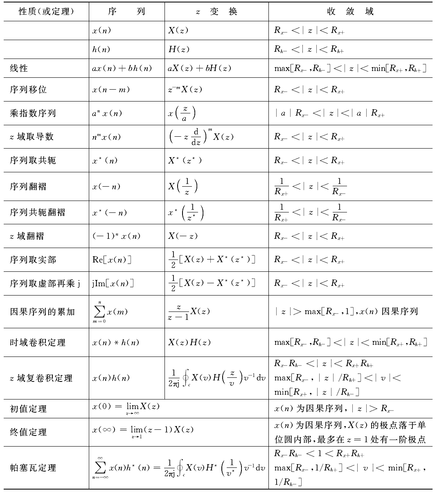

alias:: z -transform

- [[单位脉冲响应]]为  $h[n]$  的[[离散时间线性时不变系统]]对[[复指数]]输入  $z^{n}$  的响应  $y[n]$  为
  $$y[n]=H(z) z^{n} \tag{1}$$
  其中，
  $$H(z)=\sum_{n=-\infty}^{+\infty} h[n] z^{-n}\tag{2}$$
- 若  $z=\mathrm{e}^{\mathrm{j} \omega}$ , 这里  $\omega$  为实数 (即  $|z|=1$  ), 则式 $(2)$ 的求和式就是  $h[n]$  的[[离散时间傅里叶变换]]。在更为一般的情况下，当  $|z|$  不限制为 $1$ 的时候，式 $(2)$ 就称为  $h[n]$  的[[z 变换]]。
- 一个离散时间信号  $x[n]$  的 [[z 变换]] 定义为
  $$X(z) \triangleq \sum_{n=-\infty}^{+\infty} x[n] z^{-n} \tag{3}$$
- 有时为了方便, 也将  $x[n]$  的 z 变换写为  $\mathcal{Z\{x[n]\}}$ , 而  $x[n]$  和它的 z 变换之间的关系记为
  $$x[n] \stackrel{\mathcal{Z}}{\longleftrightarrow} X(z)\tag{4}$$
- ## z 变换和离散时间傅里叶变换
	- 对于连续时间信号, 拉普拉斯变换和傅里叶变换之间的几个重要关系。与此相仿, 但不完全一样,  z  变换和离散时间傅里叶变换之间也存在几个重要关系。
	- 为了说明这些关系, 现将复变量  $z$  表示成极坐标形式为
	  $$z=r \mathrm{e}^{\mathrm{j} \omega}\tag{5}$$
	  用  $r$  表示  $z$  的模, 而用  $\omega$  表示它的相角。利用  $r$  和  $\omega$ , 式 $(3)$ 变成
	  $$X\left(r \mathrm{e}^{\mathrm{j} \omega}\right)=\sum_{n=-\infty}^{+\infty} x[n]\left(r \mathrm{e}^{\mathrm{j} \omega}\right)^{-n}\tag{5}$$
	  或等效为
	  $$X\left(r \mathrm{e}^{\mathrm{j} \omega}\right)=\sum_{n=-\infty}^{+\infty}\left\{x[n] r^{-n}\right\} \mathrm{e}^{-\mathrm{j} \omega n}\tag{6}$$
	  由式 $(6)$ 可见,  $X\left(r \mathrm{e}^{\mathrm{j} \omega}\right)$  就是序列  $x[n]$  乘以实指数  $r^{-n}$  后的^^离散时间傅里叶变换^^, 即
	  $$X\left(r \mathrm{e}^{\mathrm{j} \omega}\right)=\mathcal{F}\left\{x[n] r^{-n}\right\}\tag{7}$$
		- >指数加权  $r^{-n}$  可以随  $n$  增加而衰减, 也可以随  $n$  增加而增长, 这取决于  $r$  大于 $1$ 还是小于 $1$ 。
		  特别注意到, 若  $r=1$ , 或等效为  $|z|=1$ , 式 $(3)$ 就变为 离散傅里叶变换, 即
		  $$\left.X(z)\right|_{z=\mathrm{e}^{\mathrm{j} \omega}}=X\left(\mathrm{e}^{\mathrm{j} \omega}\right)=\mathcal{F}\{x[n]\}\tag{8}$$
	- ### 关系的几何解释
	  id:: 65e77b3c-edc2-4c39-ad7b-aa6c13214b09
		- 在连续时间情况下, 当变换变量的[[实部]]为 $0$ 时, [[拉普拉斯变换]]就演变为[[傅里叶变换]]。利用[[复平面]]  $s$ 来解释, 这就意味着, 在虚轴  $\mathrm{j} \omega$  上的拉普拉斯变换就是傅里叶变换。
		- 与此对应的是, 在  z  变换中是当变换变量  z  的^^模^^为 $1$ , 即  $z=\mathrm{e}^{\mathrm{j} \omega}$  时,  z  变换就演变为[[离散时间傅里叶变换]]。
		  collapsed:: true
		  所以傅里叶变换就是 自变量 $z$ 限制在复平面中半径为 $1$ 的**圆上（不包括圆内）**的  z 变换, 如图所示。在  z  平面上, 这个圆称为[[单位圆]](圆弧)。
		  {:height 317, :width 352}
			- > 这个单位圆在  z  变换讨论中所起的作用, 类似于  $s$  平面上的虚轴在拉普拉斯变换讨论中所起的作用。
	- ### 收敛域
		- 从式 $(7)$ 可知, 为了使 [[z  变换收敛]], 要求  $x[n] r^{-n}$  的[[离散时间傅里叶变换收敛]]。
		- >对于任何一个具体的序列  $x[n]$  来说, 可以想到对某些  $r$  值, 其傅里叶变换收敛, 而对另一些  $r$  值来说则不收敛。
		- 对于某一序列的  z  变换, 存在着某一个  $z$  值的范围, 对该范围内的  $z$ , $X(z)$ 收敛。这样一些值的范围称为该具体序列的 z 变换的[[收敛域]]（和 拉普拉斯变换 一样）。
			- #+BEGIN_NOTE
			  如果序列的 z 变换的收敛域包括[[单位圆]], 则序列的 离散傅里叶变换 也收敛。
			  #+END_NOTE
	- ### 例子
		- 为了说明  z  变换及其有关的收敛域, 现举下面几个例子。
		- 
		- 
	- ### [[z 变换和拉普拉斯变换的关系]]
- ## [[z 逆变换]]
- ## 典型序列的 z 变换
	- [[单位脉冲序列]]  $\delta(n)$  的 z 变换:
	  logseq.order-list-type:: number
	  $$\begin{aligned}
	  {X}(z)=\sum_{{n}=-\infty}^{\infty} {x}({n}) z^{-n} & =\sum_{{n}=-\infty}^{\infty} {\delta}({n}) z^{-n} \\
	  & =\sum_{{n}=-\infty}^{\infty} {\delta}({n}) \\
	  & =1
	  \end{aligned}$$
	- [[单位阶跃序列]] $${u}({n})$$ 的 z 变换：
	  logseq.order-list-type:: number
	  collapsed:: true
	  $$\begin{aligned}
	  {X}(z)&=\sum_{n=-\infty}^{\infty} {x}({n}) z^{-n}=\sum_{n=-\infty}^{\infty} {u}({n}) z^{-n} \\
	  &=\sum_{n=0}^{\infty} z^{-n} = \lim_{n\to\infty}\frac{1-(z^{-1})^n}{1-z^{-1}} \\
	  &=\frac{1}{1-z^{-1}}=\frac{z}{z-1}\quad |z|>1
	  \end{aligned}$$
	  （z 变换一定要标注[[收敛域]]）（[[等比数列]]求和）
		- >参考第一个例子
	- [[矩形序列]]  $R_{4}(n)$  的 z 变换:
	  logseq.order-list-type:: number
	  $$
	  \begin{aligned}
	  {X}(z)=\sum_{n=-\infty}^{\infty} {x}({n}) z^{-n}&=\sum_{{n}=-\infty}^{\infty} {R}_{\mathbf{4}}({n}) z^{-n} \\
	  &=\sum_{n=0}^{3} z^{-n} \\
	  &=\frac{1-z^{-4}}{1-z^{-1}} \quad 0<|z|<\infty
	  \end{aligned}
	  $$
	  （[[有限长序列]]有界则可和，$z$ 的收敛域就是整个 $z$ 平面）$$
	- [[右边序列]] $$x(n)=a^{n} u(n)$$ 的 $${z}$$ 变换
	  logseq.order-list-type:: number
	  $$\begin{aligned}X(z)=\sum_{n=-\infty}^{\infty} a^{n} u(n) z^{-n}=\sum_{n=0}^{\infty} a^{n} z^{-n}&=\sum_{n=0}^{\infty}\left(a z^{-1}\right)^{n} \\
	  &=\frac{1}{1-a z^{-1}} \\
	  &= \frac{z}{z-a}
	  \end{aligned}$$
	  收敛域
	  $$\left|a z^{-1}\right|<1 \quad \rightarrow \quad|z|>a$$
		- > 见第一个例题
	- [[左边序列]]  $x(n)=a^{n} u(-n-1)$  的  z  变换
	  logseq.order-list-type:: number
	  collapsed:: true
	  $$X(z)=\sum_{n=-\infty}^{+\infty} a^{n} u(-n-1) z^{-n}=\sum_{n=-\infty}^{-1} a^{n} z^{-n}\overset{m=-n}{=}\sum_{m=1}^{\infty}\left(a^{-1} z\right)^{m}=\frac{a^{-1} z}{1-a^{-1} z}$$
	  收敛域
	  $$\left|a^{-1} z\right|<1 \quad \rightarrow \quad|z|<a$$
		- logseq.order-list-type:: number
		  >见第二个例题
	- 一个[[双边序列]]可以看成一个[[左序列]]和一个[[右序列]]，收敛域为二者收敛域有交集。交集为空，则序列的 z 变换 不存在。
	  logseq.order-list-type:: number
	- ### 其他常用 z 变换公式
	  logseq.order-list-type:: number
		- logseq.order-list-type:: number
		  $$n u(n) \leftrightarrow \frac{z}{(z-1)^{2}}$$
		- logseq.order-list-type:: number
		  $$n a^{n} u(n) \leftrightarrow \frac{z}{(z-a)^{2}}$$
	- ### [[z 变换表]]
- ## Z 变换的性质和定理
  以下是一些主要的 z 变换性质，它们允许我们在Z域内简化问题，然后再将结果转换回时间域。
	- **线性（Linearity）**
	  logseq.order-list-type:: number
	  collapsed:: true
		- 如果有两个信号\(x_1[n]\)和\(x_2[n]\)，它们的Z变换分别为\(X_1(z)\)和\(X_2(z)\)，那么对于任意常数\(a\)和\(b\)，有
		  $$Z\{a \cdot x_1[n] + b \cdot x_2[n]\} = a \cdot X_1(z) + b \cdot X_2(z)$$
	- **[[时移性]]（Time Shifting）**
	  logseq.order-list-type:: number
	  collapsed:: true
		- 对信号\(x[n]\)的Z变换进行时间上的移动，即
		  $$Z\{x[n-k]\} = z^{-k} \cdot X(z)$$
		  其中，\(k\)是整数。如果\(k\)为正，则表示信号向右移动（**延迟**）；如果\(k\)为负，则表示信号向左移动（**提前**）。
		- 序列移位不会改变Z变换的[[收敛域]]。
		- ### $x(n)$  为[[右边序列]]右移公式(有初始值带入)
		  collapsed:: true
		  \begin{array}{l}
		  x(n-1) \leftrightarrow z^{-1} X(z)+x(-1) \\
		  x(n-2) \leftrightarrow z^{-2} X(z)+z^{-1} x(-1)+x(-2) \\
		  x(n-m) \leftrightarrow z^{-m} X(z)+\sum_{i=-m}^{-1} x(k) z^{-i}
		  \end{array}
			- > 
			- >解[[差分方程]]的例子
			  
		- ### $x(n)$  为[[右边序列]]左移公式(有初始值带入)
		  \begin{array}{l}
		  x(n+1) \leftrightarrow z^{1} X(z)-x(1) \\
		  x(n+2) \leftrightarrow z^{2} X(z)-z x(1)-x(2) \\
		  x(n+m) \leftrightarrow z^{m[} X(z)-\sum_{i=0}^{m-1} x(k) z^{m-i} \\
		  \end{array}
		-
	- **[[z 域尺度变换]]（Scaling in the Z-domain）**
	  logseq.order-list-type:: number
	  collapsed:: true
		- 如果信号\(x[n]\)的Z变换是\(X(z)\)，那么信号\(a^n \cdot x[n]\)的Z变换是
		  $$Z\{a^n \cdot x[n]\} = X(a^{-1} \cdot z)$$
		  其中，\(a\)是常数。
	- **[[时域卷积定理]]（Convolution in Time Domain）**
	  logseq.order-list-type:: number
	  collapsed:: true
		- 两个信号\(x_1[n]\)和\(x_2[n]\)的卷积的Z变换等于它们各自Z变换的乘积，即
		  $$Z\{x_1[n] * x_2[n]\} = X_1(z) \cdot X_2(z)$$
		  其中，“\(*\)”表示卷积操作。
		- [[复卷积定理]]
	- **[[初始值定理]]（Initial Value Theorem）**
	  logseq.order-list-type:: number
	  collapsed:: true
		- 如果信号\(x[n]\)的Z变换是\(X(z)\)，那么信号的初始值可以通过
		  $$x[0] = \lim_{z \to \infty} X(z)$$
		  来获取。
	- **[[终值定理]]（Final Value Theorem）**
	  logseq.order-list-type:: number
	  collapsed:: true
		- 如果信号\(x[n]\)的Z变换是\(X(z)\)，并且信号随着时间趋于稳定，则
		  $$\lim_{n \to \infty} x[n] = \lim_{z \to 1} (z-1) \cdot X(z)$$
		  这个定理允许我们直接从Z变换得到信号的长期行为。
	- **[[z 域微分性质]]（Differentiation in the Z-domain）**
	  logseq.order-list-type:: number
	  collapsed:: true
		- 对信号\(x[n]\)的 Z 变换进行微分，得到
		  $$Z\{n \cdot x[n]\} = -z \frac{dX(z)}{dz}$$
		- > {:height 326, :width 566}
	- **[[复共轮序列]]的 z 变换**
	  logseq.order-list-type:: number
	  设 $${x}({n}) \leftrightarrow X(\mathrm{z})$$ ，则 
	  $$\mathcal Z\{{x}^{*}({n})\} = {X}^{*}\left(\mathbf{z}^{*}\right)$$
	- **[[帕塞瓦尔定理]]**
	  logseq.order-list-type:: number
	  collapsed:: true
		- $$E=\sum_{n=-\infty}^{+\infty}|x(n)|^{2}$$
		  时域总能量等于  z  域总能量（能量守恒）
	- 整理成表：
	  {:height 732, :width 640}
-