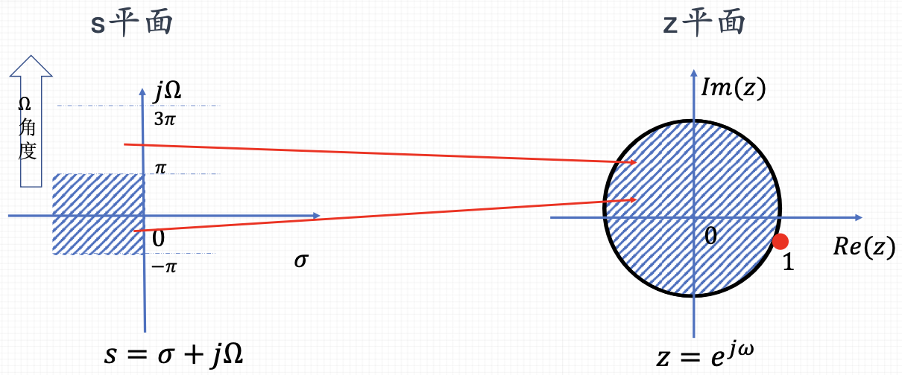
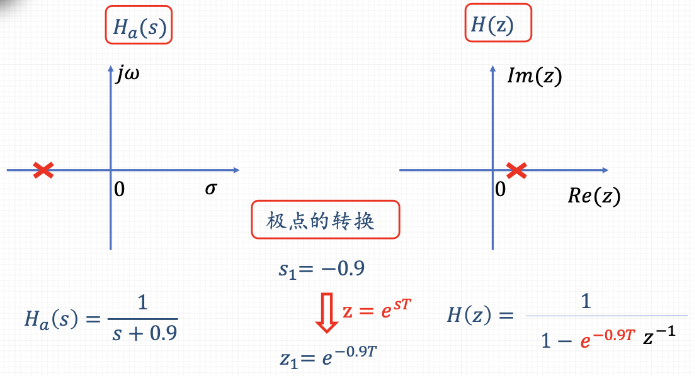

- **从连续到离散**：[[z 变换]]可以视为[[拉普拉斯变换]]的离散等价物。当连续时间信号被采样成离散时间信号时，拉普拉斯变换通过某种形式的离散化过程转换为Z变换。
  logseq.order-list-type:: number
- **映射关系**：在某些情况下，可以通过映射关系将拉普拉斯变换的s域转换为Z变换的Z域。最常见的映射方法是[[双线性变换]]，它定义了s域和Z域之间的关系：
  logseq.order-list-type:: number
  $$s = \frac{2}{T} \frac{1 - z^{-1}}{1 + z^{-1}}$$
  $$z = e^{sT}$$
  其中，\(T\) 是采样周期。这种映射保持了系统稳定性和频率响应的特性，但会引入频率扭曲，需要通过预畸变来校正。
	- 
	  logseq.order-list-type:: number
- **频率响应**：通过将s替换为\(j\omega\)，拉普拉斯变换可以用来分析连续时间系统的频率响应。类似地，
  logseq.order-list-type:: number
  $$z=e^{sT}=e^{j\omega T},$$
  Z变换可以用来分析离散时间系统的频率响应。
- ### 极点的转换
- 
  （系统函数）