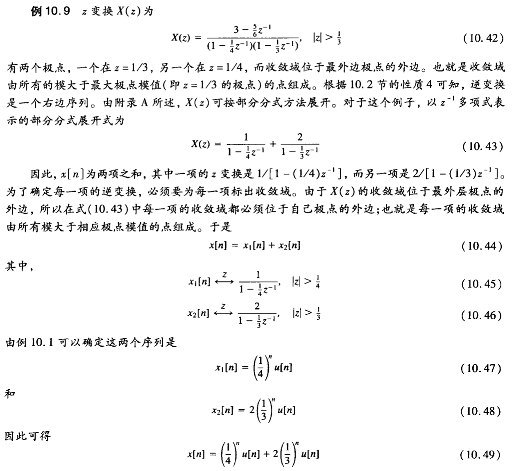

alias:: z 反变换

- 首先, 考虑用  z  变换表示一个序列的数学关系。把  z  变换看成一个指数加权后的序列的傅里叶变换, 根据这种解释就可以得到这一关系。表示为：
  $$X\left(r \mathrm{e}^{\mathrm{j} \omega}\right)=\mathcal{F}\left\{x[n] r^{-n}\right\} \tag{1}$$
  其中的  $r$  值是位于[[收敛域]]内的  $z=r \mathrm{e}^{\mathrm{j} \omega}$  的模。
- 对式 $(1)$ 两边进行[[傅里叶逆变换]], 得
  $$x[n] r^{-n}=\mathcal{F}^{-1}\left\{X\left(r \mathrm{e}^{\mathrm{j} \omega}\right)\right\}$$
  或者
  $$x[n]=r^{n} \mathcal{F}^{-1}\left[X\left(r \mathrm{e}^{\mathrm{j} \omega}\right)\right]\tag{2}
  $$
  利用傅里叶逆变换表示式, 可得
  $$x[n]=r^{n} \frac{1}{2 \pi} \int_{2 \pi} X\left(r \mathrm{e}^{\mathrm{j} \omega}\right) \mathrm{e}^{\mathrm{j} \omega n} \mathrm{~d} \omega$$
- 或者, 将  $r^{n}$  的指数因子移进积分号内, 与 $\mathrm{e}^{\mathrm{j} \omega n}$  项归并成  $\left(r \mathrm{e}^{\mathrm{j} \omega}\right)^{n}$ , 则得
  $$x[n]=\frac{1}{2 \pi} \int_{2 \pi} X\left(r \mathrm{e}^{\mathrm{j} \omega}\right)\left(r \mathrm{e}^{\mathrm{j} \omega}\right)^{n} \mathrm{~d} \omega\tag{3}$$
- 这就是说, 将[[z 变换]]沿着[[收敛域]]内  $z=r \mathrm{e}^{\mathrm{j} \omega}$ , $r$  固定而  $\omega$  在一个  $2 \pi$  区间内变化的闭合围线求值, 就能够将  $x[n]$  恢复出来。
- 现在将积分变量从  $\omega$  变为  $z$  。由于  $z=r \mathrm{e}^{\mathrm{j} \omega}$, $r$  固定,  $\mathrm{d} z=\mathrm{j} r \mathrm{e}^{\mathrm{j} \omega} \mathrm{d} \omega=\mathrm{j} z \mathrm{~d} \omega$ , 或者  $\mathrm{d} \omega=(1 / \mathrm{j}) z^{-1} \mathrm{~d} z$  。
- 这样, 式 $(2)$ 在  $\omega$  的  $2 \pi$  区间的积分, 利用  $z$  以后, 就对应于以变量  $z$  在环绕  $|z|=r$  的圆上一周的积分。
  因此, 根据  $z$ 平面内的积分, 式 $(3)$ 就可重写为
  $$x[n]=\frac{1}{2 \pi \mathrm{j}} \oint X(z) z^{n-1} \mathrm{~d} z\tag{4}$$
  式中  $\oint$  记为在半径为  $r$ , 以原点为中心的封闭圆上沿逆时针方向环绕一周的积分。$r$  的值可选为使  $X(z)$  收敛的任何值; 也就是使  $|z|=r$  的积分围线位于收敛域内的任何值。式 $(4)$ 就是^^z 逆变换^^的正规数学表示式。
  >并且它与[[拉普拉斯逆变换式]] 是对应的。
  和[[拉普拉斯逆变换式]]一样, 式 $(4)$ 逆变换的求值要利用复平面的[[围线积分]]。
- 然而, 还有另外几个方法可以从 z 变换求得与其对应的序列。
- 和拉普拉斯变换一样, 其中特别有用的是, 对于一个有理 z 变换, 可以首先将它进行部分分式展开, 然后逐项求其逆变换。
	- 现用下例给予具体说明。
	  
- ## 求 z 逆变换的方法
	- ### [[留数法]]
	- ### [[部分分式法]]
	- ### [[幂级数展开发]]
- ## 例子
	- 让我们通过一个具体的例子来逐步说明如何使用留数法进行 \( z \) 逆变换。假设我们有以下 \( Z \) 域表达式：
	  \[
	  F(z) = \frac{z}{(z - 1)(z - 2)}
	  \]
	  我们的目标是找到这个表达式的时域序列，即 \( f(n) \)。
	- ### 1. 寻找极点
	  极点是分母多项式的根。因此，我们首先解方程：
	  \[
	  (z - 1)(z - 2) = 0
	  \]
	  得到极点 \( z = 1 \) 和 \( z = 2 \)。
	- ### 2. 计算留数
	  我们需要计算在每个极点处的留数。由于这两个极点都是一阶极点，我们可以直接使用以下公式：
	  \[
	  \text{Res}[F, z_k] = \lim_{z \to z_k} (z - z_k)F(z)
	  \]
	  对于 \( z_k = 1 \)：
	  \[
	  \text{Res}[F, 1] = \lim_{z \to 1} (z - 1) \frac{z}{(z - 1)(z - 2)} = \lim_{z \to 1} \frac{z}{z - 2} = \frac{1}{1 - 2} = -1
	  \]
	  对于 \( z_k = 2 \)：
	  \[
	  \text{Res}[F, 2] = \lim_{z \to 2} (z - 2) \frac{z}{(z - 1)(z - 2)} = \lim_{z \to 2} \frac{z}{z - 1} = \frac{2}{2 - 1} = 2
	  \]
	- ### 3. 应用逆 \( Z \) 变换的留数定理
	  逆 \( Z \) 变换可以用留数来表示：
	  \[
	  f(n) = \sum \text{Res}[F(z) z^{n-1}, z_k]
	  \]
	  因此，我们得到：
	  \[
	  f(n) = -1 \cdot 1^n + 2 \cdot 2^n
	  \]
	  这就是 \( F(z) \) 的时域序列 \( f(n) \)。