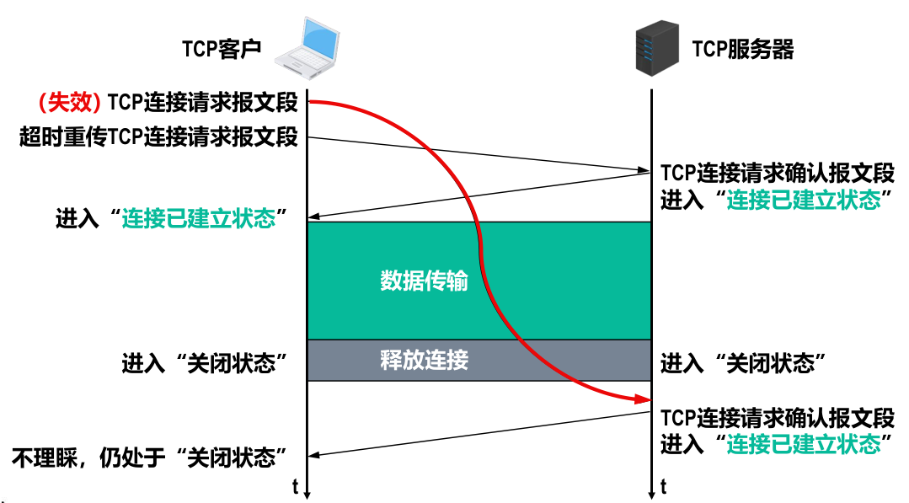

alias:: three-way handshake

- [[三报文握手]]建立TCP连接的目的在于解决以下三个主要问题：
	- 使TCP双方能够**确知对方的存在**。
	  logseq.order-list-type:: number
	- 使TCP双方能够协商一些参数（例如[[最大报文段长度]]、[[最大窗口大小]]、[[时间戳选项]]等）。
	  logseq.order-list-type:: number
	- 使TCP双方能够**对[[运输实体资源]]进行分配和初始化**。
	  logseq.order-list-type:: number
	  [[运输实体资源]]包括[[缓存]]大小、各[[状态变量]]、[[连接表]]中的项目等。
- {:height 276, :width 608}
- *客户端* 发送[[TCP 连接请求报文段]]进入[[同步已发送状态]]：
  logseq.order-list-type:: number
	- [[序号]]seq字段被设置了一个初始值 x ，作为 TCP 客户进程所选择的初始序号。
	  logseq.order-list-type:: number
	- TCP规定同步标志位[[SYN]]被设置为1的报文段（例如[[TCP 连接请求报文段]]和[[TCP连接请求确认报文段]]）不能携带数据（即没有[[数据载荷]]），但要消耗掉一个 *序号* 。
	  logseq.order-list-type:: number
	- 按上述规定，[[TCP 连接请求报文段]]不能携带数据，但是会消耗掉 *序号* x 。
	  logseq.order-list-type:: number
	  id:: 653a0785-45d4-4d3a-979d-453ffd336d09
- *服务器* 发送[[TCP 连接请求确认报文段]]进入[[同步已接收状态]]。
  logseq.order-list-type:: number
	- 序号seq字段被设置了一个初始值y，作为TCP服务器进程所选择的初始序号。
	- [[确认号]]ack字段的值被设置为x+1，这是对TCP客户进程所选择的初始序号x的确认。
- 发送针对[[TCP 连接请求确认报文段]]的[[普通TCP确认报文段]]，并进入[[连接已建立状态]]。
  logseq.order-list-type:: number
	- TCP 规定普通的TCP 确认报文段可以携带数据，但如果不携带数据，则不消耗序号。
	  logseq.order-list-type:: number
	- 如果该报文段不携带数据，则TCP客户进程要发送的下一个数据报文段的序号仍为x+1 。
	  logseq.order-list-type:: number
	- 确认号ack字段的值被设置为y+1，这是对TCP服务器进程所选择的初始序号y的确认。
	  logseq.order-list-type:: number
- ## 使用“三报文握手”而不是“两报文握手”建立TCP连接的原因
	- 是为了防止**已失效的**[[TCP连接请求报文段]]突然又传送到了TCP *服务器* 进程，因而导致错误。
	  {:height 328, :width 578}
-