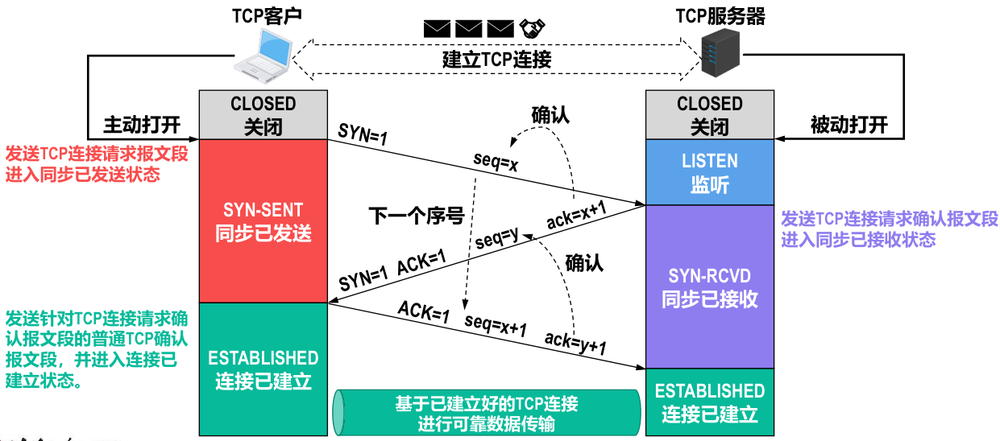

alias:: three-way handshake

- [[三报文握手]]建立TCP连接的目的在于解决以下三个主要问题：
	- 使TCP双方能够**确知对方的存在**。
	  logseq.order-list-type:: number
	- 使TCP双方能够协商一些参数（例如[[最大报文段长度]]、[[最大窗口大小]]、[[时间戳选项]]等）。
	  logseq.order-list-type:: number
	- 使TCP双方能够**对[[运输实体资源]]进行分配和初始化**。
	  logseq.order-list-type:: number
	  [[运输实体资源]]包括[[缓存]]大小、各[[状态变量]]、[[连接表]]中的项目等。
- {:height 276, :width 608}
-