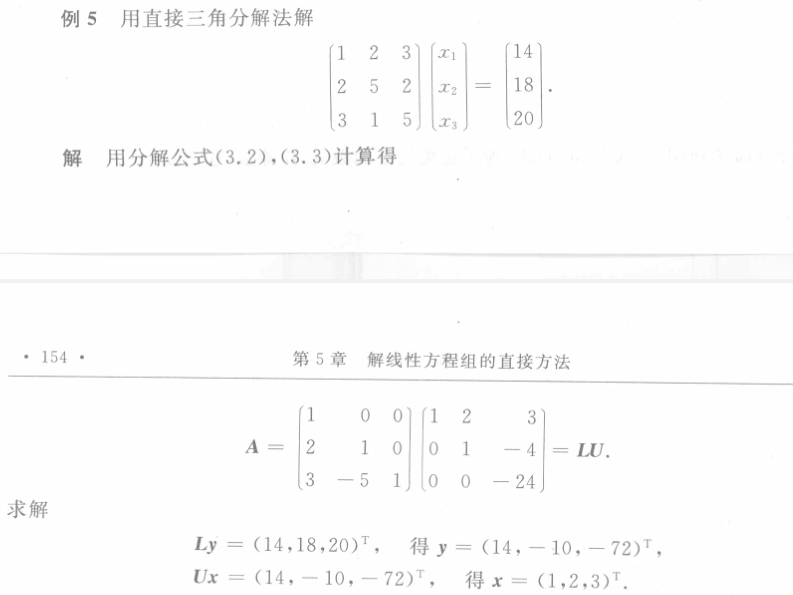

- {:height 1228, :width 711}
	- #+BEGIN_PINNED
	   
	  #+END_PINNED
- 
- #+BEGIN_TIP
  由直接三角分解计算公式，需要计算形如 $\sum a_ib_i$ 的式子，可采用[[双精度累加]], 以提高精度。
  #+END_TIP
- 直接分解法大约需要 $n^3/3$ 次乘除法，和[[高斯消去法]][[计算量]]基本相同. 
  如果已经实现了 $\boldsymbol A=\boldsymbol{LU}$ 的分解计算，且$L,U$ 保存在$A$ 的相应位置，则用直接三角分解法解具有相同系数的方程组 $Ax=(b_1b_2...b_m)$ 是相当方便的，每解一个方程组 $Ax=b_j$ **仅**需要增加$n^2$次乘除法运算。
- 矩阵 $\boldsymbol A$ 的分解公式
  $$
  u_{ri}=a_{ri}-\sum_{k=1}^{r-1}l_{rk}u_{ki},\mathrm{~}i=r,r+1,\cdots,n
  $$
  $$
  l_{ir}=\left(a_{ir}-\sum_{k=1}^{r-1}l_{ik}u_{kr}\right)/u_{rr},i=r+1,\cdots,n,\text{且} r\neq n
  $$
  
  又称为[[杜利特尔分解]]。