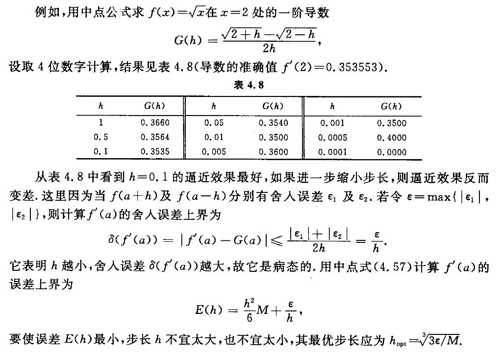

- 按导数定义可以简单地用[[差商]]近似导数, 这样立即得到几种[[数值微分公式]]
  \begin{aligned}
  f^{\prime}(a) & \approx \frac{f(a+h)-f(a)}{h}, \\
  f^{\prime}(a) & \approx \frac{f(a)-f(a-h)}{h}, \\
  f^{\prime}(a) & \approx \frac{f(a+h)-f(a-h)}{2 h},
  \end{aligned}
  其中,  $h$  为一增量, 称为[[步长]]. 后一种数值微分方法称为[[中点方法]], 它其实是前两种方法([[向前差商]]和[[向后差商]])的算术平均. 但它的误差阶却由  $O(h)$  提高到  $O\left(h^{2}\right)$ . 
  上面给出的三个公式是很实用的,尤其是中点公式更为常用.
- ### 误差分析
	- 为要利用 中点公式
	  $$G(h)=\frac{f(a+h)-f(a-h)}{2 h}$$
	  计算导数  $f^{\prime}(a)$  的近似值, 首先必须选取合适的步长, 为此需要进行误差分析. 分别将  $f(a \pm h)$  在  $x=a$  处做[[泰勒展开]], 有
	  \begin{aligned}
	  f(a \pm h)= & f(a) \pm h f^{\prime}(a)+\frac{h^{2}}{2 !} f^{\prime \prime}(a) \pm \frac{h^{3}}{3 !} f^{\prime \prime \prime}(a) \\
	  & +\frac{h^{4}}{4 !} f^{(4)}(a) \pm \frac{h^{5}}{5 !} f^{(5)}(a)+\cdots,
	  \end{aligned}
	  代人上式得
	  $$G(h)=f^{\prime}(a)+\frac{h^{2}}{3 !} f^{\prime \prime \prime}(a)+\frac{h^{4}}{5 !} f^{(5)}(a)+\cdots .$$
	  由此得知, 从[[截断误差]]的角度看, [[步长]]越小,计算结果越准确, 且
	  $$\left|f^{\prime}(a)-G(h)\right| \leqslant \frac{h^{2}}{6} M .$$
	  其中,  $M \geqslant \max _{|x-a| \leqslant h}\left|f^{\prime \prime \prime}(x)\right|$ .
	- 再考察 舍入误差, 按中点公式计算, 当  $h$  很小时, 因  $f(a+h)$  与  $f(a-h)$  很接近（小分子）, 直接相减会造成有效数字的严重损失. 因此, 从[[舍入误差]]的角度来看, [[步长]]是**不宜太小**的.
	- ### 例子
		- 