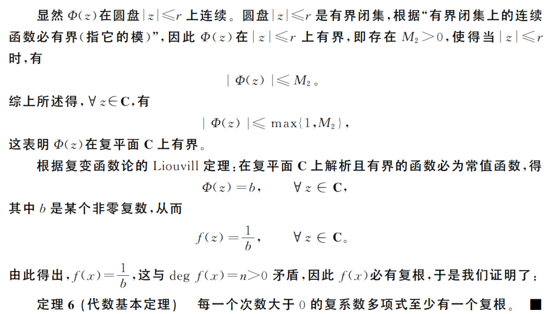

# Theorem
每一个[[次数]]**大于** $0$ 的[[复系数多项式]]**至少有** $1$ 个[[复根]]。
	- ## Corollary
		- $\mathbb{C}[x]$ 中，[[次数]]**大于** $1$ 的[[多项式]]**一定**[[可约]]。
		  logseq.order-list-type:: number
		- $\mathbb{C}[x]$ 中，[[不可约多项式]]只有[[一次多项式]]。
		  logseq.order-list-type:: number
- # Proof
	- 设$f(x)\in\mathbb{C},f(x)=\sum_{i=0}^{n}a_ix^i, \mathrm{deg}\ f(x)=n>0$。
	  collapsed:: true
	  假如$f(x)$没有[[复根]]，则$\forall z\in\mathbb{C}$，有$f(z)\ne 0$，于是[[function]]：
	  $$\phi(z)=\frac{1}{f(z)}$$
	  的定义域为$\mathbb{C}$。
	  类似于[[实变量函数]]，[[复变量]]的多项式函数有[[导数]]，且[[complex function]]的导数与[[四则运算]]的关系，以及[[复合函数的求导法则]]，都像实变量函数那样。因此，$\phi(z)$在[[复平面]]$\mathbb{C}$的每一个点处都有导数，此时称$\phi(x)$在 *复平面* $C$上[[解析]]。
		- 根据[[棣莫弗定理]]，对任意给定的正整数$n$有
		- $$\lim _{|z| \rightarrow+\infty}\left|\frac{1}{z^{n}}\right|=\lim _{|z| \rightarrow+\infty}\left|\frac{1}{z}\right|^{n}=\lim _{|z| \rightarrow+\infty} \frac{1}{|z|^{n}}=0$$
		  从而有$\lim_{\left |z\right |\to+\infty}\frac{1}{z^n}=0$，于是
		  \begin{aligned}
		  \lim _{|z| \rightarrow+\infty} \Phi(z) & =\lim _{|z| \rightarrow+\infty} \frac{1}{f(z)}=\lim _{|z| \rightarrow+\infty} \frac{1}{a_{n} z^{n}+a_{n-1} z^{n-1}+\cdots+a_{1} z+a_{0}} \\
		  & =\lim _{|z| \rightarrow+\infty} \frac{\frac{1}{z^{n}}}{a_{n}+a_{n-1} \frac{1}{z}+\cdots+a_{1} \frac{1}{z^{n-1}}+a_{0} \frac{1}{z^{n}}}=\frac{0}{a_{n}}=0
		  \end{aligned}
		  从而对于$\varepsilon$，存在$r>0$，使得对于满足$\left |z\right |>r$的一切$z$有$\left|\phi(z)\right|<1$。
	- 