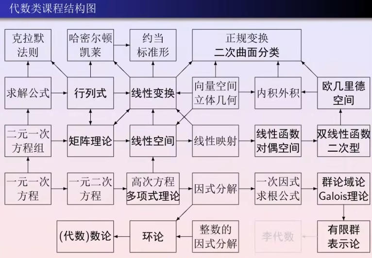

public:: true

- [[代数学]]通过[[运算]]来研究客观世界的数量关系。
- 诸如[数](https://zh.wikipedia.org/wiki/%E6%95%B0_(%E6%95%B0%E5%AD%A6))、[数量](https://zh.wikipedia.org/wiki/%E6%95%B8%E9%87%8F)、[代数式](https://zh.wikipedia.org/wiki/%E4%BB%A3%E6%95%B8%E5%BC%8F)、[关系](https://zh.wikipedia.org/wiki/%E5%85%B3%E7%B3%BB_(%E6%95%B0%E5%AD%A6))、[方程理论](https://zh.wikipedia.org/wiki/%E6%96%B9%E7%A8%8B%E7%90%86%E8%AE%BA)、[代数结构](https://zh.wikipedia.org/wiki/%E4%BB%A3%E6%95%B8%E7%B5%90%E6%A7%8B)等等都是代数学的研究对象。
	- 
- ## [[高等代数]]