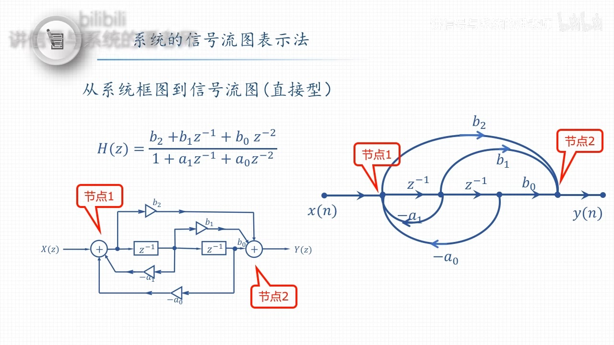
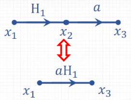
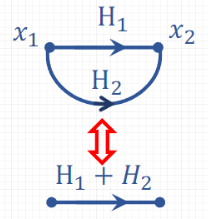
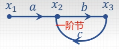
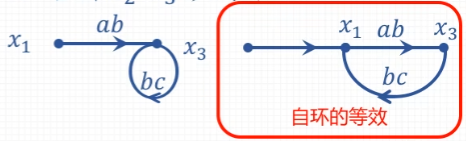
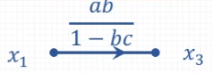

alias:: 线性信号流图

- 从系统框图到信号流图(直接型）
  {:height 388, :width 676}
-
- ## 信号流图代数运算的基本规则
  可以用子系统的系统函数 $H$ 作为支路的权值。
	- 串联支路的合并
	  logseq.order-list-type:: number
	  
	- 并联支路的合并
	  logseq.order-list-type:: number
	  
	- [[一阶节]]消去中间节点的规律
	  logseq.order-list-type:: number
	  
		- 合并 $𝑥_2$ $𝑥_3$ 形成[[自环]]
		  logseq.order-list-type:: number
		  
		- 消去[[自环]]
		  logseq.order-list-type:: number
		  
	- ### 例子
	  ((660fec2e-cdb8-45b6-a9b3-56b1ac4b656f))