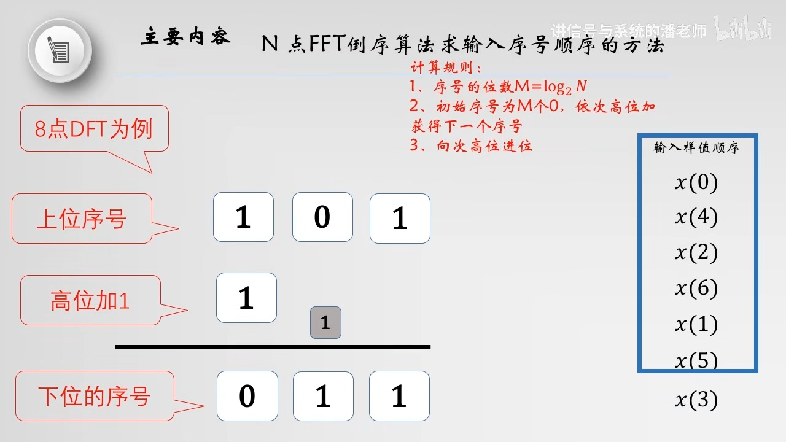

alias:: 倒序

- 对于同址运算结构, FFT 的输出 $X(k)$ 是按正常顺序排列在存储单元中,即按照 $X(0)$ 、 $X(1)$ 、 $X(2)$ 、 $\cdots$ 、 $X(N-1)$ 的顺序排列。由于要对输入 $x(n)$ 逐级进行奇、偶分解, 结果导致了输入信号不是按自然顺序存储的, 看起来好像 “杂乱无章”, 实际上却是有规律的, 我们称之为倒位序。
- 所谓倒位序, 就是将二进制数的最高有效位到最低有效位的位序进行颠倒排列而得到的二进制数。例如, 十进制数 6 , 用二进制可以表示为 $(110)_{2} ,$ 其倒位序为 $(011)_{2} ,$ 即二进制数 $3$ 。
- 下面来看看, 每一级的奇偶分解是如何导致了输入的倒位序排列的。如果十进制数 $n$ , 用二进制数表示为 $\left(n_{2} n_{1} n_{0}\right)_{2}$ 。第 $1$ 次分解时,偶数在上,奇数在下。此时,若最低位 $n_{0}$ 为 $0$ ,则对应为偶数$; n_{0}$ 为 $1$ ,则对应为奇数。
- 对 $n_{0}$ 为 $0$ 的部分再进行分解, 同样是偶数在上,奇数在下。很明显,此时若次低位 $n_{1}$ 为 $0$ , 则对应为偶数$; n_{1}$ 为 1 , 则对应为奇数。对 $n_{0}$ 为 $1$ 的部分也进行同样的分解。这一级的分解即为第 $2$ 次分解,如上图所示。依次类推, 继续分解相当于逐位判决。最终按位归类排列就可得到倒位序的排列顺序。这种在时间上按照奇数、偶数不断分解的过程,可用下图所示的树状图来描述, 从中可以更清楚地理解输入信号倒位序排列形成的原因。
  {:height 415, :width 640}
- ### 倒位序实现
  一般实际运算中, 总是先按自然顺序将输入信号存入存储单元, 然后通过整序或者说变址, 得到输入信号倒位序的排列。如果输入信号的序号 $n$ 用二进制数 $\left(n_{2} n_{1} n_{0}\right)$ 表示, 其倒位序二进制数为 $\left(n_{0} n_{1} n_{2}\right) ,$ 对应的十进制数用 $\hat{n}$ 表示。这样, 在原来自然顺序时应该存储 $x(n)$ 的单元, 倒位序后要存储 $x(\hat{n})$ 。下表列出了 $N=8$ 时的自然顺序二进制数及相应的倒位序二进制数。
  {:height 325, :width 536}
- 把按自然顺序排列的输入信号, 转换成 FFT 所需的倒位序排列, 其过程如图下所示。
   
  当 $n=\hat{n}$ 时, 不必调换。如 $n=0$ 时, 对应的 $\hat{n}$ 也为 0 , 此时不必调换。当 $n \neq \hat{n}$ 时, 必须将原来存放 $x(n)$ 的单元与原来存放 $x(\hat{n})$ 的单元互换。如 $n=1$ 时, 对应的 $\hat{n}=4 ,$ 原来存放 $x(1)$ 的单元为 $A(1) ,$ 原来存放 $x(4)$ 的单元为 $A(4) ,$ 此时要将 $A(1)$ 与 $A(4)$ 两个单元中的存储内容互换, 调换后 $A(1)$ 中存放 $x(4), A(4)$ 中存放 $x(1)$ 。
- 为了避免把已调换过的数据再次调换, 保证只调换一次, 只需要看 $\hat{n}$ 是否比 $n$ 小, 若 $\hat{n}$ 比 $n$ 小, 则意味着此时 $x(n)$ 在前边已经和 $x(\hat{n})$ 互相调换过了。只有当 $\hat{n}>n$ 时, 才要调换。这样就得到输入所需的倒位序顺序。
- 需要说明的是, 上图所示的整序运算也是[[同址运算]]。在整序的过程中, 数据是成对的互换, 因此不需要额外的存储器。
- 