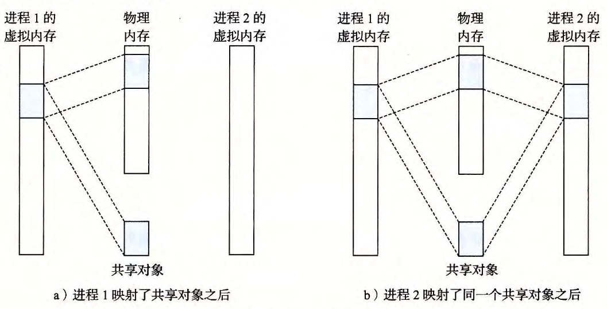
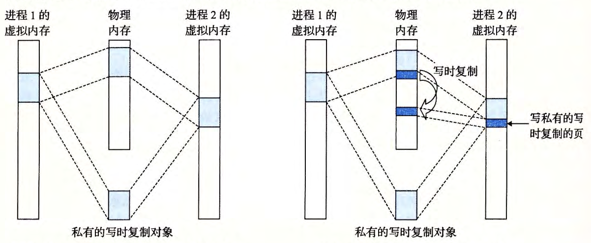

- #+BEGIN_TIP
  正如我们看到的，进程 这一抽象能够为每个进程提供自己私有的虚拟地址空间，可以免受其他进程的错误读写。
  不过，许多进程有**相同的只读代码区域**。例如，每个运行 Linux shell 程序 bash 的进程都有相同的代码区域。而且，许多程序需要访问[[只读运行时库]]代码的**相同副本**。例如，每个 C程序 都需要来自 标准C库 的诸如 `printf` 这样的函数。
  那么，如果每个进程都在 物理内存 中保持这些常用代码的副本，那就是极端的浪费了。幸运的是，[[内存映射]]给我们提供了一种清晰的机制，用来控制多个[[进程]]如何[[共享目标]]。
  #+END_TIP
- 一个[[目标]]可以被[映射]([[内存映射]])到[[虚拟内存]]的一个[区域]([[虚拟内存区域]])，要么作为[[共享目标]]，要么作为[[私有目标]]。
	- 如果一个进程将一个[[共享目标]]映射到它的虚拟地址空间的一个 *区域* 内，那么这个进程对这个 区域 的任何写操作，对于那些也把这个[[共享目标]]映射到它们虚拟内存的 其他进程 而言，也是[[可见的]]。
	  而且，这些变化也会反映在[[磁盘]]上的 *原始目标* 中。
	- 另一方面，对于一个映射到[[私有目标]]的 *区域* 做的改变，对于 其他进程 来说是[[不可见的]]，并且进程对这个区域所做的任何[[写操作]]都**不会**反映在 *磁盘* 上的 *原始目标* 中（会复制创建出新页面来进行写操作）。
- 一个映射到[[共享目标]]的[[虚拟内存区域]]叫做[[共享区域]]。类似地，也有[[私有区域]]。
- 假设 进程1 将一个 共享目标 映射到它的 虚拟内存 的一个区域中，如图a所示。现在假设 进程2 将同一个 共享目标 映射到它的 虚拟地址空间（并不一定要和进程 1 在相同的虚拟地址处，如图b所示）。
	- 
- 因为每个[[目标]]都有一个**唯一的[[文件名]]**，[[内核]]可以迅速地判定 进程1 已经映射了这个 目标 ，而且可以使 进程2 中的 页表条目 指向相应的 物理页面 。关键点在于即使 目标 被映射到了多个[[共享区域]]，[[物理内存]]中也只需要存放[[共享目标]]的**一个副本**。
  #+BEGIN_TIP
  为了方便，我们将物理页面显示为连续的，但是在一般情况下当然不是这样的。
  #+END_TIP
- [[私有目标]]使用一种叫做[[写时复制]] (copy-on-write) 的巧妙技术被映射到虚拟内存中。
	- 一个私有目标 开始生命周期的方式基本上与 共享目标 的一样，在[[物理内存]]中只保存有 私有目标 的**一份副本**。比如，图a展示了一种情况，其中两个进程将一个 私有目标 映射到它们 虚拟内存 的不同 区域 ，但是共享这个对象同一个物理副本。
	  对于每个映射[[私有目标]]的进程，相应[[私有区域]]的[[页表条目]]都被标记为[[只读]]，并且[[区域结构]]被标记为[[私有的写时复制]]。
	  **只要**没有进程试图 *写* 它自己的[[私有区域]]，它们就可以继续共享物理内存中对象的一个单独副本。
	  然而，只要有一个进程试图 *写* [[私有区域]]内的某个页面，那么这个写操作就会触发一个[[保护故障]]。当[[故障处理程序]]注意到[[保护异常]]是由于进程试图写[[私有的写时复制区域]]中的一个[[页面]]而引起的，它就会在[[物理内存]]中创建**这个页面的一个新副本**，更新[[页表条目]]指向这个新的副本，然后恢复这个页面的[[可写权限]]，如图b所示。当[[故障处理程序]]返回时， [[CPU]]重新执行这个 *写操作* ，现在在新创建的页面上这个写操作就可以正常执行了。
	- 通过延迟创建 私有目标 中的副本直到最后可能的时刻，[[写时复制]]最充分地使用了稀有的[[物理内存]]。
	- 