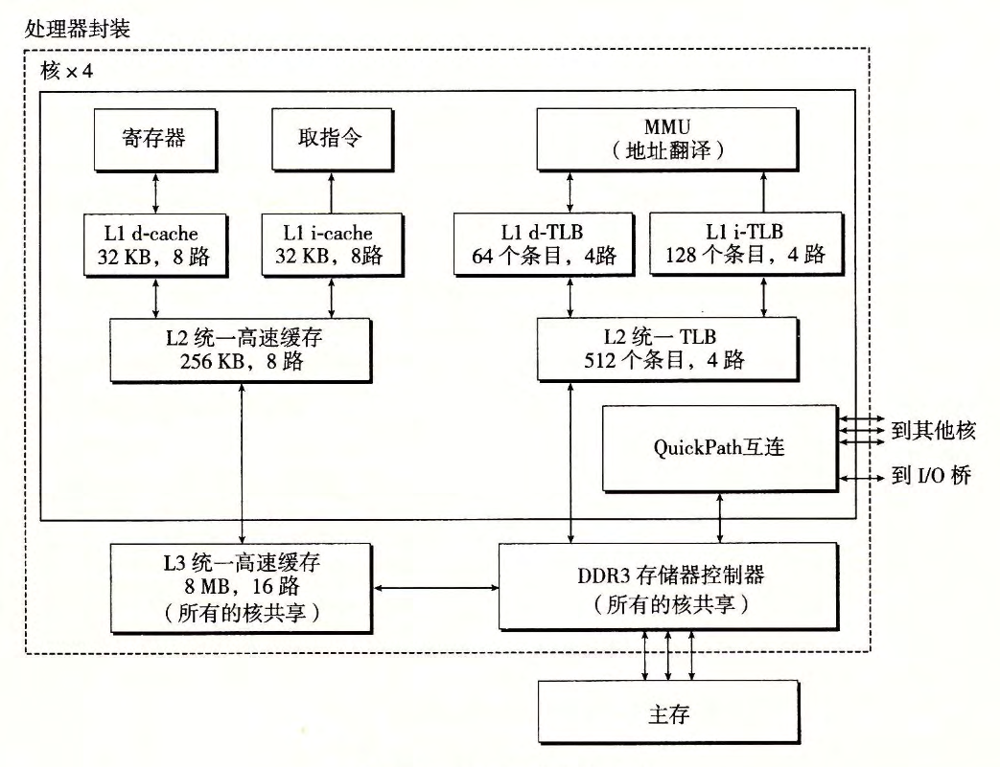
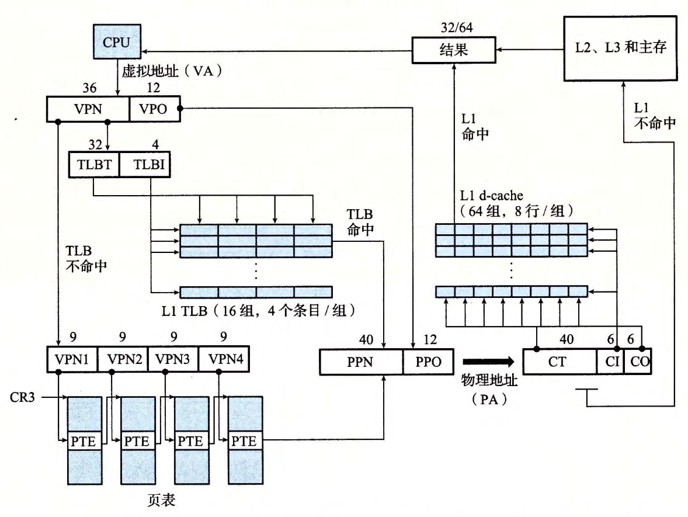

# ((6571ce00-4d0e-4ef5-9472-65f406bd3863))
	- 下图给出了 Core i7 [[内存系统]]的重要部分。处理器封装(processor package)包括四个核、一个大的所有核共享的 L3高速缓存，以及一个 DDR3内存控制器。每个核包含一个层次结构的 TLB、一个层次结构的数据和指令高速缓存，以及一组快速的点到点链路，这种链路基于 [[QuickPath]]技术，是为了让一个核与其他核和外部1/0桥直接通信。 TLB是虚拟寻址的，是四路组相联的。 Ll、 LZ和 L3高速缓存是物理寻址的，块大小为64字节。 Ll和 LZ是8路组相联的，而 L3是16路组相联的。页大小可以在启动时被配置为4KB或4MB。 Linux使用的是4KB的页。
	  
	- 下图总结了完整的 Core i7 [[地址翻译]]过程，从 CPU产生虚拟地址的时刻一直到来自内存的数据字到达 CPU。
		- Core i7采用四级页表层次结构。每个进程有它自己私有的页表层次结构。当一个 Linux进程在运行时，虽然 Core i7体系结构允许页表换进换出，但是与已分配了的页相关联的页表都是驻留在内存中的。
		- [[CR3 控制寄存器]]指向第一级[[页表]]([[L1]])的起始位置。 CR3的值是每个进程上下文的一部分，每次[[上下文切换]]时， CR3的值都会被恢复。
		  
	- 下图给出了第一级、第二级或第三级页表中条目的格式。当 P=l时(Linux中就总是如此），地址字段包含一个40位物理页号(PPN),它指向适当的页表的开始处。注意，这强加了一个要求，要求物理页表4KB对齐。
	  
	  给出了第四级页表中条目的格式。当 P=l,地址字段包括一个40位 PPN,它指向物理内存中某一页的基地址。这又强加了一个要求，要求物理页4KB对齐。
	  
	- [[PTE]]有三个权限位，控制对页的访问。
		- [[R/W 位]]确定页的内容是可以读写的还是只读。
		- [[U/S 位]]确定是否能够在用户模式中访问该页，从而保护操作系统内核中的代码和数据。不被用户程序访问。
		- [[XD 位]]是在 64 位系统中引入的，可以用来禁止从某些内存页取指令。这是一个重要的新特性，通过限制只能执行只读代码段，使得操作系统内核降低了缓冲区溢出攻击的风险。
	- 当[[MMU]]翻译每一个虚拟地址时，它还会更新另外两个内核缺页处理程序会用到的位。
		- 每次访问一个页时， MMU 都会设置[[A 位]]，称为 *引用位* 。内核可以用这个引用位来实现它的[[页替换算法]]。
		- 每次对一个页进行了写之后， MMU 都会设置[[D 位]]，又称 *修改位* 或 *脏位* 。修改位告诉内核在复制[[替换页]]之前是否必须写回[[牺牲页]]。内核可以通过调用一条特殊的[[内核模式指令]]来清除引用位或修改位 。
	- 下图给出了 Core i7 MMU 如何使用四级的页表来将虚拟地址翻译成物理地址。 36位 VPN 被划分成四个 9 位的片，每个片被用作到一个页表的偏移量。[[CR3 寄存器]]包含 L1 页表的物理地址。 VPN 1 提供到一个 L1 PTE 的偏移量 ，这个 PTE 包含 L2 页表的[[基地址]]。 VPN 2 提供到一个 L2 PTE 的偏移量，以此类推。