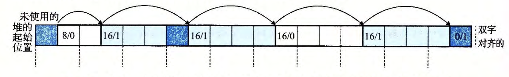

alias:: 分割

- 一旦[[分配器]]找到一个匹配的[[空闲块]]，它就必须做另一个策略决定，那就是分配这个空闲块中多少空间。
	- 一个选择是用整个空闲块。虽然这种方式简单而快捷，但是主要的缺点就是它会造成[[内部碎片]]。
	  如果[[放置策略]]趋向于产生好的匹配，那么额外的内部碎片也是可以接受的。
	- 然而，如果匹配不太好，那么分配器通常会选择将这个空闲块[[分割]]为两部分。
	  第一部分变成分配块，而剩下的变成一个新的空闲块。
- 下图展示了分配器如何分割[图](((65785dfc-2db9-4521-aa95-dbaf25a4c50e))) $8$ 个字的空闲块，来满足一个应用的对堆内存 $3$ 个字的请求。
- 