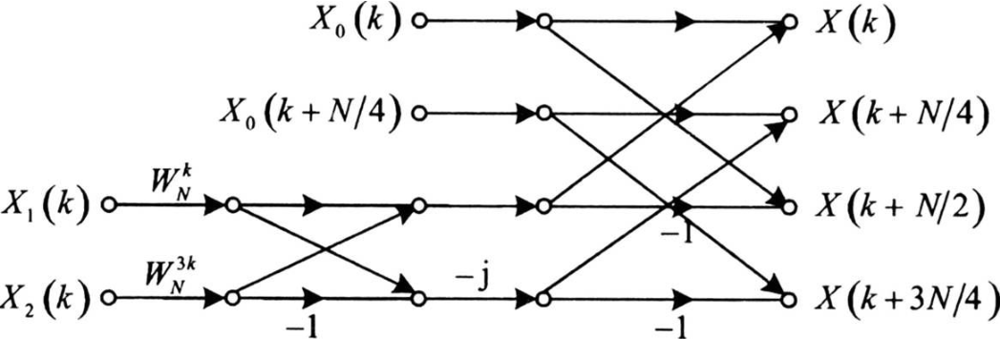
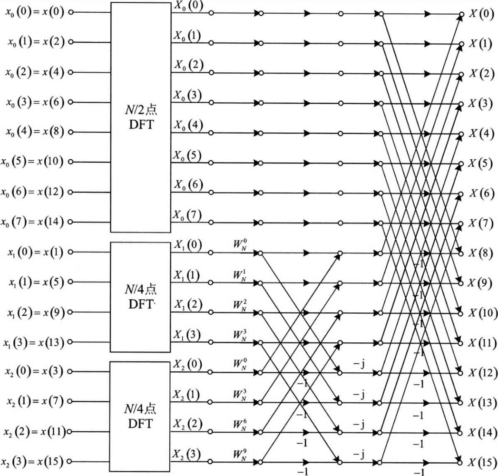
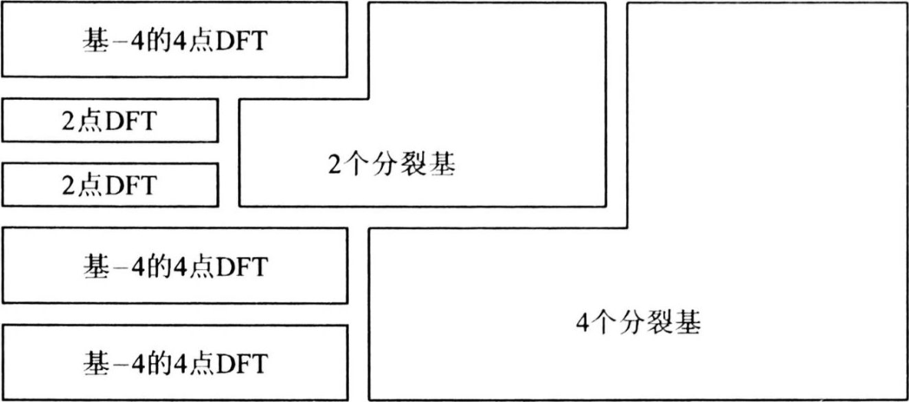
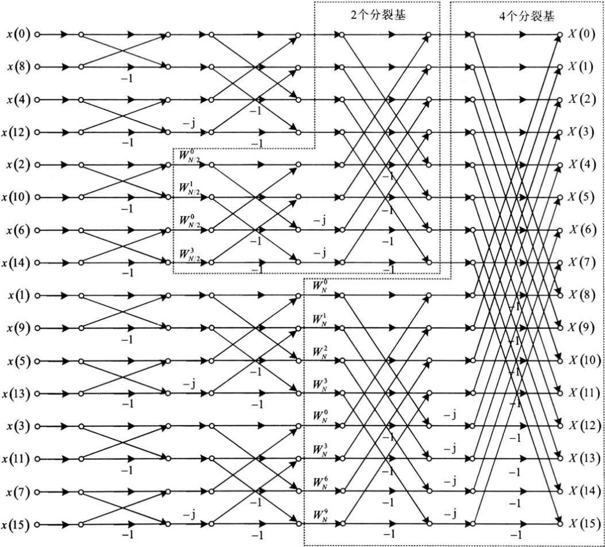

alias:: 分裂基算法

- 所谓的^^分裂基 FFT^^ 算法实际上是一种综合使用 基 -2 和 基 -4的 FFT 算法。它要求 $N= 2^{M}$ ，基本原理仍然是将大点数的 DFT 分解为多个小点数的 DFT ，但在具体做法上有所不同。先是如基 $- 2$ 算法一般将 $x(n)$ 分解为偶数点部分和奇数点部分，然后再将奇数点部分分解为两部分。
  也即是说，分裂基算法对 $x(n)$ 的**偶数点**部分是按[[基 -2]]算法来分解，对**奇数点**部分是按[[基 -4]] 算法来分解。
  分裂基 FFT 算法也同样可以按时间抽取或者按频率抽取。下面以[[按时间抽取]]为例来介绍。
- 第 $1$ 步，对 $x(n)$ 的偶数点部分进行基 $- 2$ 分解，奇数点部分进行基 $- 4$ 分解，用数学公式表示如下：
  $$\begin{aligned}
  x_{0}(n)=x(2 n), & n=0,1,2, \cdots, N / 2-1 \\
  x_{1}(n)=x(4 n+1), & n=0,1,2, \cdots, N / 4-1 \\
  x_{2}(n)=x(4 n+3), & n=0,1,2, \cdots, N / 4-1
  \end{aligned} \tag{1}
  $$
  第 $2$ 步，分别计算 $X_{0}(k)$ 、 $X_{1}(k)$ 、 $X_{2}(k)$ ：
  $$\begin{aligned}
  X_{0}(k)&=\sum_{n=0}^{N / 2-1} x_{0}(n) W_{N / 2}^{k n}=\sum_{n=0}^{N / 2-1} x(2 n) W_{N / 2}^{k n}, & k=0,1,2, \cdots, N / 2-1 \\
  X_{1}(k)&=\sum_{n=0}^{N / 4-1} x_{1}(n) W_{N / 4}^{k n}=\sum_{n=0}^{N / 4-1} x(4 n+1) W_{N / 4}^{k n}, & k=0,1,2, \cdots, N / 4-1 \\
  X_{2}(k)&=\sum_{n=0}^{N / 4-1} x_{2}(n) W_{N / 4}^{k n}=\sum_{n=0}^{N / 4-1} x(4 n+3) W_{N / 4}^{k n}, & k=0,1,2, \cdots, N / 4-1
  \end{aligned} \tag{2}
  $$
  第 $3$ 步，根据 $X_{0}(k)$ 、 $X_{1}(k)$ 、 $X_{2}(k)$ 组合得到 $X(k)$ ，推导过程与基 $- 2$ 及基 $- 4$ 算法类似，下面仅给出结论：
  $$\begin{aligned}
  X(k)&=X_{0}(k)+W_{N}^{k} X_{1}(k)+W_{N}^{3 k} X_{2}(k) \\
  X(k+N / 4)&=X_{0}(k+N / 4)-\mathrm{j} W_{N}^{k} X_{1}(k)+\mathrm{j} W_{N}^{3 k} X_{2}(k) \\
  X(k+N / 2)&=X_{0}(k)-W_{N}^{k} X_{1}(k)-W_{N}^{3 k} X_{2}(k) \\
  X(k+3 N / 4)&=X_{0}(k+N / 4)+\mathrm{j} W_{N}^{k} X_{1}(k)-\mathrm{j} W_{N}^{3 k} X_{2}(k)
  \end{aligned} \tag{3}
  $$
  式 $(3)$ 中 $k$ 的取值范围为 $0$ ， $1$ ， $2$ ， $\cdots$ ， $N / 4-1$ 。分裂基 FFT 算法的基本蝶形运算如下图所示。
	- 
	  id:: 660e9a92-1cf7-4ecf-9203-fce2480695a8
- 经过一次分解后的蝶形图如下图所示，图中 $N=16$ 。
   
  由图可见，一次分解使整个运算由一个 $N / 2$ 点 DFT、 $2$ 个 $N / 4$ 点 DFT 及 $N / 4$ 个基本的分裂基蝶形运算组成。
  （）
  像基 $-2$ 和基 $-4$ 算法一样，还可以对 $x_{0}(n)$ 、 $x_{1}(n)$ 和 $x_{2}(n)$ 做类似的分解，即将 $x_{0}(n)$ 分解为一个 $N / 4$ 点 DFT 和两个 $N / 8$ 点 DFT，将 $x_{1}(n)$ 分解为一个 $N / 8$ 点 DFT 和两个 $N / 16$ 点 DFT，将 $x_{2}(n)$ 也同样分解为一个 $N / 8$ 点 DFT 和两个 $N / 16$ 点 DFT。按照这种方法一直分解下去，直到 DFT 点数如果是 $2$ 或 $4$ ，这样就可以直接表示成基 $-2$ 或基 $-4$ 的基本蝶形运算，此时分解结束。
- 例如对 $N=2^{4}=16$ 点的 DFT，第 $1$ 级分解中， $16$ 点的 $x(n)$ 分解为一个 $8$ 点的 $x_{0}(n)$ 和 $4$ 点的 $x_{1}(n)$ 及 $x_{2}(n)$ 。第 $2$ 级分解中， $8$ 点的 $x_{0}(n)$ 可分解为 $4$ 点的 $x_{3}(n)$ 和 $2$ 点的 $x_{4}(n)$ 及 $x_{5}(n)$ ，而 $x_{1}(n)$ 及 $x_{2}(n)$ 均为 $4$ 点，可直接用基 $- 4$ 的基本蝶形运算实现，因而无需再分解。经过第 $2$ 级分解后， $x_{3}(n)$ 为 $4$ 点，可直接用基 $-4$ 的基本蝶形运算实现，也无需再分解， $x_{4}(n)$ 及 $x_{5}(n)$ 均为 $2$ 点，可直接用基 $-2$ 的基本蝶形运算实现，因而也无需再分解。
- 也即是说，$16$ 点的  DFT 用分裂基 FFT 算法，只需要两级分解。在第 $1$ 级分解中，还包括了 $4$ 个基本的分裂基蝶形运算 $;$ 在第 $2$ 级分解中，包括了 $2$ 个基本的分裂基蝶形运算。图 $6.15$ 给出了 $N=16$ 时分裂基 FFT 算法的结构示意图。
  根据下图可以很方便地画出 $N=16$ 时的分裂基 FFT 算法完整流程图，
   
  如下图所示。此时的输入为倒位序，输出为正常顺序。原因与基-2 DIT FFT 算法的完全一致。
  
- ## [[分裂基 FFT 运算量分析]]
	- 由图 $1$ 所示的基本分裂基蝶形图可知，每一个基本的蝶形运算包括 $2$ 次复数乘法和 $6$ 次复数加法。可以证明，对于 $N=2^{M}$ 点的 DFT 来说，其所需的基本蝶形运算由下式确定：
	  $$B_{M}=\frac{N}{6} \log _{2} N-\frac{1}{9}\left(N-(-1)^{M}\right) \approx \frac{N}{6} \log _{2} N, M \geqslant 3$$
	  式中 $B_{M}$ 表示 $N=2^{M}$ 时所需的基本蝶形运算数目，于是，分裂基算法所需的复数乘法次数 $m_{\mathrm{F}}$ 为：
	  $$m_{\mathrm{F}}=2 \times B_{M}=\frac{N}{3} \log _{2} N-\frac{2}{9}\left(N-(-1)^{M}\right) \approx \frac{N}{3} \log _{2} N$$
	  所需的复数加法次数 $a_{\mathrm{F}}$ 仍然是 $N \log _{2} N$ 。