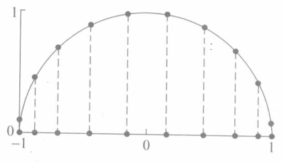

- [[第一类切比雪夫多项式]] $T_n(x)$在区间 $[-1,1]$ 上有 $n$ 个[零点]([[切比雪夫多项式零点]]) 和 $n+1$ 个[极值点]([[切比雪夫多项式零点]]) (包括 *端点* )。
  这两组点称为[[切比雪夫点]]，它们在插值中有重要作用. 从下图中可以看到切比雪夫点恰好是 *单位圆周* 上 *等距分布点* 的横坐标，这些点的横坐标在接近区间 $[-1,1]$ 的端点处是密集的.
	- 
- 利用切比雪夫点做插值，可使[[插值区间最大误差]]最小化.
	- ### Proof
	  下面设插值点 $x_0,x_1,...,x_n\in[-1,1],f\in$ $\mathbb C^{n+1}[-1,1];L_n(x)$ 为相应的 $n$ 次[[拉格朗日插值多项式]]，那么[[插值余项]]
	  $$
	  R_n(x)=f(x)-L_n(x)=\frac{f^{(n+1)}\left(\xi\right)}{\left(n+1\right)!}\omega_{n+1}\left(x\right),
	  $$
	  于是
	  $$
	  \begin{aligned}&\max_{\substack{-1\leqslant x\leqslant1}}\mid f(x)-L_n(x)\mid \leqslant\frac{M_{n+1}}{(n+1)!}\max_{\substack{-1\leqslant x\leqslant1}}\mid(x-x_0)(x-x_1)\cdots(x-x_n)\mid,\end{aligned}
	  $$
	  其中
	  $$
	  M_{n+1}\:=\:\left\|\:f^{\left(n+1\right)}\left(x\right)\:\right\|_{\infty}\:=\:\max_{-1\leqslant x\leqslant1}\:\left|\:f^{\left(n+1\right)}\left(x\right)\:\right|
	  $$
	  是由 被插函数 确定的. 如果插值节点为 $T_{n+1}(x)$ 的零点
	  $$
	  x_k=\cos\frac{2k+1}{2(n+1)}\pi,\quad k=0,1,\cdots,n,
	  $$
	  则由[[最小零偏差]]定理可得
	  $$
	  \max_{-1\leqslant x\leqslant1}\mid\omega_{n+1}\left(x\right)\mid=\max_{-1\leqslant x\leqslant1}\mid\widetilde{T}_{n+1}\left(x\right)\mid=\frac1{2^n}.
	  $$
	  （在[[切比雪夫极值]]点处取等号）由此可导出**插值误差最小化**的结论.
- ## 定理（误差估计）
	- 设插值节点 $x_0,x_1,...,x_n$ 为切比雪夫多项式 $T_{n+1}(x)$ 的 *零点* ，被插函数$f\in C^{i+1}[-1,1],L_n(x)$为相应的插值多项式，则
	  id:: 65a24e11-77e5-4a69-867a-2c4f98d79a33
	  $$
	  \max_{-1\leqslant x\leqslant1}\mid f(x)-L_n(x)\mid\leqslant\frac{1}{2^n\left(n+1\right)!}\parallel f^{\left(n+1\right)}\left(x\right)\parallel_\infty. 
	  $$
		- 对于一般区间 $[a,b]$ 上的插值只要利用[[区间变换]]则可得到相应的结果，此时插值节点为
		  $$
		  x_k=\frac{b-a}2{\cos\frac{2k+1}{2(n+1)}}\pi+\frac{a+b}2,\quad k=0,1,\cdots,n.
		  $$
- ## 例子
	- 求$f(x)=\mathrm{e}^x$在[0,1]上的四次拉格朗日插值多项式$L_4(x)$,插值节点用$T_5(x)$的零点，并估计误差$\operatorname*{max}_{0\leqslant x\leqslant1}|\mathrm{e}^x-{L}_4(x)|.$
		- 利用 $T_5(x)$ 的零点和区间变换可知节点 
		  $x_k=\frac12\left(1+\cos\frac{2k+1}{10}\pi\right),\quad k=0,1,2,3,4$,
		  即
		  $x_0=0.975\:53\:,\:x_1=0.793\:90\:,\:x_2=0.5\:$, $x_3=0.20611,\quad x_4=0.02447.$
		- 对应的拉格朗日插值多项式为
		  ${L}_4(x)=1.000 022 74 +0.998 862 33x+0.50902251x^2+0.14184105x^3+0.06849435x^4.$
		  利用[式](((65a24e11-77e5-4a69-867a-2c4f98d79a33)))可得误差估计。
- ## 优点
  使用切比雪夫多项式的零点作为插值点的优点包括：
	- **减少[[插值误差]]**：相比于[[等距插值点]]，切比雪夫零点可以最大程度减少[[插值多项式的最大误差]]，特别是在插值区间的端点附近。
	- **避免[[龙格现象]]**：在使用等距插值点时可能出现的高度振荡现象在切比雪夫零点插值中得以显著减轻。
-