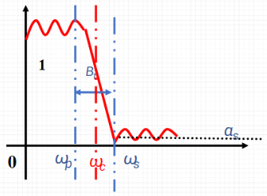
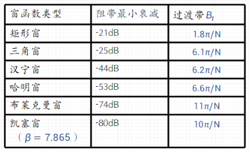

- 加窗对FIR滤波器的频响特性有重要影响，尤其是在过渡带宽度、阻带最小衰减和截止频率等方面。以下是这些概念的详细说明：
  {:height 256, :width 338}
- ### [[过渡带宽度]] \( B_t \)
  过渡带宽度 \( B_t \) 是指从通带边缘到阻带边缘的频率范围，是滤波器从完全通过到完全阻止信号的频率区间。对于FIR滤波器，过渡带宽度 \( B_t \) 通常与窗函数的长度（或窗函数的主瓣宽度）成反比。即窗函数越长，主瓣越窄，过渡带就越窄。它定义为通带边缘频率 \( \omega_p \) 和阻带边缘频率 \( \omega_s \) 之差：
  $$
  B_t = \omega_p - \omega_s
  $$
- ### [[阻带最小衰减]] \( a_s \)
  阻带最小衰减 \( a_s \) 表示阻带内信号衰减的最小值，通常以分贝（dB）表示。这是衡量滤波器性能的关键参数之一，表示滤波器可以多大程度上减少不希望的频率成分。不同的窗函数会导致不同的阻带衰减特性，例如，布莱克曼窗和汉明窗能提供较高的阻带衰减（即更好的旁瓣抑制）。
- ### [[3 dB 截止频率]] \( \omega_c \)
  对于低通滤波器，\( 3 \) dB 截止频率常常用来定义其截止频率，计算方法是：
  $$
  \omega_c = \frac{\omega_p + \omega_s}{2}
  $$
  其中 \( \omega_p \) 是通带的最高频率，\( \omega_s \) 是阻带的最低频率。这个频率通常被认为是滤波器性能的衡量标准，它反映了滤波器的频率响应和宽带特性。
- 下表为六种窗函数的基本参数
  