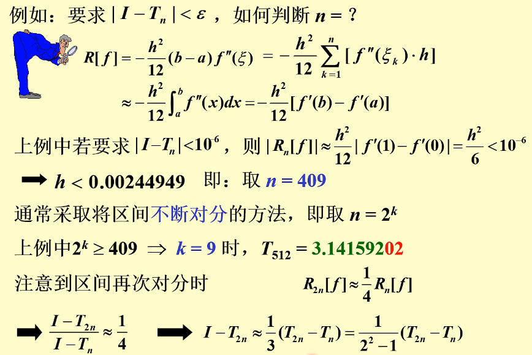
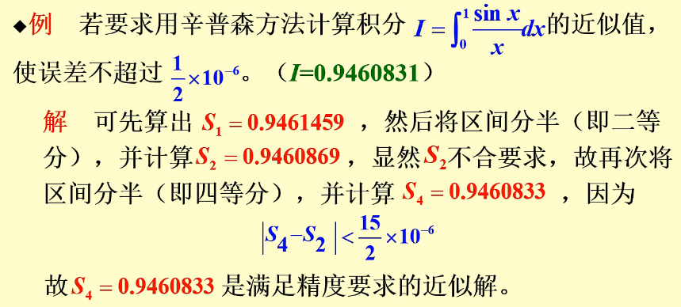

alias:: 逐步二分法

- ### 要求[[误差]]  $\left|I-T_{n}\right|<\varepsilon$ , 如何判断[[节点数]]  $n$ ?
	- {:height 490, :width 723}
- 从理论上说，可以用[误差式]([[求积公式截断误差]])来估计近似值的误差，或者根据精度要求来确定区间的等分数  $n$  (即确定步长  $h$  ), 而实际上, 由于公式中包含有被积函数的高阶导数, 要对它做出估计往往很困难, 因此在实际计算时, 最有效的方法是“事后估计误差法”, 即将区间逐次分半进行计算 (每分一次就进行一次计算), 并利用前后两次计算结果来判断误差的大小,其原理如下.
- 先看梯形公式, 由[梯形法误差公式](((65a547c4-08c4-4357-830b-77a440f900b1))), 知
  $$I-T_{n}=-\frac{b-a}{12}\left(\frac{b-a}{n}\right)^{2} f^{\prime \prime}\left(\xi_{1}\right), \quad \xi_{1} \in(a, b),$$
  其中,  $I$  表示积分  $\int_{a}^{b} f(x) \mathrm{d} x$  的真值,  
  $$T_{n}=\frac{h}{2}\left[f(a)+2 \sum_{k=1}^{n-1} f\left(x_{k}\right)+f(b)\right] .$$
  同理,还可以得到
  $$I-T_{2 n}=-\frac{b-a}{12}\left(\frac{b-a}{2 n}\right)^{2} f^{\prime \prime}\left(\xi_{2}\right), \quad \xi_{2} \in[a, b] .$$
  若  $f^{\prime \prime}(x)$  在  $[a, b]$  上变化不大, 则  $f^{\prime \prime}\left(\xi_{1}\right) \approx f^{\prime \prime}\left(\xi_{2}\right)$ , 且由上面两式可得
  $$\frac{I-T_{n}}{I-T_{2 n}} \approx 4 \text {. }$$
- 于是有
  id:: 65a7a3c7-fb4f-4846-9091-6597c2aba092
  $$I \approx T_{2 n}+\frac{1}{3}\left(T_{2 n}-T_{n}\right)=T_{2 n}+\frac{1}{4-1}\left(T_{2 n}-T_{n}\right) .$$
  此式表明, 若用  $T_{2 n}$  作为  $I$  的近似值, 则其[截断误差]([[求积公式截断误差]])约为  
  $$R_{2n}[f]\approx\frac{T_{2 n}-T_{n}}{3} .$$
- 因此, 在逐次二分进行计算时, 可以用  $T_{n}$  与  $T_{2 n}$  来估计误差, 这种直接用计算结果来估计误差的方法通常称作[误差的事后估计法]([[事后误差估计]]), 若  $\left|T_{2 n}-T_{n}\right|<\varepsilon^{\prime}=3 \varepsilon$  (  $\varepsilon$  为计算结果的允许误差), 则停止计算, 并取  $T_{2 n}$  作为积分的近似值; 否则将区间再次二分后算出  $T_{4 n}$ , 并检验不等式  $\left|T_{4 n}-T_{2 n}\right|<\varepsilon^{\prime}$  是否满足.
- 对于辛普森公式, 若  $f^{(4)}(x)$  在  $[a, b]$  上连续且变化不大, 有
  $$I \approx S_{2 n}+\frac{1}{15}\left(S_{2 n}-S_{n}\right)=S_{2 n}+\frac{1}{2^{4}-1}\left(S_{2 n}-S_{n}\right)$$
- 对于柯特斯公式, 若  $f^{(6)}(x)$  在  $[a, b]$  上连续且变化不大, 有
  $$I \approx C_{2 n}+\frac{1}{63}\left(C_{2 n}-C_{n}\right)=C_{2 n}+\frac{1}{2^{6}-1}\left(C_{2 n}-C_{n}\right)$$
- ## 例子
	- 
- ## [[变步长算法]]