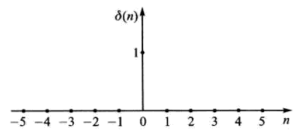

alias:: 单位抽样信号, Kronecker 函数, 单位脉冲信号, 单位脉冲序列

- 单位冲激信号  $\delta(n)$, 其波形如图所示。其数学定义式如下:
  $$\delta(n)=\left\{\begin{array}{l}
  1, n=0 \\
  0, n \neq 0
  \end{array}\right.$$
  这个信号是最简单、最基本的[[离散时间信号]], 也是最重要的离散时间信号之一。  
  
  > $\delta(n)$  类似于[[时域连续信号]]中的[[冲激函数]]  $\delta(t)$ , 它们的作用是相同的。
  所不同的是,  $\delta(t)$  是广义函数, 在  $t=0$ 时刻幅度趋向于无限大, 即无幅度可言, 只有用面积表示的强度。  $\delta(t)$  反映一种持续时间极短、函数值极大的信号类型, 如电学中的雷击电闪、力学中瞬间作用的冲击力等。
  而  $\delta(n)$  在  $n=0$  时刻有确定的[[幅度]]值, 即为 $1$ 。
- 对于任意序列  $x(n)$ , 可以用 单位脉冲序列 的[[移位加权和表示, 即
  $$x(n)=\sum_{m=-\infty}^{\infty} x(m) \delta(n-m)$$
-