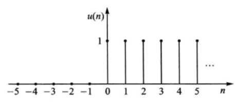

- [[单位阶跃信号]]  $u(n)$  的波形如图所示, 其数学定义式如下:
  $$u(n)=\left\{\begin{array}{l}
  1, n \geqslant 0 \\
  0, n<0
  \end{array}\right.$$
  它等效的物理模型是开关的闭合。
  单位阶跃信号的基本特性是[[单边性]], 即在  $n<0$  时  $u(n)$  全为 $0$ , 在  $n \geqslant 0$  时  $u(n)$  全为 $1$ 。利用这种单边性可以构成其他许多[[单边信号]]。
  