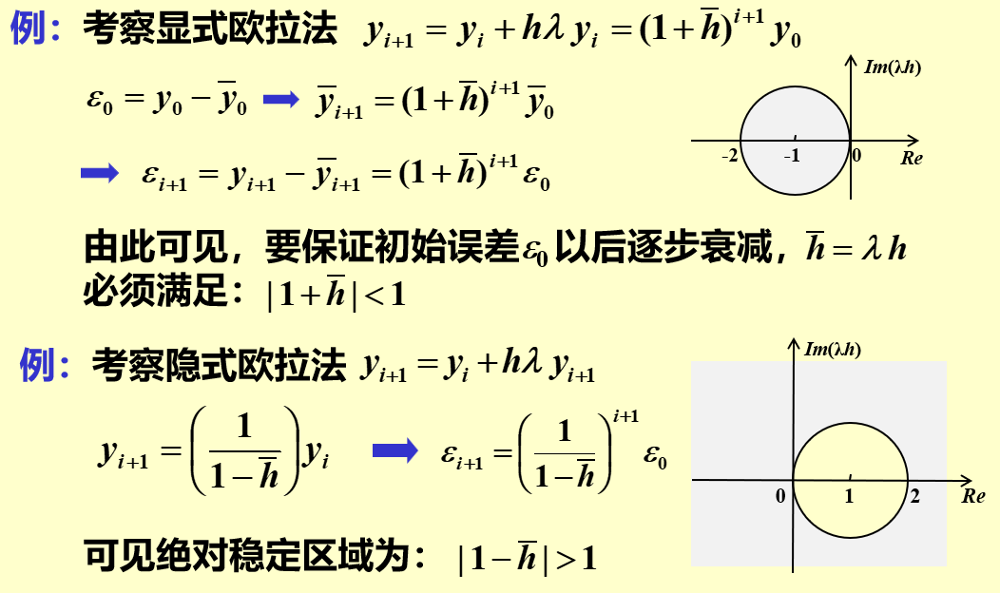
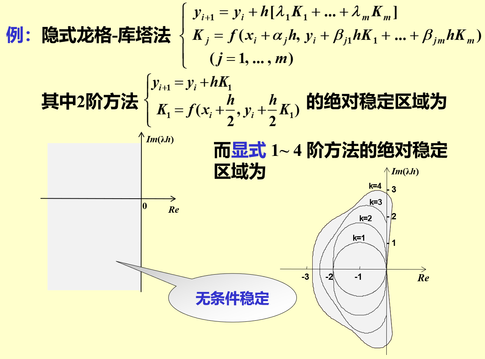

## 定义
	- 若一种[[数值方法]]在[[节点值]]  $y_{n}$  上有大小为  $\delta$  的[[扰动]], 对以后各节点值  $y_{m}(m>n)$  上产生的[[偏差]]均不超过  $\delta$ , 则称该方法是[[稳定]]的.
	  id:: 65b33926-fab2-4b02-9f64-7671e626059f
	- 若某算法在计算过程中任一步产生的[[误差]]在以后的计算中都**逐步衰减**, 则称该算法是[[绝对稳定]]的。
- 一般分析时为简单起见, 只考虑[[试验方程]]
  id:: 65b34063-cdc7-437f-9cce-b04e8eb23bb7
  $$y^{\prime}=\lambda y \quad \operatorname{Re}(\lambda)<0$$
  当步长取为  $h$  时, 将某算法应用于上式, 并假设只在初值产生误差  $\varepsilon_{0}=y_{0}-\bar{y}_{0}$ , 则若此误差以后逐步衰减, 就称该算法相对于  $\bar{h}=\lambda h$  [[绝对稳定]],  $\bar{h}$  的**全体**构成[[绝对稳定区域]]。
  我们称算法  $\mathbf{A}$  比算法  $\mathbf{B}$  [[稳定]], 就是指  $\mathbf{A}$  的 绝对稳定区域 比  $\mathbf{B}$ 的大。
- >一般来说，[[隐式欧拉法]]的[[绝对稳定性]]比**同阶**的[显式法]([[显式欧拉公式]])的好。
- ## 例子
	- {:height 437, :width 723}
	- 