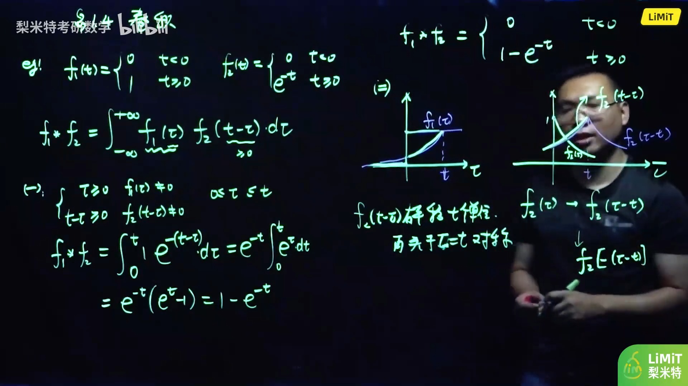
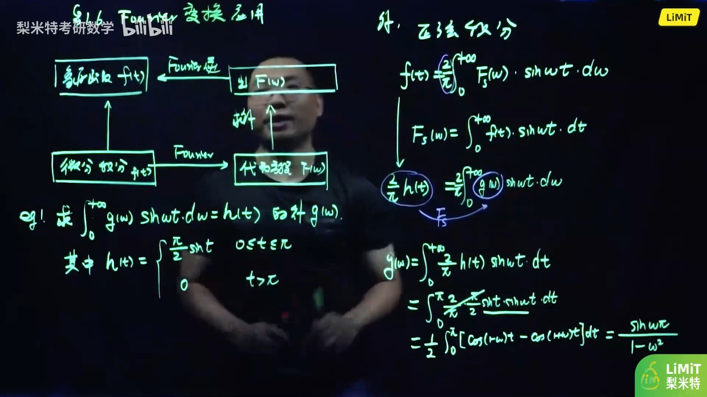
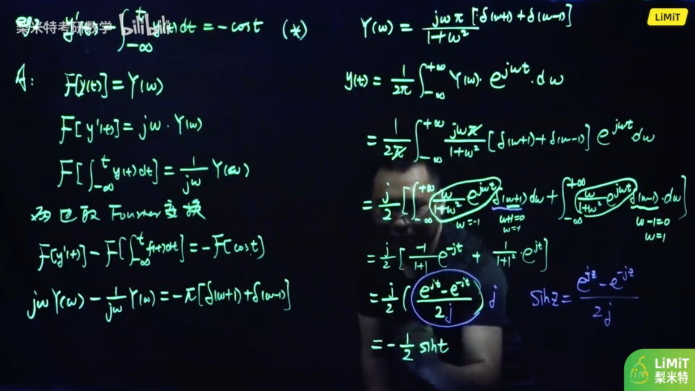

alias:: 卷积运算

- 卷积是一种数学运算，用于合并两个函数以产生第三个函数，反映了一个函数修改另一个函数的方式。
- ### 卷积运算的定义
	- 设实值函数  $f_{1}(t)$  与  $f_{2}(t)$  在  $(-\infty,+\infty)$  内有定义. 若[[反常积分]]  $\int_{-\infty}^{+\infty} f_{1}(\tau) f_{2}(t-\tau) \mathrm{d} \tau$  对任何实数  $t$  收敛, 则它定义了一个自变量为  $t$  的函数, 称此函数为  $f_{1}(t)$  与  $f_{2}(t)$  的 *卷积* , 记为  $f_{1}(t)$ * $f_{2}(t)$ , 即
	  $$f_{1}(t) * f_{2}(t)=\int_{-\infty}^{+\infty} f_{1}(\tau) f_{2}(t-\tau) \mathrm{d} \tau .$$
- ### 卷积的性质
  卷积运算具有几个重要性质，这些性质在理论分析和实际应用中都非常有用：
	- **交换律**：
	  logseq.order-list-type:: number
	  \[ f * g = g * f \]
	- **结合律**：
	  logseq.order-list-type:: number
	  \[ f * (g * h) = (f * g) * h \]
	- **分配律**：
	  logseq.order-list-type:: number
	  \[ f * (g + h) = f * g + f * h \]
	- **线性性质**：
	  logseq.order-list-type:: number
	  如果\( a \)和\( b \)是常数，则
	  \[ a(f * g) + b(g * h) = af * g + bg * h \]
	- **微分性质**：
	  logseq.order-list-type:: number
	  如果\( f \)和\( g \)是可微函数，则
	  \[ \frac{d}{dt}(f * g) = \frac{df}{dt} * g = f * \frac{dg}{dt} \]
	- **积分性质**：
	  logseq.order-list-type:: number
	  $$\int_{-\infty}^t(f*g)\mathrm d\tau =\int_{-\infty}^t f\mathrm d\tau * g=\int_{-\infty}^t g \mathrm d\tau*f$$
		- $$f(t) * \delta(t)=\int_{-\infty}^{+\infty} f(\tau) \cdot \delta(t-\tau) \mathrm d \tau=f(t)$$
		  >[[单位脉冲函数]] $\delta(t)$ 相当于是[[单位元]]。
		- $$f^{\prime}(t)=f^{\prime}(t) * \delta(t)=f(t) * \delta^{\prime}(t)$$
		  > [[导数]]可以写成卷积的形式，所以导数是一个特殊的卷积。
		- \begin{aligned}
		  f(t) * u(t) &=\int_{-\infty}^{+\infty} f(\tau) u(t-\tau) d \tau \\
		  &=\int_{-\infty}^{t} f(\tau) u(t-\tau) d \tau+\int_{t}^{+\infty} f(\tau) u(t-\tau) d \tau \\
		  &=\int_{-\infty}^t f(\tau)\mathrm d\tau
		  \end{aligned}
		  > [[积分]]也是卷积
	- **[[时移性质]]**：
	  logseq.order-list-type:: number
	  如果\( f(t - t_0) \)和\( g(t - t_0) \)是函数\( f \)和\( g \)的时移版本，则
	  \[ f(t - t_0) * g(t - t_0) = (f * g)(t - t_0) \]
	- **[[卷积定理]]**：
	  logseq.order-list-type:: number
	  设  $F_{1}(\omega)=\mathcal{F}\left[f_{1}(t)\right], F_{2}(\omega)=\mathcal{F}\left[f_{2}(t)\right]$ , 则有
	  \begin{aligned}
	  \mathcal{F}\left[f_{1}(t) * f_{2}(t)\right]=F_{1}(\omega) \cdot F_{2}(\omega), \\
	  \mathcal{F}\left[f_{1}(t) \cdot f_{2}(t)\right]=\frac{1}{2 \pi} \overline{F_{1}}(\omega) * F_{2}(\omega) .
	  \end{aligned}
		- \begin{aligned}
		  \mathcal F\left[\int_{-\infty}^{t} f(t) d t\right] &=\mathcal F\left[f(t) * u^{\prime}(t)\right] \\
		  &=F(\omega) \cdot\left[\frac{1}{j \omega}+\pi \delta(\omega)\right] \\
		  &=\frac{1}{j \omega} F(w)+\pi F(0) \cdot \delta(\omega)
		  \end{aligned}
		- $$\mathcal F[f^{\prime}(t)]=\mathcal F[f{*} \delta^{\prime}(t)]=(j \omega) F(\omega)$$
- ## 例子
	- 
	- 
	- 