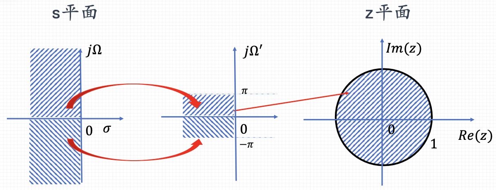

alias:: 双线性变换

- ### 双线性变换的频率扭曲
  双线性变换将s平面（拉普拉斯变换域）中的复频率变量s转换为z平面（Z变换域）中的复频率变量z，使用以下公式：
  $$z = e^{sT}$$
  但在实际应用中，为了简化计算，通常使用双线性变换的近似形式：
  $$s = \frac{2}{T} \cdot \frac{1 - z^{-1}}{1 + z^{-1}}$$
  这里，\(T\) 是采样周期。这种变换保持了系统的稳定性和[[因果性]]，但会导致频率轴上的非线性扭曲。
- ### [[频率预畸变]]处理步骤
	- **确定关键频率点**：首先，确定模拟滤波器设计中的关键频率点，如截止频率、通带边缘或阻带边缘等。
	  logseq.order-list-type:: number
	- **计算预畸变频率**：对于每个关键频率点，使用双线性变换的逆变换关系来计算相应的预畸变频率。这可以通过以下公式完成：
	  logseq.order-list-type:: number
	  $$\Omega = \frac{2}{T} \tan\left(\frac{\omega T}{2}\right)$$
	  这里，\(\omega\) 是数字滤波器设计中的目标频率（弧度/秒），\(\Omega\) 是对应的预畸变后的模拟频率（弧度/秒），\(T\) 是采样周期。
	- **使用预畸变频率重新设计模拟滤波器**：根据计算得到的预畸变频率，重新设计模拟滤波器。这意味着在模拟滤波器设计中使用预畸变后的频率作为设计参数。
	  logseq.order-list-type:: number
	- **应用双线性变换**：在使用预畸变后的模拟滤波器参数完成设计后，应用双线性变换将模拟滤波器转换为数字滤波器。
	  logseq.order-list-type:: number
	  
- ## 例子
	- ((6616779e-2edc-422d-bd41-8f1937c0e314))