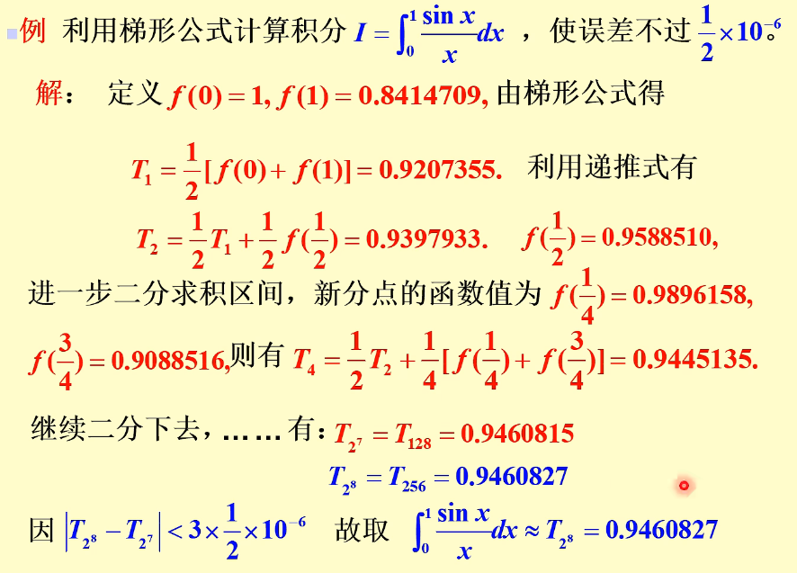

alias:: 变步长牛顿-柯特斯公式

- ## [[梯形法的递推化]]
	- 下面以梯形法为例, 介绍[[变步长算法]].
	  将积分区间  $[a, b]$ $n$  等分, 则一共有  $(n+1)$  个分点, 按[[梯形公式]]计算积分的近似值  $T_{n}$ , 需要计算  $(n+1)$  个函数值, 当 $T_{n}$  不满足精度要求时, 就将各个小区间二分, 此时分点增至  $(2 n+1)$  个, 如果再直接用梯形公式计算积分新的近似值  $T_{2 n}$ , 就需要计算  $(2 n+1)$  个函数值, 实际上, 这  $(2 n+1)$  个点中有  $(n+1)$  个点是 “老分点”, 对应的函数值在计算  $T_{n}$  时已经算出, 为了避免这种重复计算, 将计算  $T_{2 n}$  的式子作如下改造.
	  由梯形公式,有
	  $$T_{2 n}=\frac{b-a}{4 n}\left[f(a)+2 \sum_{k=1}^{2 n-1} f\left(a+k \frac{b-a}{2 n}\right)+f(b)\right] .$$
	- 注意到在分点  $x_{k}=a+k \frac{b-a}{2 n} \quad(k=1,2, \cdots, 2 n-1)$  中, 当  $k$  取 偶数 时是 “老分点”, 当  $k$ 取奇数时是新增加的点, 将 “老分点” 的函数值从右端求和记号中分离出来, 即得
	  \begin{aligned}
	  T_{2 n}= & \frac{b-a}{4 n}\left[f(a)+2 \sum_{k=1}^{n-1} f\left(a+2 k \frac{b-a}{2 n}\right)\right. \\
	  & \left.+f(b)+2 \sum_{k=1}^{n} f\left(a+(2 k-1) \frac{b-a}{2 n}\right)\right] \\
	  = & \frac{b-a}{4 n}\left[f(a)+2 \sum_{k=1}^{n-1} f\left(a+2 k \frac{b-a}{2 n}\right)+f(b)\right] \\
	  & +\frac{b-a}{2 n} \sum_{k=1}^{n} f\left[a+(2 k-1) \frac{b-a}{2 n}\right] .
	  \end{aligned}
	- 再由梯形公式, 就得到递推算式
	  $$T_{2 n}=\frac{1}{2} T_{n}+\frac{b-a}{2 n} \sum_{k=1}^{n} f\left[a+(2 k-1) \frac{b-a}{2 n}\right] .$$
	  上式表明, 只要算出新增加的  $n$  个点上的函数值, 就可以求出  $T_{2 n}$ , 与直接用梯形式求  $T_{2 n}$  相比较, 计算工作量几乎节省了一半 ([[动态规划]]).
	- 为了便于编制程序, 通常将积分区间  $[a, b]$  的等分数依次取  $1=2^{0}, 2=2^{1}, 4=2^{2}, 8=2^{3}, \cdots$ , 并将**递推式**改写成
	  id:: 65a8126c-39fe-4fb9-b7c0-878814dc54a0
	  collapsed:: true
	  $$\left\{\begin{array}{l}
	  T_{1}=\frac{b-a}{2}[f(a)+f(b)], \\
	  T_{2^{k}}=\frac{1}{2} T_{2^{k-1}}+\frac{b-a}{2^{k}} \sum_{i=1}^{2^{k-1}} f\left[a+(2 i-1) \frac{b-a}{2^{k}}\right] .
	  \end{array}\right.$$
		- 利用上式在电子计算机上求积分的计算步骤如下:
		  collapsed:: true
			- 计算初值  T_{1} ;
			  logseq.order-list-type:: number
			- $k \leftarrow 1$（$k$ 赋值为 $1$ ）;
			  logseq.order-list-type:: number
			- 计算新的梯形值  $T_{2^{k}}$ ;
			  logseq.order-list-type:: number
			- 精度控制: 若  $\left|T_{2^{k}}-T_{2^{k-1}}\right|<\varepsilon$ , 则停止计算, 并输出  $T_{2^{k}}$  作为积分的近似值; 否则  $k \leftarrow k+1$ , 并转第 3 步继续计算 (其中  $\varepsilon$  根据问题的精度要求确定).
			  logseq.order-list-type:: number
	- ### 例子
	  collapsed:: true
		- 
- ## [[龙贝格算法]]