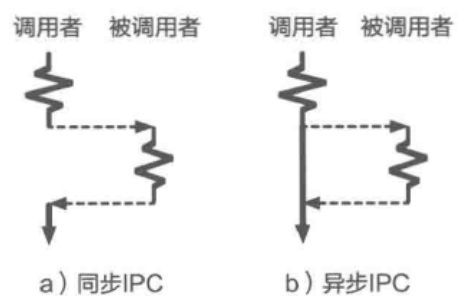

- 进程间通信的另一种分类是: 同步 IPC 和 异步IPC 。
- 简单来看，^^同步 IPC^^ 指 IPC 操作（如`Send`）会[[阻塞]]进程直到该操作完成；
  而[[异步 IPC]]则通常是非阻塞的，进程只要发起一次操作即可返回，不需要等待其完成。
  
- 同步 IPC往往是[[双向 IPC]](RPC), 即发送者需要等待返回结果。
  不过也存在单向PC是同步的，在这种场景下，虽然发送者不会阻塞等待接收返回结果，但是发送者会阻塞等待接收者接收。
- 考虑一个具体的场景，假设操作系统支持多方通信：允许一个连接上有多个发送者，但不支持多个接收者。这种场景下，一个可能的情况是，发送者发送消息的时候接收者正在接收和处理其他发送者的消息。
	- 在^^同步^^的设计下，此时发送者需要等待一定的时间，
	- 而[异步]([[异步 IPC]])的设计则会通过[[内核缓冲区]]等方式暂存消息，从而避免等待。
- 在早期的[[微内核系统]]（如L4微内核）中，^^同步 IPC^^ 往往是唯一的 PC 方式。这是因
  为相比异步而言，同步 PC有更好的编程抽象。
  使用（同步的）RPC时，调用者可以将进程间通信看成一种[[函数调用]]。
- 然而同步PC在操作系统的发展中逐渐表现出一些不足之处，一个典型的问题是[[并发]]。
  当一个服务进程要响应很多客户进程的通信时，比如一个微内核中的用户态文件系统，在同步PC的实现下，服务进程（为了性能）往往需要创建大量工作线程去响应不同的客户进程，否则有可能出现阻塞客户请求的情况。然而，这往往需要权衡，即过少的工作线程会导致大量客户进程被阻塞，过多的工作线程会浪费系统资源。
  而使用[[异步IPC]]则可以在并发通信时避免这类问题。
  后续的一些设计（如Android Binder）通过[[线程池]]的模型克服了同步 IPC 下的并发挑战。
-