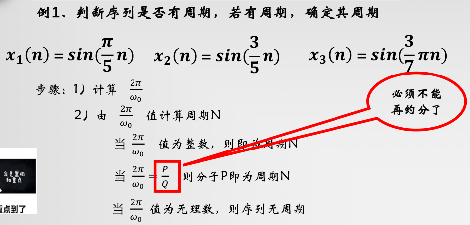
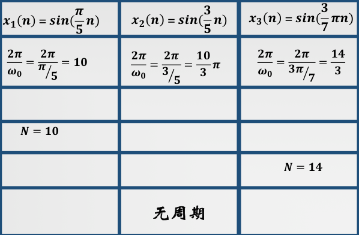
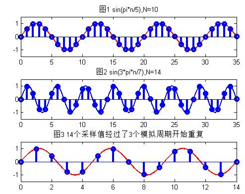

alias:: 周期序列

- ### 定义
  一个离散时间序列 \(x[n]\) 被称为周期序列，如果存在一个正整数 \(N\)，使得对于所有整数 \(n\)，都有：
  \[ x[n] = x[n + N] \]
  这里的 \(N\) 被称为序列的周期，是指序列在每 \(N\) 个样本后重复一次。如果 \(N\) 是满足上述条件的最小正整数，则 \(N\) 被称为序列的基本周期。
- ### 数学表达
  周期序列可以通过各种离散函数来表示，例如离散时间的正弦波或余弦波。一个简单的周期序列例子是离散时间[[正弦序列]]，可以表示为：
  \[ x[n] = A \sin(2\pi f n + \phi) \]
  其中，
	- \(A\) 是振幅，
	- \(f\) 是序列的频率，表示每个周期内重复的次数，
	- \(n\) 是离散时间指标，
	- \(\phi\) 是相位偏移。
- 需要注意的是，在离散时间序列中，频率的概念与连续时间信号略有不同。由于采样的存在，离散时间序列的频率是相对于采样频率的，并且受到奈奎斯特定律（Nyquist Theorem）的限制，即序列的最大无歧义频率不能超过采样频率的一半。
- ### 傅里叶级数表示
  与连续时间周期信号可以通过傅里叶级数分解为一系列正弦波和余弦波的和相似，周期序列也可以用离散时间傅里叶级数（Discrete-Time Fourier Series, DTFS）表示。DTFS将周期序列分解为一系列离散频率的正弦波和余弦波的和：
  \[ x[n] = \sum_{k=0}^{N-1} c_k e^{j(2\pi k/N) n} \]
  其中，\(c_k\) 是序列在频率 \(k/N\) 处的傅里叶系数，\(N\) 是序列的周期，\(e^{j(2\pi k/N) n}\) 表示离散时间复指数函数，是周期序列分析中的基本构建块。
- 
- 
- 