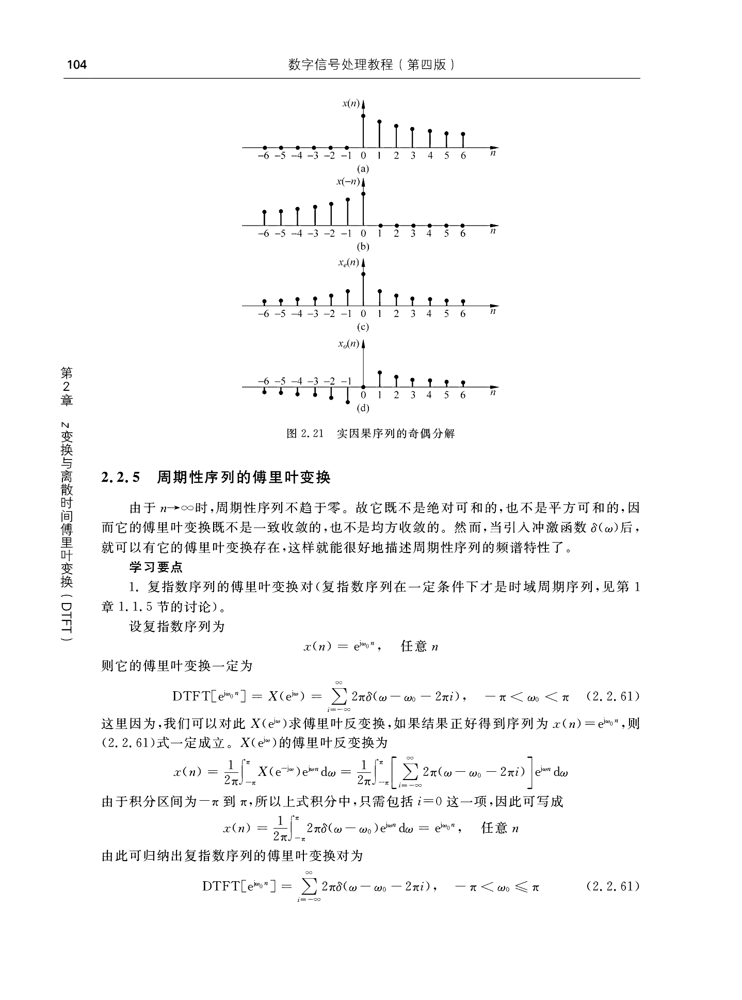
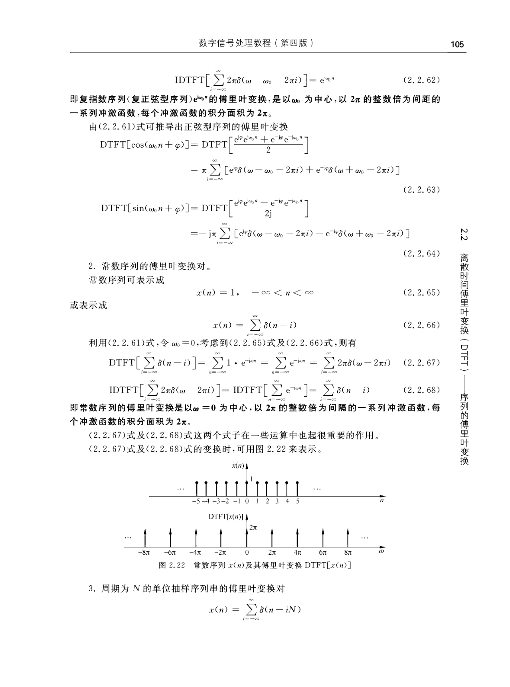
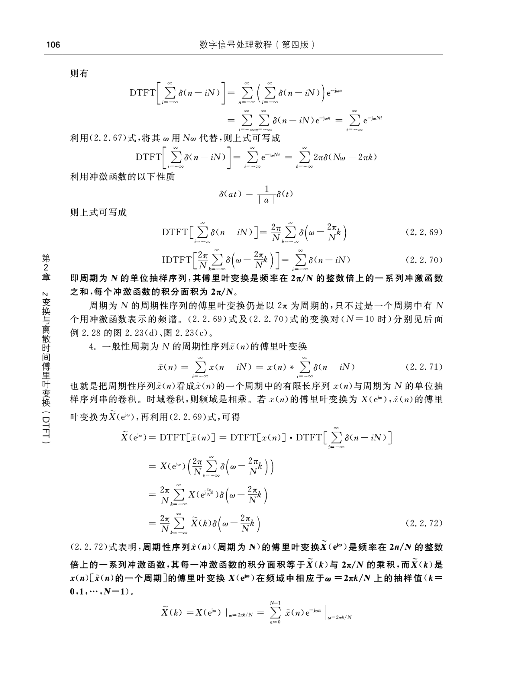
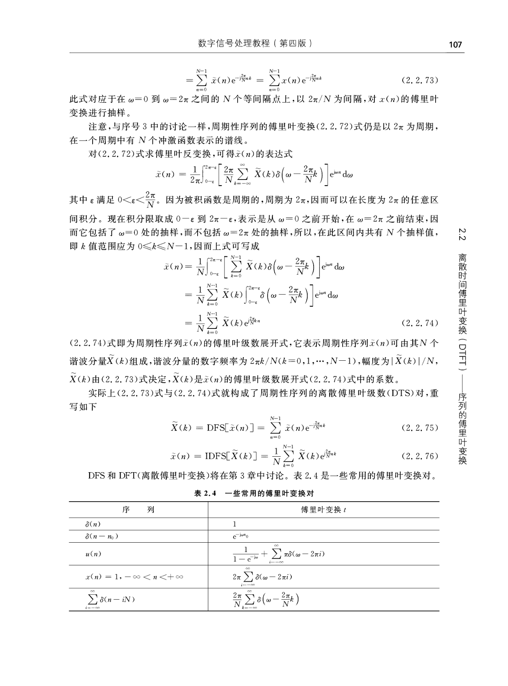
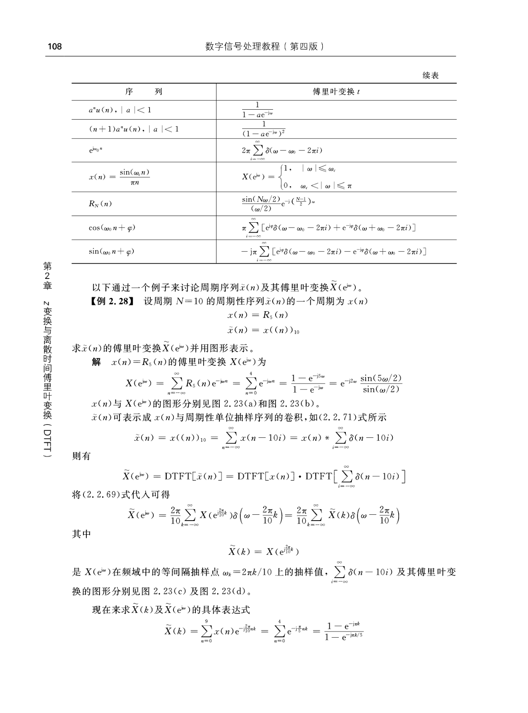

- 
- 
- 
- 
- 
- 2.2.5 周期性序列的傅里叶变换
  由于 $n \rightarrow \infty$ 时, 周期性序列不趋于零。故它既不是绝对可和的, 也不是平方可和的, 因而它的傅里叶变换既不是一致收玫的, 也不是均方收玫的。然而, 当引人冲激函数 $\delta(\omega)$ 后,就可以有它的傅里叶变换存在, 这样就能很好地描述周期性序列的频谱特性了。
  学习要点
  1. 复指数序列的傅里叶变换对 $($复指数序列在一定条件下才是时域周期序列, 见第 $1$ 章 1.1 .5 节的讨论)。
  设复指数序列为
  $x(n)=\mathrm{e}^{\mathrm{j} \omega_{0} n}, \quad \text {$ 任意 $} n$
  则它的傅里叶变换一定为
  $$\operatorname{DTFT}\left[\mathrm{e}^{\mathrm{j} \omega_{0} n}\right]=X\left(\mathrm{e}^{\mathrm{j} \omega}\right)=\sum_{i=-\infty}^{\infty} 2 \pi \delta\left(\omega-\omega_{0}-2 \pi i\right), \quad-\pi<\omega_{0}<\pi$$
  这里因为, 我们可以对此 $X\left(\mathrm{e}^{\mathrm{j} \omega}\right)$ 求傅里叶反变换, 如果结果正好得到序列为 $x(n)=\mathrm{e}^{\mathrm{j} \omega_{0} n} ,$ 则 $(2.2.61)$式一定成立。 $X\left(\mathrm{e}^{\mathrm{j} \omega}\right)$ 的傅里叶反变换为
  $$x(n)=\frac{1}{2 \pi} \int_{-\pi}^{\pi} X\left(\mathrm{e}^{-\mathrm{j} \omega}\right) \mathrm{e}^{\mathrm{j} \omega n} \mathrm{~d} \omega=\frac{1}{2 \pi} \int_{-\pi}^{\pi}\left[\sum_{i=-\infty}^{\infty} 2 \pi\left(\omega-\omega_{0}-2 \pi i\right)\right] \mathrm{e}^{\mathrm{j} \omega n} \mathrm{~d} \omega$$
  由于积分区间为 $-\pi$ 到 $\pi ,$所以上式积分中, 只需包括 $i=0$ 这一项,因此可写成
  $x(n)=\frac{1}{2 \pi} \int_{-\pi}^{\pi} 2 \pi \delta\left(\omega-\omega_{0}\right) \mathrm{e}^{\mathrm{j} \omega n} \mathrm{~d} \omega=\mathrm{e}^{\mathrm{j} \omega_{0} n}, \quad \text {$ 任意 $} n$
  由此可归纳出复指数序列的傅里叶变换对为
  $$\operatorname{DTFT}\left[\mathrm{e}^{\mathrm{j} \omega_{0} n}\right]=\sum_{i=-\infty}^{\infty} 2 \pi \delta\left(\omega-\omega_{0}-2 \pi i\right), \quad-\pi<\omega_{0} \leqslant \pi$$
- 则有
  $$\begin{aligned}
  \operatorname{DTFT}\left[\sum_{i=-\infty}^{\infty} \delta(n-i N)\right] & =\sum_{n=-\infty}^{\infty}\left(\sum_{i=-\infty}^{\infty} \delta(n-i N)\right) \mathrm{e}^{-\mathrm{j} \omega n} \\
  & =\sum_{i=-\infty}^{\infty} \sum_{n=-\infty}^{\infty} \delta(n-i N) \mathrm{e}^{-\mathrm{j} \omega n}=\sum_{i=-\infty}^{\infty} \mathrm{e}^{-\mathrm{j} \omega N i}
  \end{aligned}$$
  利用$(2.2.67)$ 式, 将其 $\omega$ 用 $N \omega$ 代替, 则上式可写成
  $$\text { DTFT }\left[\sum_{i=-\infty}^{\infty} \delta(n-i N)\right]=\sum_{i=-\infty}^{\infty} \mathrm{e}^{-\mathrm{j} \omega N i}=\sum_{k=-\infty}^{\infty} 2 \pi \delta(N \omega-2 \pi k)$$
  利用冲激函数的以下性质
  $$\delta(a t)=\frac{1}{|a|} \delta(t)$$
  则上式可写成
  $$\begin{aligned}
  \operatorname{DTFT}\left[\sum_{i=-\infty}^{\infty} \delta(n-i N)\right]=\frac{2 \pi}{N} \sum_{k=-\infty}^{\infty} \delta\left(\omega-\frac{2 \pi}{N} k\right) \\
  \operatorname{IDTFT}\left[\frac{2 \pi}{N} \sum_{k=-\infty}^{\infty} \delta\left(\omega-\frac{2 \pi}{N} k\right)\right]=\sum_{i=-\infty}^{\infty} \delta(n-i N)
  \end{aligned}$$
  即周期为 $N$ 的单位抽样序列, 其傅里叶变换是频率在 $2 \pi / N$ 的整数倍上的一系列冲激函数之和,每个冲激函数的积分面积为 $2 \pi / N$ 。
  周期为 $N$ 的周期性序列的傅里叶变换仍是以 $2 \pi$ 为周期的, 只不过是一个周期中有 $N$ 个用冲激函数表示的频谱。$(2.2.69)$ 式及 $(2.2.70)$ 式的变换对 $( N=10$ 时) 分别见后面例 2.28 的图 $2.23(d)$、图 $2.23(c)$。
  4. 一般性周期为 $N$ 的周期性序列 $\tilde{x}(n)$ 的傅里叶变换
  $$\tilde{x}(n)=\sum_{i=-\infty}^{\infty} x(n-i N)=x(n) * \sum_{i=-\infty}^{\infty} \delta(n-i N)$$
  也就是把周期性序列 $\tilde{x}(n)$ 看成 $\tilde{x}(n)$ 的一个周期中的有限长序列 $x(n)$ 与周期为 $N$ 的单位抽样序列串的卷积。时域卷积, 则频域是相乘。若 $x(n)$ 的傅里叶变换为 $X\left(\mathrm{e}^{\mathrm{j} \omega}\right), \tilde{x}(n)$ 的傅里叶变换为 $\tilde{X}\left(\mathrm{e}^{\mathrm{j} \omega}\right) ,$再利用 $(2.2 .69)$ 式,可得
  $$\begin{aligned}
  \tilde{X}\left(\mathrm{e}^{\mathrm{j} \omega}\right) & =\operatorname{DTFT}[\tilde{x}(n)]=\operatorname{DTFT}[x(n)] \cdot \operatorname{DTFT}\left[\sum_{i=-\infty}^{\infty} \delta(n-i N)\right] \\
  & =X\left(\mathrm{e}^{\mathrm{j} \omega}\right)\left(\frac{2 \pi}{N} \sum_{k=-\infty}^{\infty} \delta\left(\omega-\frac{2 \pi}{N} k\right)\right) \\
  & =\frac{2 \pi}{N} \sum_{k=-\infty}^{\infty} X\left(\mathrm{e}^{\mathrm{j} \frac{2 \pi}{N} k}\right) \delta\left(\omega-\frac{2 \pi}{N} k\right) \\
  & =\frac{2 \pi}{N} \sum_{k=-\infty}^{\infty} \tilde{X}(k) \delta\left(\omega-\frac{2 \pi}{N} k\right)
  \end{aligned}$$
  $(2.2.72)$ 式表明, 周期性序列 $\tilde{x}(n) ($周期为 ${N} )$ 的傅里叶变换 $\tilde{{X}}\left(\mathrm{e}^{\mathrm{j} \omega}\right)$ 是频率在 $2 n / N$ 的整数倍上的一系列冲激函数, 其每一冲激函数的积分面积等于 $\tilde{{X}}(k)$ 与 $2 \pi / N$ 的乘积, 而 $\tilde{{X}}(k)$ 是 $x(n)[\tilde{x}(n)$ 的一个周期 ] 的傅里叶变换 $X\left(\mathrm{e}^{\mathrm{j} \omega}\right)$ 在频域中相应于 $\omega=2 \pi k / N$ 上的抽样值 $(k= \mathbf{0}, \mathbf{1}, \cdots, \mathrm{N}-\mathbf{1})$ 。
  $$\tilde{X}(k)=\left.X\left(\mathrm{e}^{\mathrm{j} \omega}\right)\right|_{\omega=2 \pi k / N}=\left.\sum_{n=0}^{N-1} \tilde{x}(n) \mathrm{e}^{-\mathrm{j}_{\omega} n}\right|_{\omega=2 \pi k / N}$$