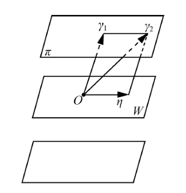

# Definition
	- 设 $W$ 是过原点 $O$ 的一个[[平面]]，则与 $W$ 平行的所有 *平面* 以及 $W$ 给出了[[几何空间]]$V$的一个划分。设$\pi$是平行于$W$的一个平面，$\gamma_1$与$\gamma_2$都属于$\pi$当且仅当$\gamma_2-\gamma_1=\eta\in W$。
	  logseq.order-list-type:: number
	  {:height 363/2, :width 344/2}
	  受此启发，取[[线性空间]]$V$的一个[[子空间]]$W$，然后规定：
	  $$\alpha\sim \beta\Longleftrightarrow \alpha-\beta\in W$$
	  这样就在 $V$ 上建立了一个[[二元关系]]$\sim$. 可证 $\sim$ 是 $V$ 上的一个[[equivalence relation]].
	- 对于$\alpha\in V$，$\alpha$的[[等价类]]$\bar{\alpha}$为：
	  logseq.order-list-type:: number
	  $$\begin{aligned}
	  \bar{\alpha} & =\{\beta \in V \mid \beta \sim \alpha\} \\
	  & =\{\beta \in V \mid \beta-\alpha \in W\} \\
	  & =\{\beta \in V \mid \beta=\alpha+\gamma, \gamma \in W\} \\
	  & =\{\alpha+\gamma \mid \gamma \in W\},
	  \end{aligned}$$
		- 把最后一个集合记作 $\alpha+W$ ，称它为 $W$ 的一个[[陪集]]，
		  $\alpha$ 称为这个 [[陪集]] 的一个[[代表]]。
		- 子空间$W$本身也是$W$的一个[[陪集]]。可得：
		  $$\gamma+W=W\Longleftrightarrow\gamma+W=0+W\Longleftrightarrow\gamma\in W$$
	- 对于上述 *等价关系* $\sim$，[[商集]]$V/\sim$ 记成 $V/W$, 称它是 $V$ 对于[[子空间]]$W$ 的[[商集]]，即
	  logseq.order-list-type:: number
	  $$V/W=\{\alpha+W\mid\alpha\in V\}$$
	  $0+W$（即 $W$）是$V/W$的[[零元]]，$(-\alpha)+W$ 是 $\alpha+W$ 的[[负元]]。
	- 易证$V/W$成为域$F$上的一个[[线性空间]]，称它是$V$对于$W$的[[商空间]]。
	  logseq.order-list-type:: number
- # Theorem
	- 设$V$是域$F$上一个[[有限维线性空间]]，$W$ 是 $V$ 的一个[[子空间]]，则
	  logseq.order-list-type:: number
	  id:: 64d51db8-ccd9-4cf9-b0ea-72665fe7f8df
	  $$\mathrm{dim}(V/W)=\mathrm{dim}V-\mathrm{dim}W$$
	  ([[维数]])
	- 如果商空间$V/W$的一个[[基]]为$\beta_1+W,\beta_2+W,\cdots,\beta_t+W$，令 $U=<\beta_1,\beta_2,\cdots,\beta_t>$(由$\beta_1,\beta_2,\cdots,\beta_t$张成的[[线性空间]])，则$V=W\oplus U$（[[直和]]），且 $\beta_1,\beta_2,\cdots,\beta_t$ 是 $U$ 的一个[[基]]。
	  logseq.order-list-type:: number