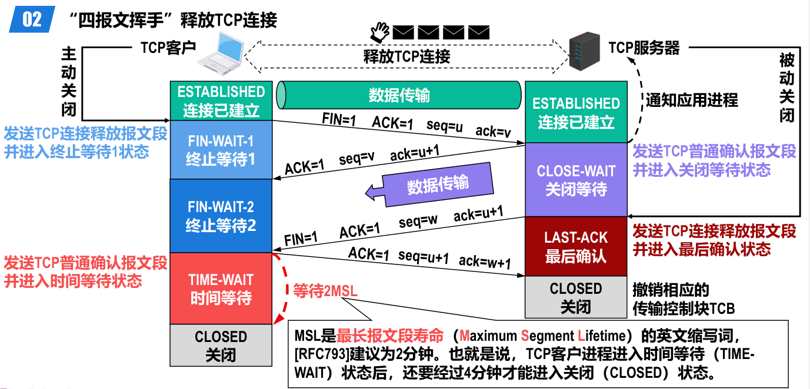
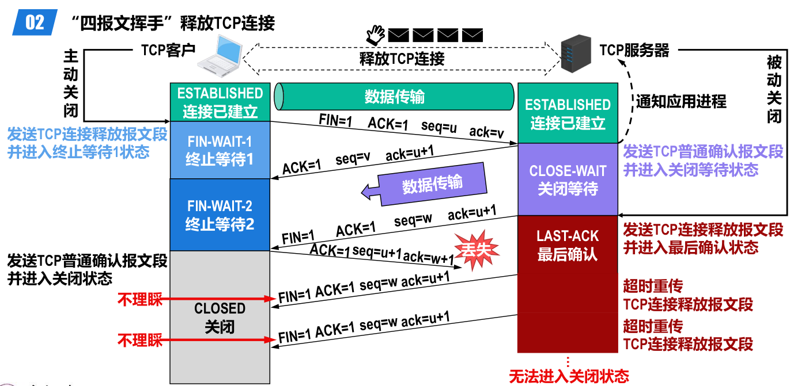

- {:height 300, :width 608}
- *客户端* 发送[[TCP 连接释放报文段]]并进入[[终止等待1]]状态，称为[[主动关闭]]。
  logseq.order-list-type:: number
	- TCP连接释放报文段首部中的终止标志位[[FIN]]和确认标志位[[ACK]]的值都被设置为 1 。
	  logseq.order-list-type:: number
	  表明这是一个TCP连接释放报文段，同时也对之前收到的TCP报文段进行确认。
	- [[序号]] seq 字段的值设置为 u ，它等于TCP客户进程之前已经传送过的数据的最后一个字节的序号加 1 。
	  logseq.order-list-type:: number
	- TCP规定终止标志位[[FIN]]等于 1 的TCP报文段即使不携带数据，也要消耗掉一个 *序号*。
	  logseq.order-list-type:: number
	- [[确认号]]ack字段的值设置为 v ，它等于TCP客户进程之前已收到的数据的最后一个字节的序号加1。
	  logseq.order-list-type:: number
- *服务器* 发送[[普通TCP确认报文段]]并进入[[关闭等待]]状态
  logseq.order-list-type:: number
	- 序号seq字段的值设置为v，它等于TCP服务器进程之前已传送过的数据的最后一个字节的序号加1。
	  logseq.order-list-type:: number
	  这也与之前收到的TCP连接释放报文段中的确认号v匹配。
	- 确认号ack字段的值设置为u+1，这是对TCP连接释放报文段的确认。
	  logseq.order-list-type:: number
	- 从TCP客户进程到TCP服务器进程这个方向的连接就 *释放* 了。
	  logseq.order-list-type:: number
	  TCP客户进程已经没有数据要发送了。但TCP服务器进程如果还有数据要发送，TCP客户进程仍要接收，也就是从TCP服务器进程到TCP客户进程这个方向的连接并未关闭。
- *服务器* 发送[[TCP连接释放报文段]]，并进入[[最后确认状态]]，称为[[被动关闭]]
  logseq.order-list-type:: number
	- TCP连接释放报文段首部中的终止标志位FIN和确认标志位ACK的值都被设置为1。
	  logseq.order-list-type:: number
	  表明这是一个TCP连接释放报文段，同时也对之前收到的TCP报文段进行确认。
	- 序号seq字段的值假定被设置为w，这是因为在半关闭状态下TCP服务器进程可能又发送了一些数据。
	  logseq.order-list-type:: number
	- 确认号ack字段的值被设置为u+1，这是对之前收到的TCP连接释放报文段的重复确认。
	  logseq.order-list-type:: number
- *客户端* 发送[[TCP普通确认报文段]]并进入[[时间等待]]状态。
  logseq.order-list-type:: number
	- 确认号ack字段的值设置为w+1，这是对所收到的TCP连接释放
	  报文段的确认。
	- [[服务器]]在收到后会撤销相应的传输控制块[[TCB]]，并进入[[关闭状态]]。
- *客户端* 等待 2 [[MSL]]后，撤销相应的传输控制块[[TCB]]，并进入[[关闭状态]]。
  logseq.order-list-type:: number
	- [[MSL]]是的英文缩写词，[[RFC793]]建议为2分钟。也就是说，TCP客户进程进入[[时间等待]]状态后，还要经过4分钟才能进入关闭状态。
	  logseq.order-list-type:: number
	- 对于现在的网络，MSL取为2分钟可能太长了，因此TCP允许不同的实现可根据具体情况使用更小的MSL值。
	  logseq.order-list-type:: number
- ## 等待 2MSL 原因
	- 处于时间等待状态后要经过 2MSL 时长，可以确保TCP服务器进程能够收到最后一个TCP确认报文段而进入关闭状态。
	- 
	  id:: 653a3627-479b-4b48-85aa-0f9d2dd591be
-