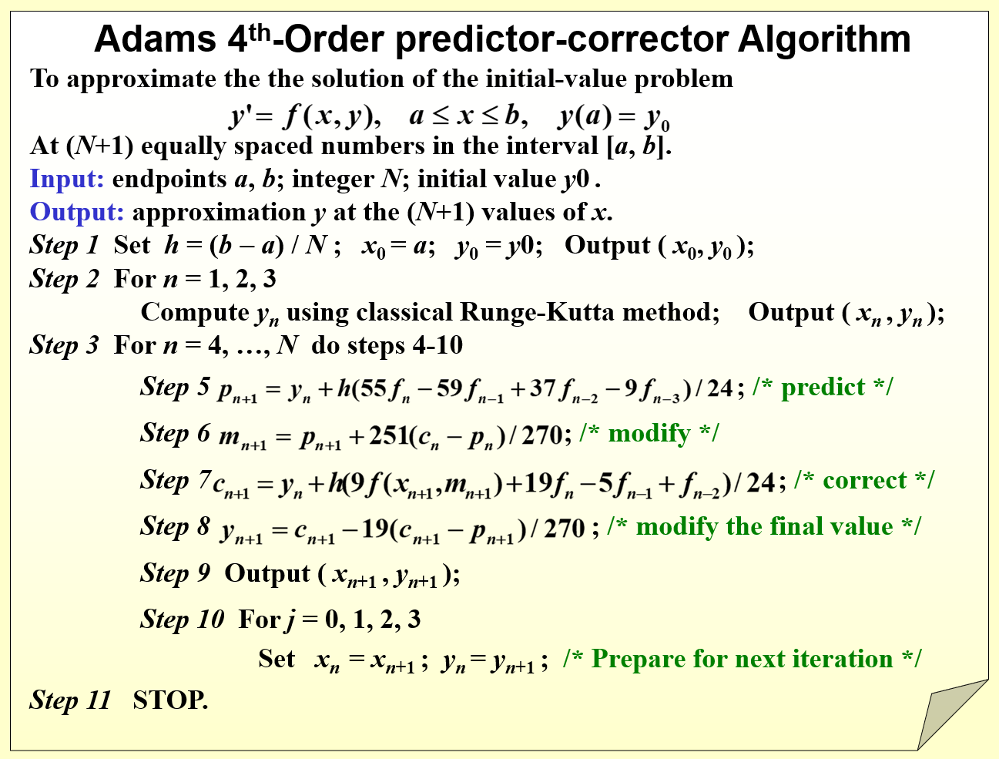

alias:: 亚当斯预测-校正公式

- 将[[四步四阶显式亚当斯公式]]作为[[预测公式]], 并将[[三步四阶隐式亚当斯公式]]作为[[校正公式]], 构成 亚当斯预测-校正公式
  \begin{array}{l}
  y_{n+1}^{\mathrm{p}}=y_{n}+\frac{h}{24}\left(55 f_{n}-59 f_{n-1}+37 f_{n-2}-9 f_{n-3}\right), \\
  y_{n+1}^{\mathrm{c}}=y_{n}+\frac{h}{24}\left(9 f\left(x_{n+1}, y_{n+1}^{\mathrm{p}}\right)+19 f_{n}-5 f_{n-1}+f_{n-2}\right) .
  \end{array}
  它们的局部截断误差分别是
  \begin{array}{l}
  T_{n+1}^{\mathrm{p}}=y\left(x_{n+1}\right)-y_{n+1}^{\mathrm{p}}=\frac{251}{720} h^{5} y^{(5)}\left(x_{n}\right)+O\left(h^{6}\right), \\
  T_{n+1}^{\mathrm{c}}=y\left(x_{n+1}\right)-y_{n+1}^{\mathrm{c}}=-\frac{19}{720} h^{5} y^{(5)}\left(x_{n}\right)+O\left(h^{6}\right) .
  \end{array}
- 利用[[外推原理]], 将上两式作[[线性组合]], 消去[[局部截断误差主项]], 使[[计算精度]]至少提高一阶. 同时得到两个[[修正公式]], 将它们和上两式组合构成了如下修正的[[亚当斯预测-校正公式]].
	- 预测  
	  $$\quad y_{n+1}^{\mathrm{p}}=y_{n}+\frac{h}{24}\left(55 f_{n}-59 f_{n-1}+37 f_{n-2}-9 f_{n-3}\right) ,$$
	- 修正  
	  $$\quad y_{n+1}^{\mathrm{pm}}=y_{n+1}^{\mathrm{p}}+\frac{251}{270}\left(y_{n}^{\mathrm{c}}-y_{n}^{\mathrm{p}}\right) ,$$
	- 校正  
	  $$\quad y_{n+1}^{\mathrm{c}}=y_{n}+\frac{h}{24}\left[9 f\left(x_{n+1}, y_{n+1}^{\mathrm{pm}}\right)+19 f_{n}-5 f_{n-1}+f_{n-2}\right] ,$$
	- 修正  
	  $$y_{n+1}=y_{n+1}^{\mathrm{c}}-\frac{19}{270}\left(y_{n+1}^{\mathrm{c}}-y_{n+1}^{\mathrm{p}}\right) .$$
- 同理, 在计算时, 调节计算步长  $h$ , 使  
  $$\left|-\frac{19}{270}\left(y_{n+1}^{\mathrm{c}}-y_{n+1}^{\mathrm{p}}\right)\right|<\varepsilon ,$$ 
  由同阶[[单步法]]提供初值  $y_{0}, y_{1}, y_{2}, y_{3}$ . 当计算  $y_{4}$ 时, 可取 $y_{3}^{\mathrm{c}}=y_{3}^{\mathrm{p}}$ .
- 