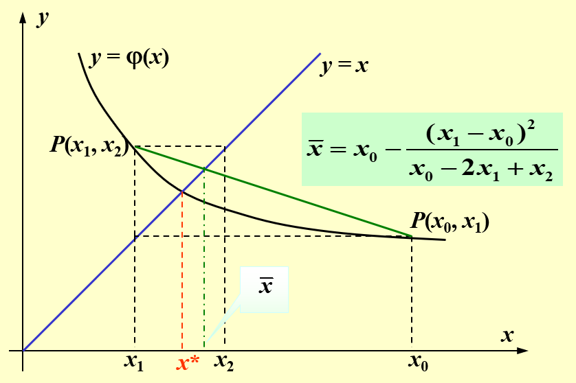

alias:: Aitken’s process

- 设  $\left\{x_{k}\right\}$  是一个[[线性收敛序列]], 其极限为  $x^{*}$ , [误差]([[迭代误差]])  $e_{k}=x^{*}-x_{k}$ , 即
  $$\lim _{k \rightarrow \infty} \frac{\left|e_{k+1}\right|}{\left|e_{k}\right|}=c, \quad(0<c<1).$$
  因此,当  $k$  充分大时有
  $$\frac{x^{*}-x_{k+2}}{x^{*}-x_{k+1}} \approx \frac{x^{*}-x_{k+1}}{x^{*}-x_{k}}$$
  由此得
  $$x^{*} \approx x_{k+2}-\frac{\left(x_{k+2}-x_{k+1}\right)^{2}}{x_{k+2}-2 x_{k+1}+x_{k}}=x_{k}-\frac{\left(x_{k+1}-x_{k}\right)^{2}}{x_{k}-2 x_{k+1}+x_{k+2}} .$$
  以上式右端得出的结果作为新的改进值, 记
  $$\bar{x}_{k+1}=x_{k}-\frac{\left(x_{k+1}-x_{k}\right)^{2}}{x_{k}-2 x_{k+1}+x_{k+2}}=x_{k}-\left(\Delta x_{k}\right)^{2} / \Delta^{2} x_{k}, \tag{1}$$
  ([[二阶差分]])
  可望得到的新序列  $\left\{\bar{x}_{k}\right\}$  较原序列  $\left\{x_{k}\right\}$  更快的收敛到  $x^{*}$ .
  式 $(1)$ 称为 Aitken  $\Delta^{2}$  加速方法.
- 可以证明 $\lim _{k \rightarrow \infty} \frac{\bar{x}_{k}-x^{*}}{x_{k}-x^{*}}=0$ , 它表明序列 $\left\{\bar{x}_{k}\right\}$ 的[收敛速度]([[迭代法的收敛速度]])比 $\left\{x_{k}\right\}$ 的快.
- 