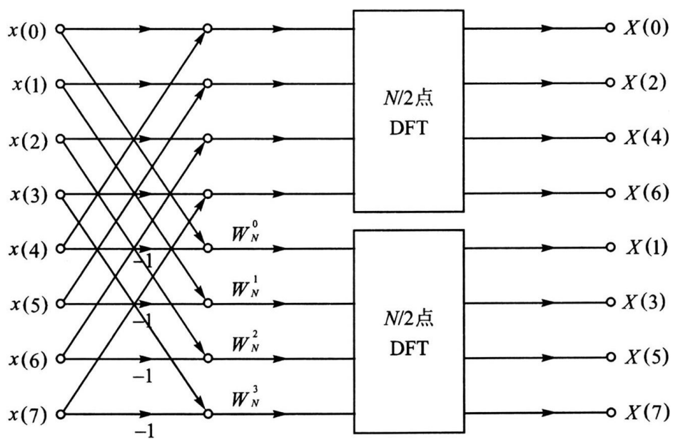
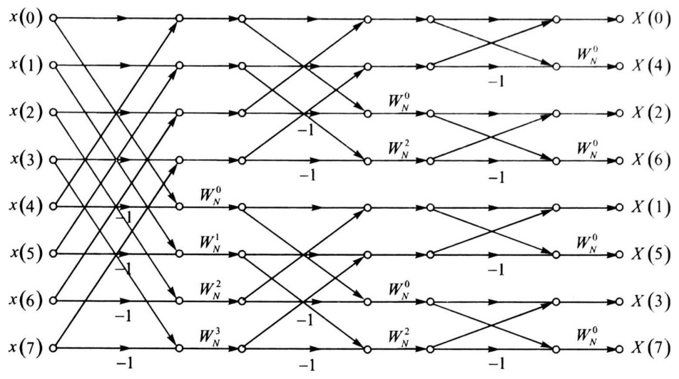

alias:: 基 -2 DIF

- 在[[基 -2 DIT 算法]]中是将输入 $x(n)$ 按偶数点和奇数点来分解,类似地, 也可以将输出 $X(k)$ 按偶数点和奇数点来分解。这也即是说, 先计算偶数点的 $X(k) ,$ 再计算奇数点的 $X(k)$ 。遵循的同样是将大点数 DFT 分解为小点数 DFT 这个直观的原则。
	- > 基-2 DIF 同样要求 $N=2^{M}$ 。
- 第 $1$ 步是将 $X(k)$ 按偶数点和奇数点划分为 $X_{0}(k)$ 和 $X_{1}(k) ,$ 用数学公式表示如下:
  $$\begin{aligned}
  X_{0}(k) & =X(2 k), & k & =0,1,2, \cdots, N / 2-1 \\
  X_{1}(k) & =X(2 k+1), & k & =0,1,2, \cdots, N / 2-1
  \end{aligned}\tag{1}$$
  第 $2$ 步是分别计算 $X_{0}(k)$ 和 $X_{1}(k)$ ，用数学公式表示如下:
  $$\begin{aligned}
  X_{0}(k) & =X(2 k)=\sum_{n=0}^{N-1} x(n) W_{N}^{2 k n}=\sum_{n=0}^{N / 2-1} x(n) W_{N / 2}^{k n}+\sum_{n=0}^{N / 2-1} x(n+N / 2) W_{N / 2}^{k n} \\
  & =\sum_{n=0}^{N / 2-1}[x(n)+x(n+N / 2)] W_{N / 2}^{k n} 
  \end{aligned} \tag{2}$$
  $$\begin{aligned}
  X_{1}(k) & =X(2 k+1)=\sum_{n=0}^{N-1} x(n) W_{N}^{(2 k+1) n} \\
  & =\sum_{n=0}^{N / 2-1} x(n) W_{N}^{n} W_{N / 2}^{k n}+\sum_{n=0}^{N / 2-1} x(n+N / 2) W_{N}^{n+N / 2} W_{N / 2}^{k n} \\
  & =\sum_{n=0}^{N / 2-1} x(n) W_{N}^{n} W_{N / 2}^{k n}-\sum_{n=0}^{N / 2-1} x(n+N / 2) W_{N}^{n} W_{N / 2}^{k n} \\
  & =\sum_{n=0}^{N / 2-1}[x(n)-x(n+N / 2)] W_{N}^{n} W_{N / 2}^{k n}
  \end{aligned}\tag{3}$$
  式 $(2)$ 和式 $(3)$ 中, $n$ 和 $k$ 的取值范围均为 $0,1,2, \cdots, N / 2-1$ 。
- 式 $(2)$ 和式 $(3)$ 所示的运算可以用如图 1 所示的蝶形图表示, 图中 $N=8$ 。
  
- 与[[按时间抽取方法]]相比, 此时在计算 $N / 2$ 点 DFT 之前要先对信号 $x(n)$ 的前半部分和后半部分进行组合。
- 按照式 $(1)$ 式 $(3)$ 所示的分解方法, 可以再将 $2$ 个 $N / 2$ 点的 DFT 分解为 $4$ 个 $N / 4$ 点的 DFT, 再分解为 $8$ 个 $N / 8$ 点的 DFT, 一直分解下去, 直到分解为 $2$ 点的 DFT。图 2 给出了 $8$ 点 DIF FFT 算法的完整流程图。
   
  由图可以看出, 输入 $x(n)$ 是正常顺序的, 输出 $X(k)$ 是倒位序的。这与[[按时间抽取方法]]正好相反。
- 频域抽取的 $N$ 点 DFT 的偶数项和奇数项计算公式：
  设前半部分序列的 $\mathrm{N} / 2$ 点的DFT 为 $X_{1}(m)$ ，
  后半部分序列的 $\mathrm{N} / 2$ 点的DFT为 $X_{2}(m)$ ，则
  $$\begin{aligned}
  X(2 m) & =X_{1}(m)+X_{2}(m) \\
  X(2 m+1) & =X_{1}(m)-X_{2}(m)
  \end{aligned}
  $$
-