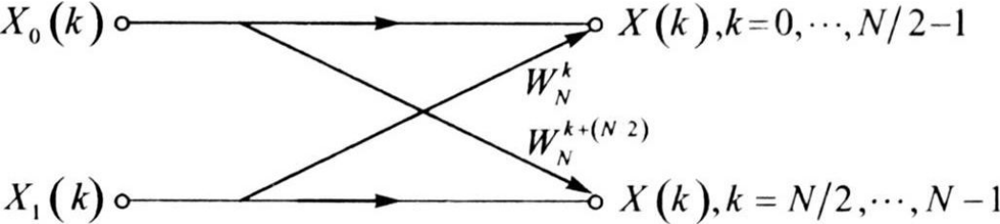
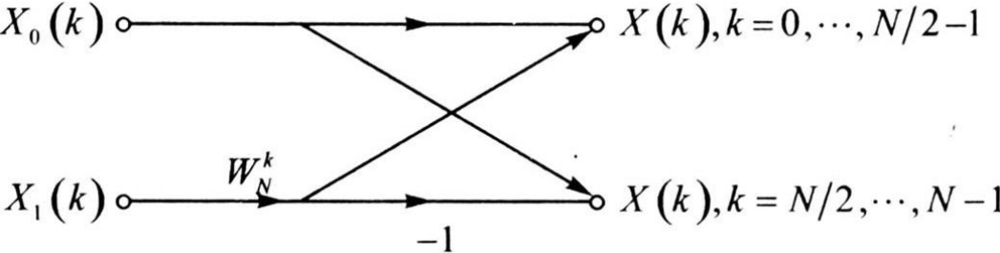
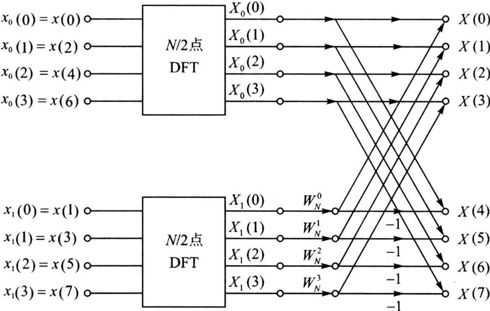
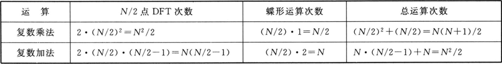
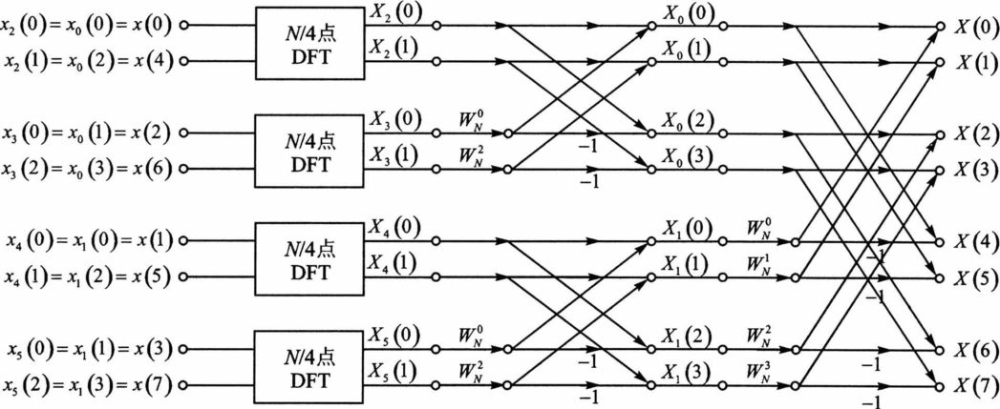
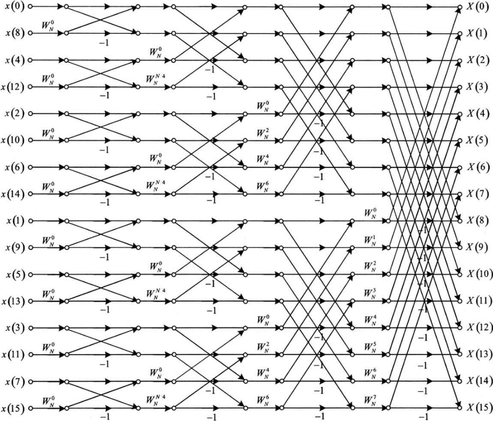
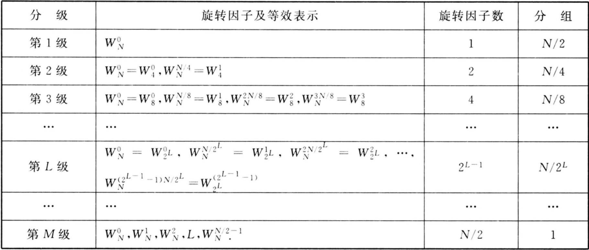
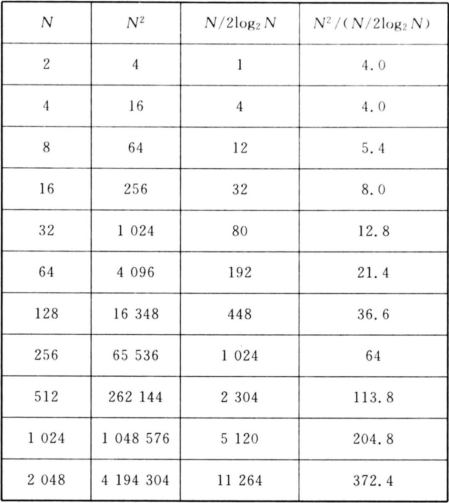

-
- alias:: 库利-图基FFT算法, 库利-图基算法, Cooley-Tukey, 基 -2 DIT 算法
- ^^基- 2 DIT FFT 算法^^要求信号长度 $$N=2^{M} ,$$ 其中 $M$ 为整数, 若信号长度不满足这个条件,可以通过补零来满足要求。
  为了计算长度为 $N$ 的信号 $$x(n)$$ 的 [[DFT]] , 可以在时间上以 $2$ 为基底, 先将 $$x(n)$$ 分解为两个长度均为 $N / 2$ 点的信号 $$x_{0}(n)$$ 和 $$x_{1}(n) ,$$ 其中 $$x_{0}(n)$$ 为 $$x(n)$$ 的偶数点部分$$, x_{1}(n)$$ 为 $$x(n)$$ 的奇数点部分, 用数学公式表示如下:
  $$\begin{array}{ll}
  x_{0}(n)=x(2 n), & n=0,1,2, \cdots, N / 2-1 \\
  x_{1}(n)=x(2 n+1), & n=0,1,2, \cdots, N / 2-1
  \end{array} \tag{1}$$
- 然后再分别计算 $$x_{0}(n)$$ 的 $N / 2$ **点** DFT $$X_{0}(k)$$ 和 $$x_{1}(n)$$ 的 $N / 2$ **点** DFT $$X_{1}(k) ,$$ 用数学公式表示如下:
  $$\begin{aligned}
  X_{0}(k)=\sum_{n=0}^{N / 2-1} x_{0}(n) W_{N / 2}^{k n}=\sum_{n=0}^{N / 2-1} x(2 n) W_{N / 2}^{k n}, k=0,1,2, \cdots, N / 2-1 \\
  X_{1}(k)=\sum_{n=0}^{N / 2-1} x_{1}(n) W_{N / 2}^{k n}=\sum_{n=0}^{N / 2-1} x(2 n+1) W_{N / 2}^{k n}, k=0,1,2, \cdots, N / 2-1
  \end{aligned}\tag{2}$$
- 最后对 $$X_{0}(x)$$ 和 $$X_{1}(k)$$ 进行某种组合, 可以得到 $$x(n)$$ 的 DFT $$X(k)$$ 。对照 $$X(k)$$ 的定义式:
  $$X(k)=\sum_{n=0}^{N-1} x(n) W_{N}^{k n}=\sum_{n=0}^{N / 2-1} x(2 n) W_{N}^{k \cdot 2 n}+\sum_{n=0}^{N / 2-1} x(2 n+1) W_{N}^{k \cdot(2 n+1)}, k=0,1, \cdots, N-1\tag{3}$$
- 利用旋转因子的如下特性:
  $$W_{N}^{2}=W_{N / 2}^{1}$$
  式 $(3)$ 可变形为:
  $$X(k)=\sum_{n=0}^{N / 2-1} x(2 n) W_{N / 2}^{k n}+W_{N}^{k} \sum_{n=0}^{N / 2-1} x(2 n+1) W_{N / 2}^{k n}, k=0,1, \cdots, N-1\tag{4}$$
- 由式 $$(2)$$ 和式 $$(4),$$ 可以得到 $$X(k)$$ 与 $$X_{0}(k)$$ 及 $$X_{1}(k)$$ 有如下关系:
  collapsed:: true
  $$X(k)=X_{0}(k)+W_{N}^{k} X_{1}(k), k=0,1, \cdots, N-1\tag{5}$$
	- > 对照式 $$(2)$$ 和式 $$(5),$$ 细心的读者可能会问$$, X_{0}(k)$$ 和 $$X_{1}(k)$$ 中 $k$ 的取值范围是 $$0 \sim (N / 2-1) ,$$ 但 $$X(k)$$ 中 k 的取值范围却是 $$0 \sim(N-1) ,$$ 在 $$0 \sim(N / 2-1)$$ 范围内, 根据 $$X_{0}(k)$$ 和 $$X_{1}(k) ,$$ 利用式 $$(5)$$ 计算得到 $$X(k)$$ 很好理解, 但在 $$N / 2 \sim(N-1)$$ 范围时, 式 $$(5)$$ 还能适用吗? 回答同样是肯定的, 因为由 DFT 的周期性可知$$, X_{0}(k)$$ 和 $$X_{1}(k)$$ 的周期均为 N / 2 , 所以只要知道 $$0 \sim(N / 2-1)$$ 范围内 $$X_{0}(k)$$ 和 $$X_{1}(k)$$ 的取值, 就意味着也知道了 $$N / 2 \sim(N-1)$$ 范围内 $$X_{0}(k)$$ 和 $$X_{1}(k)$$ 的取值, 因而同样可以用式 $$(5)$$计算 $$X(k)$$ 。
- 式 $$(5)$$ 的运算关系可以用下图所示的流程图表示, 因为其形状如蝴蝶一般, 故也称为[[蝶形运算]]。
   
  当支路上没有标出系数时, 表示该支路的系数为 $1$ 。
  由图可以看出, 完成一个基本的蝶形运算,需要两次复数乘法。
- 但利用旋转因子的如下特性:
  $$W_{N}^{k+N / 2}=W_{N}^{N / 2} W_{N}^{k}=-W_{N}^{k}$$
  式 $$(5)$$ 可改写为:
  $$\begin{aligned}
  X(k)=X_{0}(k)+W_{N}^{k} X_{1}(k), & k=0,1, \cdots, N / 2-1 \\
  X(k+N / 2)=X_{0}(k)-W_{N}^{k} X_{1}(k), & k=0,1, \cdots, N / 2-1
  \end{aligned}\tag{6}$$
  上图所示的流程图可以简化为下图所示的形状，此时完成一个基本蝶形运算只需要一次复数乘法，从而进一步提高了运算效率。
	- 
	  id:: 660e9b3e-2fcb-429a-a13c-3e6a41152ec9
- 采用上图所示的形式, 可以将前面讨论的分解过程表示于下图中的取值为 $$N=2^{3}=8$$ ：
  
  由图可知, 通过一次分解之后, $N$ 点的 DFT 包括如下的运算: 两个 $N / 2$ 点的 $DFT$ 和 $N / 2$ 个蝶形运算。每个蝶形运算包括一次复数乘法和两次复数加法。
- 分解后的运算量如下表所列。
  collapsed:: true
   
  一次分解后总的复数乘法次数为 $$N(N+1) / 2 \approx N^{2} / 2 ,$$ 总的加法次数为 $$N^{2} / 2$$ 。
  而直接进行 $N$ 点 DFT 的话,需要 $$N^{2}$$ 次复数乘法和近似 $$N^{2}$$ 次复数加法 。
  这表明,一次分解后,运算量近似为直接计算的 $1 / 2$ 。
	- >由此可见, 上述这种先在时间上按奇偶数将大点数 DFT 分解为小点数 DFT, 然后再对小点数 DFT 结果进行组合的方法, 的确可以提高 DFT 的运算效率。
- 那么很自然地, 如果 $N / 2$ 仍然是偶数, 则对上图中的两个 $N / 2$ 点的 DFT, 也可以按照式 $(1)$ 式 $(5)$重复同样的过程, 将每个 $N / 2$ 点的 DFT 都分解为两个 $N / 4$ 点的 DFT。若用 $x_{2}(n)$ 和 $x_{3}(n)$ 分别表示 $x_{0}(n)$ 的偶数点部分和奇数点部分, $X_{2}(k)$ 和 $X_{3}(k)$ 分别表示其 $N / 4$ 点的 DFT, 则与式 $(5)$类似, $X_{0}(k)$ 可写为:
  $$X_{0}(k)=X_{2}(k)+W_{N / 2}^{k} X_{3}(k), k=0,1, \cdots, N / 2-1\tag{7}$$
  用 $x_{4}(n)$ 和 $x_{5}(n)$ 分别表示 $x_{1}(n)$ 的偶数点部分和奇数点部分, $X_{4}(k)$ 和 $X_{5}(k)$ 分别表示其 $N / 4$ 点的 DFT, 则与式 $(7)$ 类似, $X_{1}(k)$ 可写为:
  $$X_{1}(k)=X_{4}(k)+W_{N / 2}^{k} X_{5}(k), k=0,1, \cdots, N / 2-1\tag{8}$$
  考虑到 $W_{N / 2}^{k+N / 4}=W_{N / 2}^{N / 4} W_{N / 2}^{k}=-W_{N / 2}^{k}$ 及 $W_{N / 2}^{k}=W_{N}^{2 k} ,$ 经过第 $2$ 次分解后, 上图所示的流程图变为下图所示的流程图。
  
  一直持续下去, 直到 DFT 的点数变为 $2$ 点。
	- >实际上, $2$ 点的 DFT 仍然可以分解为两个 $1$ 点的 DFT, 因为 $1$ 点的 DFT 就是信号本身, 两个 $1$ 点的 DFT, 或者说一个 $2$ 点的 DFT, 正好构成一个基本的蝶形运算。
- $N＝16$ 时的基 -2 DIT FFT算法流程图为：
  
- ### 级
	- $2$ 点的 DFT 构成一个基本的[[蝶形运算]]。每分解一次, 称为一级运算, 由于 $N=2^{M} ,$ 所以 $N$ 点的 DFT 可以分解为 $M$ ^^级蝶形运算^^。
	- 上图中 $N=2^{3}= 8 ,$ 总共有 $3$ 级蝶形运算, 依次为 $m=1$ 级、 $m=2$ 级、 $m=3$ 级。
	- 每一级蝶形运算都包括 $N / 2$ 个基本的蝶形运算。
	- 每多一级分解，**单个DFT 的点数**就减少为 $N/2^M$ 。
- ### [[同址运算]]
	- ^^同址运算^^也称为原位运算, 指的是在运算的过程中, 输入和输出占用相同的存储地址, 从而可以节约存储空间, 进而降低硬件成本。
	- 可以看出，[[FFT]]运算是典型的同址运算。
	  collapsed:: true
		- >可以看出每个蝶形运算的输入和输出并不交叉。任何一个蝶形运算的两个输入经过蝶形运算后就失去了利用价值, 不再需要保存, 因此可以实现原位运算。
		  FFT 是由多级蝶形运算构成, 若输入数据最初保存在 $\mathrm{A}(0) \sim \mathrm{A}(N-1)$ 的存储单元中, 第一级蝶形运算完成之后, 运算结果保存在 $\mathrm{A}(0) \sim \mathrm{A}(N-1)$ 中, 原来保存在 $\mathrm{A}(0) \sim \mathrm{A}(N-1)$ 中的原始输入数据被覆盖掉了。上一级的输入为下一级的输出, 每一级蝶形运算均为同址运算, 最终的 DFT 结果也保存在 $\mathrm{A}(0) \sim \mathrm{A}(N-1)$ 中, 中间各级蝶形运算的结果都没有被保存。这即是说,存放数据的存储单元始终为 $N$ 个。
- ### 旋转因子
   $\mathrm{N}$ 点基 -2 FFT 运算流图的级数为 $\mathrm{M}=\log _{2} \mathrm{~N}$ ，
  则第 $\mathrm{L}$ 级的[[旋转因子]]计算为： 
  $$\quad W_{N}^{J \cdot 2^{M-L}}$$
	- $J=0,1,2 \cdots\left(2^{L-1}-1\right)$
	- $L$ ：运算流图中具体对应的级数
	- $M$ ：运算流图的总级数
- 
  表中给出了每级不同旋转因子的个数及分组。这里所谓的^^组^^, 指的是具有**相同结构及旋转因子**的一类蝶形运算, 每级蝶形运算都包括 $N / 2$ 个蝶形运算,但在不同的级中, 分组是不一样的, 如在 $m=1$ 级分成了 $4$ 组, 在 $m=2$ 级分成了 $2$ 组,在 $m=3$ 级分成了 $1$ 组。更一般意义上说,第 $m=L$ 级,可分为 $N / 2^{L}$ 组。
- ## [[倒位序]]
- ## [[基 -2 FFT 运算量分析]]
	- 从前面算法的推导过程可以看出, FFT 算法是一个非常纯粹的数学技巧, 几乎不涉及物理上的意义。因此对 FFT 算法, 运算量的减少才是最为关键的。
	- 对于 $M$ 级蝶形运算,每一级都由 $N / 2$ 个蝶形构成,因此全部 $N$ 点的 FFT 共有 $M \cdot N / 2$ 个蝶形运算。每个蝶形运算需要一次复数乘法和两次复数加法。所以, $N$ 点的 FFT 所需的复数乘法次数 $m_{\mathrm{F}}$ 和复数加法次数 $a_{\mathrm{F}}$ 分别为:
	  $$\begin{aligned}
	  m_{\mathrm{F}}=\frac{N}{2} \times M=\frac{N}{2} \log _{2} N \\
	  a_{\mathrm{F}}=\frac{N}{2} \times 2 \times M=N \log _{2} N
	  \end{aligned}$$
	  $N$ 点 DFT 所需的[复数乘法次数和复数加法次数](((660a8f99-ec94-4688-b9c3-3343b0ae2d7c)))分别为 $N^{2}$ 和 $N(N- 1)$。直接计算 DFT 与 FFT 算法复数乘法的运算量之比为:
	  $$\frac{N^{2}}{N / 2 \cdot \log _{2} N}=\frac{2 N}{\log _{2} N}$$
	  表 4 给出了 $N$ 为不同取值情况下的复数乘法运算次数及对应的比值（加法也类似）。
	  {:height 667, :width 588}