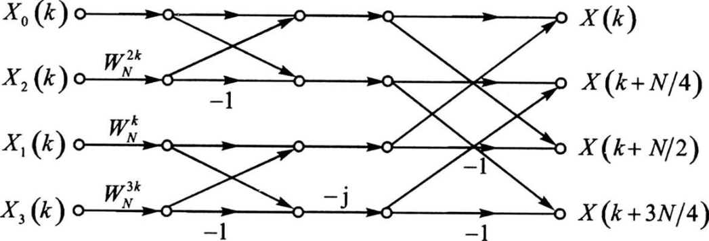
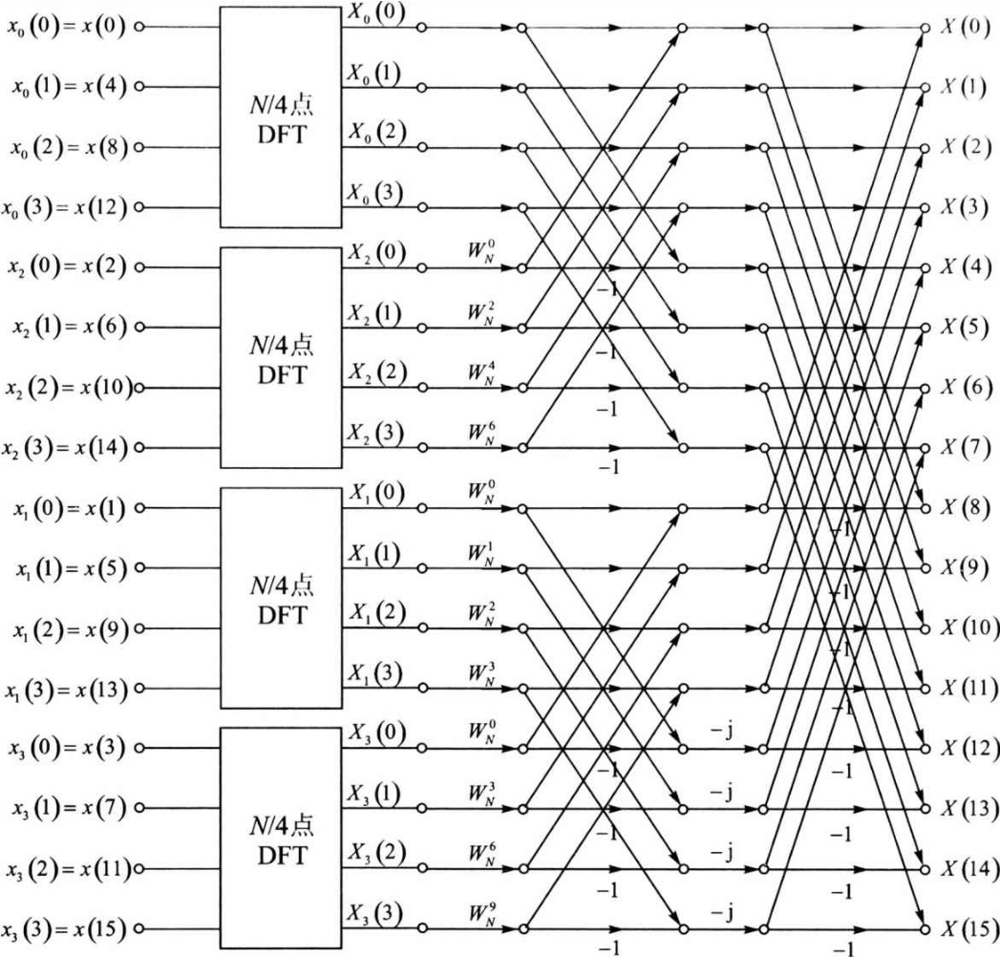
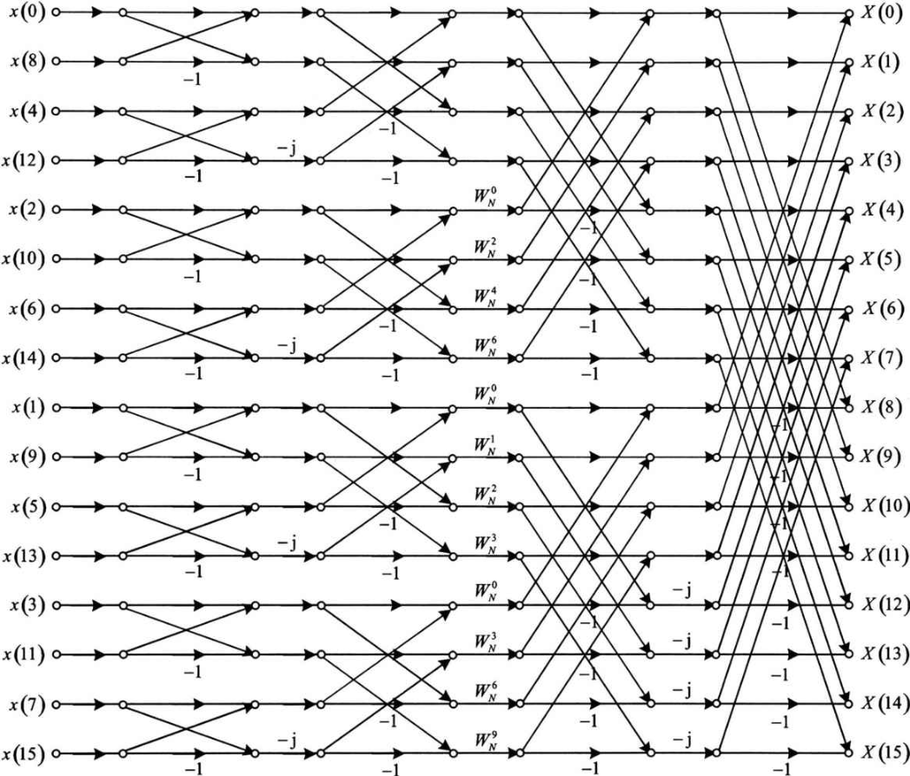

alias:: 基 -4

- 在前面[[基 -2 FFT 算法]]的讨论过程中, 先是将 $N$ 点 DFT 分解为 $2$ 个 $N / 2$ 点 DFT, 再分解为 $4$ 个 $N / 4$ 点 DFT, 再分解为 $8$ 个 $N / 8$ 点 DFT, 一直分解下去。每一次的分解后 DFT 的点数变为原来点数的 $1 / 2 ,$ 因而称为基 $-2 \mathrm{FFT}$ 。
- 类似的, ^^基- 4 FFT 算法^^指的是每一次的分解后点数变为原来点数的 $1 / 4$ 。最开始是 $N$ 点的 DFT,第 $1$ 次分解后是 $4$ 个 $N / 4$ **点的 DFT**, 第 $2$ 次分解后是 $16$ 个 $N / 16$ 点的 DFT, 按照这个规律一直分解下去。
- 基- 4 FFT 算法中, 要求 $N=4^{M} ,$ 最后一直分解到 $4$ 点的 DFT 为最小单位。基-4 FFT 算法也同样有 DIT 和 DIF 两种形式。这里仅以[[DIT]]为例来介绍基-4 FFT 算法。
- 第 $1$ 步是按如下方式将 $x(n)$ 分为 $4$ 段, 每段长度为 $N / 4 :$
  $$\begin{aligned}
  x_{0}(n)&=x(4 n), & n=0,1,2, \cdots, N / 4-1 \\
  x_{1}(n)&=x(4 n+1), & n=0,1,2, \cdots, N / 4-1 \\
  x_{2}(n)&=x(4 n+2), & n=0,1,2, \cdots, N / 4-1 \\
  x_{3}(n)&=x(4 n+3), & n=0,1,2, \cdots, N / 4-1
  \end{aligned}\tag{1}$$
- 第 $2$ 步是分别计算 $X_{0}(k)$ 、 $X_{1}(k)$ 、 $X_{2}(k)$ 、 $X_{3}(k) :$
  $$\begin{aligned}
  X_{0}(k)&=\sum_{n=0}^{N / 4-1} x_{0}(n) W_{N / 4}^{k n}=\sum_{n=0}^{N / 4-1} x(4 n) W_{N / 4}^{k n}, & k=0,1,2, \cdots, N / 4-1 \\
  X_{1}(k)&=\sum_{n=0}^{N / 4-1} x_{1}(n) W_{N / 4}^{k n}=\sum_{n=0}^{N / 4-1} x(4 n+1) W_{N / 4}^{k n}, & k=0,1,2, \cdots, N / 4-1 \\
  X_{2}(k)&=\sum_{n=0}^{N / 4-1} x_{2}(n) W_{N / 4}^{k n}=\sum_{n=0}^{N / 4-1} x(4 n+2) W_{N / 4}^{k n}, & k=0,1,2, \cdots, N / 4-1 \\
  X_{3}(k)&=\sum_{n=0}^{N / 4-1} x_{3}(n) W_{N / 4}^{k n}=\sum_{n=0}^{N / 4-1} x(4 n+3) W_{N / 4}^{k n}, & k=0,1,2, \cdots, N / 4-1
  \end{aligned}\tag{2}$$
- 第 $3$ 步是根据 $X_{0}(k)$ 、 $X_{1}(k)$ 、 $X_{2}(k)$ 、 $X_{3}(k)$ 组合得到 $X(k) ,$ 推导过程与基- 2 算法类似,下面仅给出结论:
  $$\begin{aligned}
  X(k)&=X_{0}(k)+W_{N}^{k} X_{1}(k)+W_{N}^{2 k} X_{2}(k)+W_{N}^{3 k} X_{3}(k) \\
  X(k+N / 4)&=X_{0}(k)-\mathrm{j} W_{N}^{k} X_{1}(k)-W_{N}^{2 k} X_{2}(k)+\mathrm{j} W_{N}^{3 k} X_{3}(k) \\
  X(k+N / 2)&=X_{0}(k)-W_{N}^{k} X_{1}(k)+W_{N}^{2 k} X_{2}(k)-W_{N}^{3 k} X_{3}(k) \\
  X(k+3 N / 4)&=X_{0}(k)+\mathrm{j} W_{N}^{k} X_{1}(k)-W_{N}^{2 k} X_{2}(k)-\mathrm{j} W_{N}^{3 k} X_{3}(k)
  \end{aligned}\tag{3}$$
  式 $(3)$ 中 $k$ 的取值范围为 $0,1,2, \cdots, N / 4-1$ 。基 $-4 FFT$ 算法的基本蝶形运算如图 1 所示。
	- 
	  id:: 660e9baa-0489-4236-9216-2d2402f34315
- 经过一次分解后的蝶形图如下图所示。图中 $N＝16$ 。
  
- 按照式 $(1)$ 式 $(3)$ 所示的分解方法，可以再将 $4$ 个 $N / 4$ 点的 DFT 分解为 $16$ 个 $N / 16$ 点的 DFT，以此类推，一直分解下去，直到分解为 $4$ 点的 DFT。下图给出了 $16$ 点 DIT FFT 算法的完整流程图。图中输入为[[倒位序]]，输出为正常顺序，其原因与基- 2 DIT FFT 算法的完全一致。
  
- ### [[基- 4 FFT 运算量分析]]
	- 由图 1 所示的基 $-4$ 算法基本蝶形图可知，每一个基本的蝶形运算包括 $3$ 次复数乘法及 $8$ 次复数加法。由图 3 所示基 $-4$ 算法的完整流程图可知， $N=4^{M}$ 点的 DFT，总共包括 $M$ 级蝶形运算，每级蝶形运算包括 $N / 4$ 个基本的蝶形运算，并且第 $1$ 级的蝶形运算没有乘法，因此所需的复数乘法次数 $m_{\mathrm{F}}$ 和复数加法次数 $a_{\mathrm{F}}$ 分别为：
	  $$\begin{aligned}
	  m_{\mathrm{F}}&=3 \frac{N}{4} \times(M-1)=3 \times \frac{N}{4} \times\left(\log _{4} N-1\right) \approx \frac{3 N}{8} \log _{2} N \\
	  a_{\mathrm{F}}&=8 \times \frac{N}{4} \times M=8 \times \frac{N}{4} \times \log _{4} N=N \log _{2} N
	  \end{aligned}
	  $$
	  表 $6.6$ 中第 $3$ 列给出了 $N$ 为不同取值时基 $- 4$ 算法所需的复数乘法的次数，符号 $“-”$ 表示不能进行基 $-4$ 分解。对比式 $(6.19)$ 与式 $(6.31)$ 可以发现，基 $-4$ 算法所需的复数乘法次数比基 $- 2$ 算法减少约 $25 \%$ 。基 $- 2$ 算法和基 $- 4$ 算法所需的复数加法次数完全相同。
-