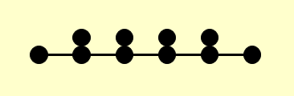

- 将区间$[a,b]$划分为$n$等份，分点$x_k=a+kh,h=\frac{b-a}n,\ddots,n$,在每个子区间
  在每个子区间  $\left[x_{k-1}, x_{k}\right]$  上用[[梯形公式]]:
  $$
  \int_{x_{k-1}}^{x_{k}} f(x) d x \approx \frac{x_{k}-x_{k-1}}{2}\left[f\left(x_{k-1}\right)+f\left(x_{k}\right)\right], k=1, \cdots, n $$
  记 
  $$T_{n} = \int_{a}^{b} f(x) d x \approx \sum_{k=1}^{n} \frac{h}{2}\left[f\left(x_{k-1}\right)+f\left(x_{k}\right)\right]=\frac{h}{2}\left[f(a)+2 \sum_{k=1}^{n-1} f\left(x_{k}\right)+f(b)\right]$$
  称为[[复合梯形公式]]。
  
- 复合梯形公式的[余项]([[求积公式余项]])为：
  id:: 65a547c4-08c4-4357-830b-77a440f900b1
  \begin{aligned}
  R[f] &=\sum_{k=1}^{n}\left[-\frac{h^{3}}{12} f^{\prime \prime}\left(\xi_{k}\right)\right] \\
  &=-\frac{h^{2}}{12}(b-a) \frac{\sum_{k=1}^{n} f^{\prime \prime}\left(\xi_{k}\right)}{n} \\ 
  &=-\frac{h^{2}}{12}(b-a) f^{\prime \prime}(\xi), \quad \xi \in(a, b)
  \end{aligned}